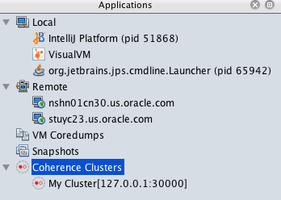

# Access Management Over REST Endpoint Using VisualVM Plugin

This sample shows how to connect the VisualVM Plugin in Coherence 12.2.1.4.0 to a Coherence cluster using REST. 

> **Note**: Use of management over REST is available only when using the operator with Coherence 12.2.1.4.0.

[Return to Management over REST samples](../)  [Return to Management samples](../../) / [Return to samples](../../../README.md#list-of-samples)

## Prerequisites

1. Install Coherence Cluster

   Follow the instructions [here](../standard/README.md#installation-steps) to install a Coherence cluster and port forward the management
   over REST port.

2. Install the Coherence VisualVM plugin

   Follow the instructions [here](https://docs.oracle.com/middleware/12213/coherence/manage/using-jmx-manage-oracle-coherence.htm)
   to install the VisualVM plugin.

## Installation Steps

1. Start VisualVM

   ```bash
   $ jvisualvm
   ```
   
   Or, if you have downloaded VisualVM separately, the executable is `visualvm`.
   
   
1. Create the connection

   If the Coherence Visualvm plugin is correctly installed, then you should see **Coherence Clusters** item under the
   Applications tab. Right-click on this and select **Add Coherence Cluster**.
   
   Enter a name for the cluster, and then enter the following  URL for management REST:
   
   `http://127.0.0.1:30000/management/coherence/cluster`
   
   
   
   
   
1. Connect to the cluster

   Double-click on the new cluster you created and you can view the **Coherence** tab in VisualVM.
   
## Uninstall the Charts

Use the following command to delete the chart installed in this sample:

```bash
$ helm delete storage --purge
```

Before starting another sample, ensure that all the pods are removed from previous samples.

If you want to remove the `coherence-operator`, then include it in the `helm delete` command.
