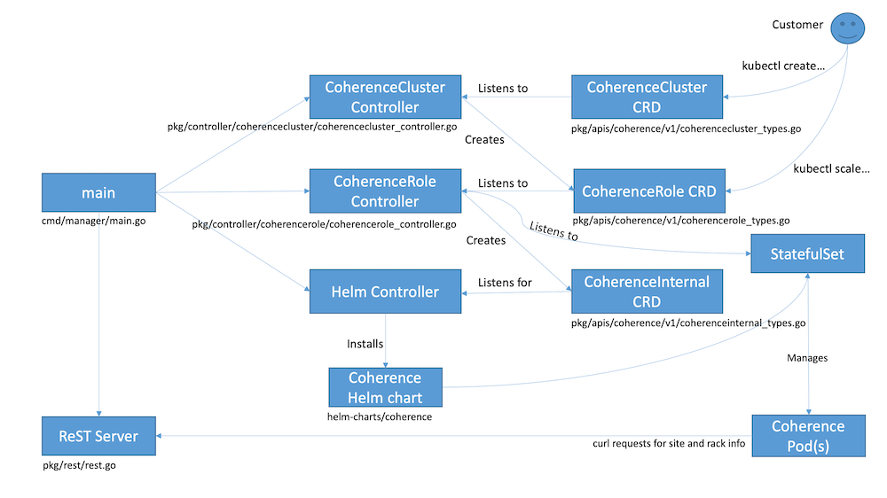

///////////////////////////////////////////////////////////////////////////////

    Copyright (c) 2019 Oracle and/or its affiliates. All rights reserved.

    Licensed under the Apache License, Version 2.0 (the "License");
    you may not use this file except in compliance with the License.
    You may obtain a copy of the License at

        http://www.apache.org/licenses/LICENSE-2.0

    Unless required by applicable law or agreed to in writing, software
    distributed under the License is distributed on an "AS IS" BASIS,
    WITHOUT WARRANTIES OR CONDITIONS OF ANY KIND, either express or implied.
    See the License for the specific language governing permissions and
    limitations under the License.

///////////////////////////////////////////////////////////////////////////////

= How It Works

== How The Operator Works
The high level operation of the Coherence Operator can be seen in the diagram below.

The entry point to the operator is the`main()` function in the `cmd/manager/main.go` file. This function performs
the creation and initialisation of the three controllers and the REST server. It also creates a configuration k8s
`secret` that is used by Coherence Pods. The Coherence Operator works in a single namespace, that is it manages CRDs
and hence Coherence clusters only in the same namespace that it is installed into.

=== Controllers
In the Operator SDK framework a controller is responsible for managing a specific CRD. A single controller could,
in theory, manage multiple CRDs but it is clearer and simpler to keep them separate. The Coherence Operator has three
controllers, two are part of the operator source code and one is provided by the Operator SDK framework.

All controllers have a `Reconcile` function that is triggered by events from Kubernetes for resources that the
controller is listening to.

=== CoherenceCluster Controller
The CoherenceCluster controller manages instances of the CoherenceCluster CRD. The source for this controller is
in the `pkg/controller/coherencecluster/coherencecluster_controller.go` file.
The CoherenceCluster controller listens for events related to CoherenceCluster CRDs created or modified in the
namespace that the operator is running in. It also listens to events for any CoherenceRole CRD that it owns. When
a CoherenceCluster resource is created or modified a CoherenceRole is created (or modified or deleted) for each role
in the CoherenceCluster spec. Each time a k8s event is raised for a CoherenceCluster or CoherenceRole resource the
`Reconcile` method on the CoherenceCluster controller is called.

* *Create* -
When a CoherenceCluster is created the controller will work out how many roles are present in the spec. For each role
that has a `Replica` count greater than zero a CoherenceRole is created in k8s. When a CoherenceRole is created it is
associated to the parent CoherenceCluster so that k8s can track ownership of related resources (this is used for
cascade delete - see below).

* *Update* -
When a CoherenceCluster is updated the controller will work out what the roles in the updated spec should be.
It then compares these roles to the currently deployed CoherenceRoles for that cluster. It then creates, updates or
deletes CoherenceRoles as required.

* *Delete* -
When a CoherenceCluster is deleted the controller does not currently need to do anything. This is because k8s has
cascade delete functionality that allows related resources to be deleted together (a little like cascade delete in
a database). When a CoherenceCluster is deleted then any related CoherenceRoles will be deleted and also any resources
that have those CoherenceRoles as owners (i.e. the corresponding CoherenceInternal resources)

=== CoherenceRole Controller
The CoherenceRole controller manages instances of the CoherenceRole CRD. The source for this controller is
in the `pkg/controller/coherencerole/coherencerole_controller.go` file.

The CoherenceRole controller listens for events related to CoherenceRole CRDs created or modified in the
namespace that the operator is running in. It also listens to events for any StatefulSet resources that were created
by the corresponding Helm install for the role.
When a CoherenceRole resource is created or modified a corresponding CoherenceInternal resource is created
(or modified or deleted) from the role's spec. Creation of a CoherenceInternal resource will trigger a Helm install
of the Coherence Helm chart by the Helm Controller.
Each time a k8s event is raised for a CoherenceRole or for a StatefulSet resource related to the role the
`Reconcile` method on the CoherenceRole controller is called.

The StatefulSet resource is listened to as a way to keep track of the state fo the role, i.e how many replicas are actually
running and ready compared to the desired state. The StatefulSet is also used to obtain references to the Pods that make up
the role when performing a StatusHA check prior to scaling.

* *Create* -
When a CoherenceRole is created a corresponding CoherenceInternal resource will be created in k8s.

* *Update* -
When a CoherenceRole is updated one of three actions can take place.
** Scale Up - If the update increases the role's replica count then the role is being scaled up. The role's spec is
first checked to determine whether anything else has changed, if it has a rolling upgrade is performed first to bring
the existing members up to the desired spec. After any possible the upgrade then the role's member count is scaled up.
** Scale Down - If the update decreases the role's replica count then the role is being scaled down. The member count
of the role is scaled down and then the role's spec is checked to determine whether anything else has changed, if it has
a rolling upgrade is performed to bring the remaining members up to the desired spec.
** Update Only - If the changes to the role's spec do not include a change to the replica count then a rolling upgrade
is performed of the existing cluster members.

* *Rolling Upgrade* -
A rolling upgrade is actually performed out of the box by the StatefulSet associated to the role. To upgrade the
members of a role the CoherenceRole controller only has to update the CoherenceInternal spec. This will cause the Helm
controller to update the associated Helm install whivh in turn causes the StatefulSet to perform a rolling update of
the associated Pods.

* *Scaling* -
The CoherenceOperator supports safe scaling of the members of a role. This means that a scaling operation will not take
place unless the members of the role are Status HA. Safe scaling means that the number of replicas is scaled one at a time
untile the desired size is reached with a Status HA check being performed before each member is added or removed.
The exact action is controlled by a customer defined scaling policy that is part of the role's spec.
There are three policy types:
** SafeScaling - the safe scaling policy means that regardless of whether a role is being scaled up or down the size
is always scaled one at a time with a Status HA check before each member is added or removed.
** ParallelScaling - with parallel scaling no Status HA check is performed, a role is scaled to the desired size by
adding or removing the required number of members at the same time. For a storage enabled role with this policy scaling
down could result in data loss. Ths policy is intended for storage disabled roles where it allows for fatser start and
scaling times.
** ParallelUpSafeDownScaling - this policy is the default scaling policy. It means that when scaling up the required number
of members is added all at once but when scaling down members are removed one at a time with a Status HA check before each
removal. This policy allows clusters to start and scale up fatser whilst protecting from data loss when scaling down.

* *Delete* -
As with a CoherenceCluster, when a CoherenceRole is deleted its corresponding CoherenceInternal resource is also deleted
by a cascading delete in k8s. The CoherenceRole controller does not need to take any action on deletion.

=== Helm Controller
The final controller in the Coherence Operator is the Helm controller. This controller is actually part of the Operator SDK
and the source is not in the Coherence Operator's source code tree. The Helm controller is configured to watch for a
particular CRD and performs Helm install, delete and upgrades as resources based on that CRD are created, deleted or updated.

In the case of the Coherence Operator the Helm controller is watching for instances of the CoherenceInternal CRD that are
created, updated or deleted by the CoherenceRole controller. When this occurs the Helm controller uses the spec of the
CoherenceInternal resource as the values file to install or upgrade the Coherence Helm chart.

The Coherence Helm chart used by the operator is actually embedded in the Coherence Operator Docker image so there is no
requirement for the customer to have access to a chart repository.

The Helm operator also uses an embedded helm and tiller so there is no requirement for the customer to install Helm in
their k8s cluster. A customer can have Helm installed but it will never be used by the operator so there is no version
conflict. If a customer were to perform a `helm ls` operation in their cluster they would not see the installs controlled
by the Coherence Operator.
