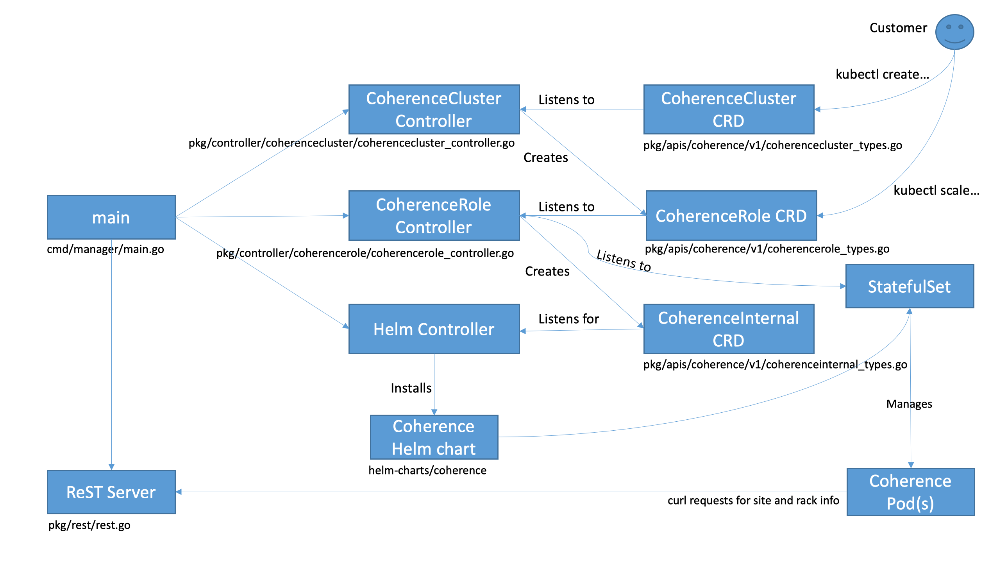

= Coherence Operator

This module is the Coherence Operator implementation. It is a Go based project built using the
https://github.com/operator-framework/operator-sdk[Operator SDK]. The project also contains a
Java sub-project that is used to create Coherence utilities that the Operator relies on to work
correctly with Coherence clusters that it is managing.

== Prerequisites
The following prerequisites are required to build and test the operator (the prerequisites to just run the operator
are obviously a sub-set of these).

* https://github.com/operator-framework/operator-sdk/tree/v0.9.0[operator-sdk] version *v0.9.0*
* https://git-scm.com/downloads[git]
* https://golang.org/dl/[go] version v1.12+.
* https://www.mercurial-scm.org/downloads[mercurial] version 3.9+
* https://docs.docker.com/install/[docker] version 17.03+.
* https://kubernetes.io/docs/tasks/tools/install-kubectl/[kubectl] version v1.11.3+.
* Access to a Kubernetes v1.11.3+ cluster.

* http://jdk.java.net/[Java 8+ JDK]
* https://maven.apache.org[Maven] version 3.5+
* Access to a Maven repository containing Oracle Coherence 12.2.1.4 (for the exact GAV see the
`pom.xml` file in the `java/` directory)

* Optional: https://github.com/go-delve/delve/tree/master/Documentation/installation[delve]
version 1.2.0+ (for local debugging with `operator-sdk up local --enable-delve`).

* This project uses `make` for building, which should already be installed on most systems

*_Note:_* This project currently uses the Operator SDK v0.9.0 so make sure you install the correct version of
the Operator SDK CLI.

*_Note:_* As stated above this project requires K8s v1.11.3+ so if using Docker on MacOS you need at least version 2.1.0.0

== High Level Design

The Coherence Operator has been built using the https://github.com/operator-framework/operator-sdk[Operator SDK] and
hence the design is based on how the framework works.

=== Custom Resource Definitions (CRDs)
In Kubernetes a CRD is a yaml (or json) file that defines the structure of a custom resource. When building operators
using the Operator SDK the yaml files are not edited directly, they are generated from the Go structs in the source code.
The Coherence Operator has three CRDs:

* CoherenceCluster
* CoherenceRole
* CoherenceInternal

==== CoherenceCluster CRD
The CoherenceCluster CRD is the main CRD that defines what a Coherence cluster looks like. This is the CRD that a customer
creates and manges through the normal kubernetes commands and APIs. A CoherenceCluster is made up of one or more roles.
Each role defines a sub-set of the members of a Coherence cluster (or all of the members in the case of a cluster with a
single role).

The yaml for the CoherenceCluster CRD is in the file `deploy/crds/coherence_v1_coherencecluster_crd.yaml`. This yaml
is generated by the Operator SDK from the `CoherenceCluster` struct in the `pkg/apis/coherence/v1/coherencecluster_types.go`
source file.

==== CoherenceRole CRD
The CoherenceRole CRD is a definition of a role within a CoherenceCluster. A role is a sub-set of the members of a
cluster that all share the same configuration. A customer should not interact directly with a CoherenceRole other
than when scaling (for example using `kubectl scale` commands).

The reason that a cluster is split into roles represented by a different CRD is to allow more fine grained control over
different parts of the cluster, especially for operations such as scaling. By having a separate CRD for a role allows
a customer to update or scale each role individually.

The yaml for the CoherenceRole CRD is in the file `deploy/crds/coherence_v1_coherencerole_crd.yaml`. This yaml
is generated by the Operator SDK from the `CoherenceRole` struct in the `pkg/apis/coherence/v1/coherencerole_types.go`
source file.

==== CoherenceInternal CRD
The CoherenceInternal CRD is (as the name suggests) entirely internal to the Coherence Operator and a customer should
not interact with it at all. The CoherenceInternal CRD is a representation of the values file used to install the
Coherence Helm chart.

The yaml for the CoherenceInternal CRD is in the file `deploy/crds/coherence_v1_coherenceinternal_crd.yaml`. This yaml
is generated by the Operator SDK from the `CoherenceInternal` struct in the `pkg/apis/coherence/v1/coherenceinternal_types.go`
source file.

=== Operation
The high level operation of the Coherence Operator can be seen in the diagram below.

The entry point to the operator is the`main()` function in the `cmd/manager/main.go` file. This function performs
the creation and initialisation of the three controllers and the ReST server. It also creates a configuration k8s
`secret` that is used by Coherence Pods. The Coherence Operator works in a single namespace, that is it manages CRDs
and hence Coherence clusters only in the same namespace that it is installed into.

==== Controllers
In the Operator SDK framework a controller is responsible for managing a specific CRD. A single controller could,
in theory, manage multiple CRDs but it is clearer and simpler to keep them separate. The Coherence Operator has three
controllers, two are part of the operator source code and one is provided by the Operator SDK framework.

All controllers have a `Reconcile` function that is triggered by events from Kubernetes for resources that the
controller is listening to.

===== CoherenceCluster Controller
The CoherenceCluster controller manages instances of the CoherenceCluster CRD. The source for this controller is
in the `pkg/controller/coherencecluster/coherencecluster_controller.go` file.
The CoherenceCluster controller listens for events related to CoherenceCluster CRDs created or modified in the
namespace that the operator is running in. It also listens to events for any CoherenceRole CRD that it owns. When
a CoherenceCluster resource is created or modified a CoherenceRole is created (or modified or deleted) for each role
in the CoherenceCluster spec. Each time a k8s event is raised for a CoherenceCluster or CoherenceRole resource the
`Reconcile` method on the CoherenceCluster controller is called.

* Create -
When a CohereceCluster is created the controller will work out how many roles are present in the spec. For each role
that has a `Replica` count greater than zero a CoherenceRole is created in k8s. When a CoherenceRole is created it is
associated to the parent CoherenceCluster so that k8s can track ownership of related resources (this is used for
cascade delete - see below).

* Update -
When a CoherenceCluster is updated the controller will work out what the roles in the updated spec should be.
It then compares these roles to the currently deployed CoherenceRoles for that cluster. It then creates, updates or
deletes CoherenceRoles as required.

* Delete -
When a CoherenceCluster is deleted the controller does not currently need to do anything. This is because k8s has
cascade delete functionality that allows related resources to be deleted together (a little like cascade delete in
a database). When a CoherenceCluster is deleted then any related CoherenceRoles will be deleted and also any resources
that have those CoherenceRoles as owners (i.e. the corresponding CoherenceInternal resources)

===== CoherenceRole Controller

== Building:

The Operator SDK generates Go projects that use Go Modules and hence the Coherence Operator uses Go Modules too.
The Coherence Operator can be checked out from Git to any location, it does not have to be under your `$GOPATH`.
The first time that the project is built may require Go to fetch a number of dependencies and may take longer than
usual to complete.

The easiest way to build the whole project is using `make`.
To build the Coherence Operator, package the Helm charts and create the various Docker images run the following
command:

[source,bash]
----
make build-all-images
----

The `build-all-images` make target will build the Go and Java parts of the Operator and create all of the images required.

=== Testing

The Coherence Operator contains tests that can be executed using `make`. The tests are plain Go tests and
also https://github.com/onsi/ginkgo[Ginkgo] test suites.

To execute the unit and functional tests that do not require a k8s cluster you can execute the following command:
[source,bash]
----
make test-all
----
This will build and execute all of the Go and Java tests, you do not need to have run a `make build` first.

To only tun the Go tests use:
[source,bash]
----
make test-operator
----

To only tun the Java tests use:
[source,bash]
----
make test-mvn
----

==== Build Versions

By default the version number used to tag the Docker images and Helm charts is set in the `VERSION` property
in the `Makefile` and in the `pom.xml` files in the `java/` directory.

The `Makefile` also contains a `VERSION_SUFFIX` variable that is used to add a suffix to the build. By default
this suffix is `ci` so the default version of the build artifacts is `2.0.0-ci`. Change this suffix, for
example when building a release candidate or a full release.

For example, if building a release called `alpha2` the following command can be used:
[source,bash]
----
make build-all-images VERSION_SUFFIX=alpha2
----

If building a full release without a suffix the following command can be used
[source,bash]
----
make build-all-images VERSION_SUFFIX=""
----

== Running the Coherence Operator

There are two ways to run the Coherence Operator, either deployed into a k8s cluster or by using the Operator SDK
to run it locally on your dev machine (assuming your dev machine has access to a k8s cluster such as Docker Desktop
on MacOS).

=== Namespaces
*NOTE:* The Coherence Operator by default runs in and monitors a *single* namespace.
This is different behaviour to v1.0 of the Coherence Operator.
For more details see the Operator SDK document on
https://github.com/operator-framework/operator-sdk/blob/v0.9.0/doc/operator-scope.md[Operator Scope].

=== Install the CRDs

Prior to any testing the CRDs need to be installed in the k8s cluster. Although the Operator runs in a single
namespace CRDs are a global (non-namespaced) resource. The simplest way to install the CRDs is to run the
make target:
[source,bash]
----
make install-crds
----
This script will first delete any old installs of the CRDs and then install the new versions.

To uninstall the CRDs there is a corresponding uninstall make target:
[source,bash]
----
make uninstall-crds
----

=== Running Locally

During development running the Coherence Operator locally is by far the simplest option as it is faster and
it also allows remote debugging if you are using a suitable IDE.

To run a local copy of the operator that will connect to whatever you local kubernetes config is pointing to:
[source,bash]
----
make run
----

If https://github.com/go-delve/delve/tree/master/Documentation/installation[delve] is installed then the
operator can be run in debug mode so that a Go debugger can be attached.
[source,bash]
----
make run-debug
----

==== Stopping the Local Operator
To stop the local operator just use CTRL-Z or CTRL-C. Sometimes processes can be left around even after exiting in
this way. To make sure all of the processes are dead you can run the kill script:
[source,bash]
----
./hack/kill-local.sh
----

=== Clean-up

After running the operato the CRDs can be removed from the k8s cluster by running the make target:
[source,bash]
----
make uninstall-crds
----

=== Debugging Locally

When running locally in development it is often useful to be able to attach a debugger to the running code.
To do this you need to have https://github.com/go-delve/delve/tree/master/Documentation/installation[delve]
installed and then add the `--enable-delve` parameter to the `operator-sdk up` command.
[source,bash]
----
export OPERATOR_NAME=coherence-operator
operator-sdk up local --namespace=default \
    --operator-flags="--watches-file=local-watches.yaml" \
    --enable-delve
----
This will start the operator in debug mode; the Go code will pause until a debugger connects on port 2345 which
is the default debug port.

A simpler way to run the operator in debug mode is to use the shell script:
[source,bash]
----
./hack/debug.sh
----
As well as running the same `operator-sdk up` commands as above it also pipes the output to both the console
and to the file `operator.out`

== Project Structure

This project was initially generated using the Operator SDK and this dictates the structure of the project
which means that files and directories should not be moved arbitrarily.

=== Operator SDK Files
The following should not be moved:

|===
|File |Description

|`bin/` |scripts used in the Operator Docker image 
|`build/Dockerfile` |the `Dockerfile` used by the Operator SDK to build the Docker image 
|`cmd/manager/main.go` |The Operator `main` generated by the Operator SDK 
|`deploy/` |Yaml files generated and maintained by the Operator SDK 
|`deploy/crds` |The CRD files generated and maintained by the Operator SDK 
|`helm-charts/` |The Helm charts used by the Operator 
|`pkg/apis` |The API `struct` code generated by the Operator SDK and used to generate the CRD files 
|`pkg/controller` |The controller code generated by the Operator SDK
|`watches.yaml` |The Helm Operator configuration generated by the Operator SDK
|`local-watches.yaml` |The Helm Operator configuration used when running the operator locally
|===

== Useful Info

=== Labeling Your K8s Node

For local testing, for example in Docker Desktop it is useful to add the zone label to your local K8s node with
the fault domain that is then used by the Coherence Pods to set their `zone` property.

For example, if your local node is called `docker-desktop` you can use the following command to set
the zone name to `twilight-zone`:
[source,bash]
----
kubectl label node docker-desktop failure-domain.beta.kubernetes.io/zone=twilight-zone
----
With this label set all Coherence Pods installed by the Coherence Operator on that node will be
running in the `twilight-zone`.

=== Kubernetes Dashboard

Assuming that you have the https://github.com/kubernetes/dashboard[Kubernetes Dashboard] then you can easily
start the local proxy and display the required login token by running:
[source,bash]
----
./hack/kube-dash.sh
----
This will display the authentication token, the local k8s dashboard URL and then start `kubectl proxy`.

