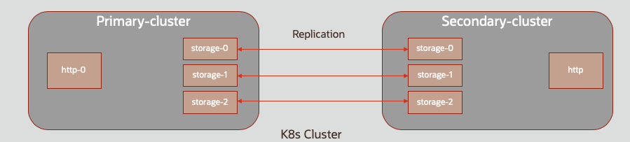

///////////////////////////////////////////////////////////////////////////////

    Copyright (c) 2019 Oracle and/or its affiliates.

    Licensed under the Apache License, Version 2.0 (the "License");
    you may not use this file except in compliance with the License.
    You may obtain a copy of the License at

        http://www.apache.org/licenses/LICENSE-2.0

    Unless required by applicable law or agreed to in writing, software
    distributed under the License is distributed on an "AS IS" BASIS,
    WITHOUT WARRANTIES OR CONDITIONS OF ANY KIND, either express or implied.
    See the License for the specific language governing permissions and
    limitations under the License.

///////////////////////////////////////////////////////////////////////////////

= Overview

This section includes links to a number of examples which uses the Coherence Operator.

== Examples Overview

There are a number of examples which show you how to build and deploy applications for the Coherence Operator.

=== 1. Deployment Example

This example showcases how to deploy Coherence applications using the Coherence Operator.

The following scenarios are covered:

1. Installing the Coherence Operator
1. Installing a Coherence cluster
1. Deploying a Proxy tier
1. Deploying an storage-disabled application
1. Enabling Active Persistence

After the initial install of the Coherence cluster, the following examples build on the previous ones by issuing a kubectl apply to modify the install adding additional roles.

Please see https://github.com/oracle/coherence-operator/tree/master/examples/deployment[GitHub] for full instructions.

=== 2. Coherence Demo

The Coherence Demonstration application is an application which demonstrates various Coherence
related features such include Persistence, Federation and Lambda support.  This demonstration
can run stand alone but can also be installed on the Coherence Operator.

When installed using the Coherence Operator, the setup includes two Coherence Clusters, in the same Kubernetes cluster,
which are configured with Active/Active Federation.

Please see https://github.com/coherence-community/coherence-demo[The Coherence Demo GitHub project] for full instructions.

=== 3. Autoscaling

The Autoscaling example demonstrates how to use the Kubernetes
https://kubernetes.io/docs/tasks/run-application/horizontal-pod-autoscale/[Horizontal Pod Autoscaler]
to scale a Coherence cluster based on metrics. The example scales based on heap usage after GC.

Please see https://github.com/oracle/coherence-operator/tree/master/examples/autoscaler[GitHub] for full instructions.

