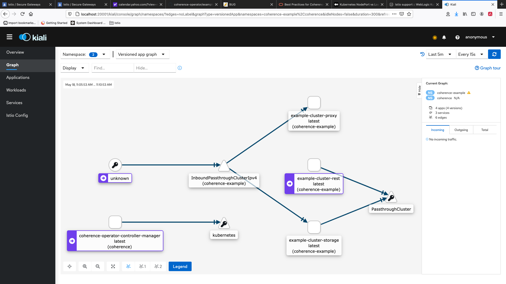
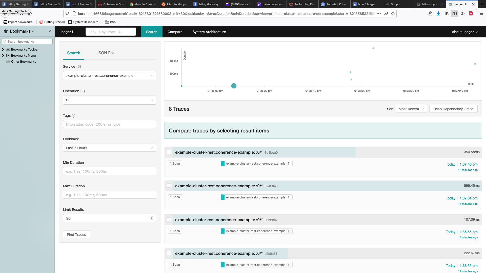
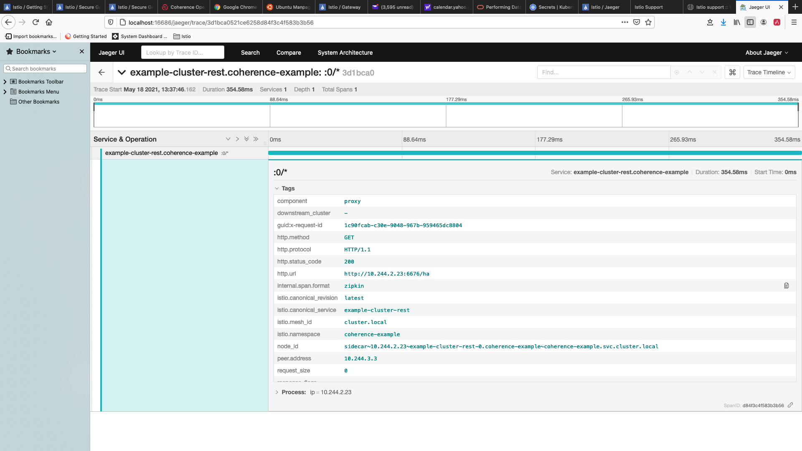

= Istio Support

== Overview

Coherence Operator 3.1.15 and later supports Istio 1.9.1 and later. You can run the operator and Coherence cluster managed by the operator with Istio sidecar injection enabled.  Coherence caches can be accessed from outside via Coherence*Extend, REST, and other supported Coherence clients.  

== Limitations

The current support for Istio has the following limitation:

 * TLS between cluster members do not work in Istio environment. Coherence client can support TLS through Istio secure gateway with TLS termination to connect to Coherence cluster running inside kubernetes.  For example, you can apply the following Istio gateway and and virtual service in the namespace of the Coherence cluster:

tlsGateway.yaml
[source,bash]
----
apiVersion: networking.istio.io/v1alpha3
kind: Gateway
metadata:
  name: tlsgateway
spec:
  selector:
    istio: ingressgateway # use istio default ingress gateway
  servers:
  - port:
      number: 8043
      name: tls
      protocol: TLS
    tls:
      mode: SIMPLE
      credentialName: "extend-credential" # must be the same as secret for the TLS key and cert
      maxProtocolVersion: TLSV1_3
    hosts:
    - "*"
----

tlsVS.yaml
[source,bash]
----
apiVersion: networking.istio.io/v1alpha3
kind: VirtualService
metadata:
  name: extend
spec:
  hosts:
  - "*"
  gateways:
  - tlsgateway
  tcp:
  - match:
    route:
    - destination:
        port:
          number: 20000                    # the proxy server listening port
        host: example-cluster-proxy-proxy  # the ClusterIP service name of the proxy server
----

Then a Coherence*Extend client can connect to the proxy server via TLS protocol at port 8043.

== Using the Coherence operator with Istio

NOTE: These instructions assume that you are using a Kubernetes cluster with Istio installed and configured already.

You can deploy the operator into a namespace which has Istio automatic sidecar injection enabled. Before installing the operator, create the namespace in which you want to run the Coherence operator and label it.

[source,bash]
----
kubectl create namespace coherence-operator
----

Istio Sidecar AutoInjection is done automatically if you label coherence-operator namespace with istio-injection. If you want to implement manual injection with the deployments then you need to use istioctl kube-inject.

[source,bash]
----
kubectl label namespace coherence-operator istio-injection=enabled
----

After the namespace is labeled, you can install the operator using your preferred method in the Operator https://oracle.github.io/coherence-operator/docs/latest/#/installation/01_installation[Installation Guide].

After installed operator, use the following command to confirm the operator is running:

[source,bash]
----
kubectl get pods -n coherence-operator
----

== Creating a Coherence cluster with Istio support

You can configure your cluster to run with Istio automatic sidecar injection enabled. Before creating your cluster, create the namespace in which you want to run the cluster and label it for automatic injection.

[source,bash]
----
kubectl create namespace coherence-cluster
kubectl label namespace coherence-cluster istio-injection=enabled
----

There is no other requirements to run Coherence in Istio environment.

The following is an example that creates a cluster named example-cluster:

example.yaml
[source,bash]
----
# Example
apiVersion: coherence.oracle.com/v1
kind: Coherence
metadata:
  name: example-cluster
----

[source,bash]
----
$ kubectl -n coherence-cluster apply -f example.yaml
----

After you installed the Coherence cluster, run the following command to view the pods:

[source,bash]
----
$ kubectl -n coherence-cluster get pods

NAME                                             READY   STATUS    RESTARTS   AGE
example-cluster-0                                2/2     Running   0          45m
example-cluster-1                                2/2     Running   0          45m
example-cluster-2                                2/2     Running   0          45m
----

You can see that 3 members in the cluster are running with 3 pods. 2/2 in READY column means that there are 2 containers running in each Pod. One is Coherence member and the other is Envoy Proxy.

== Prometheus

You can use Prometheus with Istio to record metrics that track the health of Istio and of Coherence cluster within the service mesh and view them through Granfana. 

== Traffic Management

Istio provides traffic management capabilities, including the ability to visualize traffic in Kiali. You do not need to change your applications to use this feature. The Istio proxy (envoy) sidecar that is injected into your pods provides it. The image below shows an example with traffic flowing: In from the Istio gateway on the left, to a cluster called example-cluster in the coherence-example namespace.

In this example, you can see how the traffic flows to the cluster services and then to the individual cluster members.  This example has storage members (example-cluster-storage), a member running proxy service (example-cluster-proxy), and a member running http server (example-cluster-rest).  

To learn more, see https://istio.io/latest/docs/concepts/traffic-management/[Istio traffic management].

== Distributed Tracing

Istio provides distributed tracing capabilities, including the ability to view traces in Jaeger. In order to use distributed tracing, you will need to enable Coherence Distributed Tracing. For example:

example.yaml
[source,bash]
----
# Example
apiVersion: coherence.oracle.com/v1
kind: Coherence
metadata:
  name: example-cluster
spec:
  coherence:
    tracing:
      ratio: 1
----

The images below show an example of a distributed trace flow and details of a trace span.

To learn more, see https://istio.io/latest/docs/tasks/observability/distributed-tracing/[distrubting tracing in Istio].
