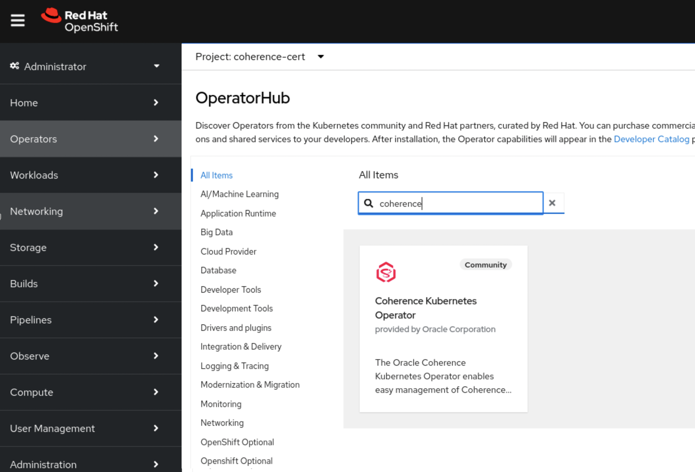
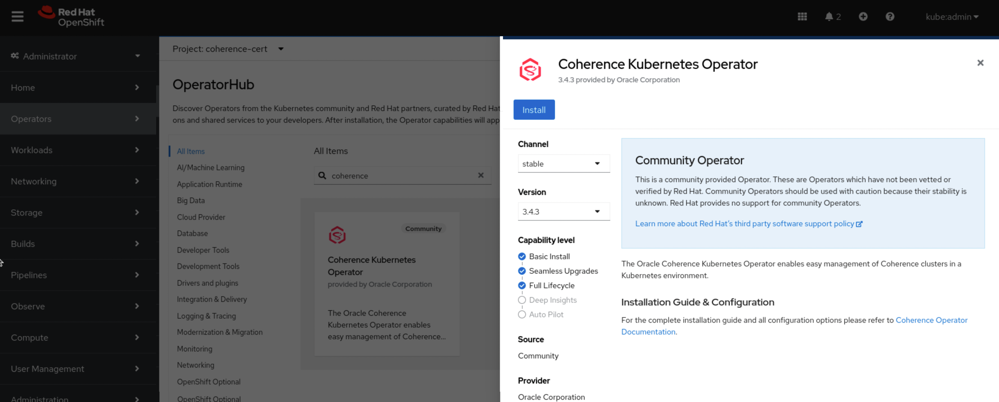
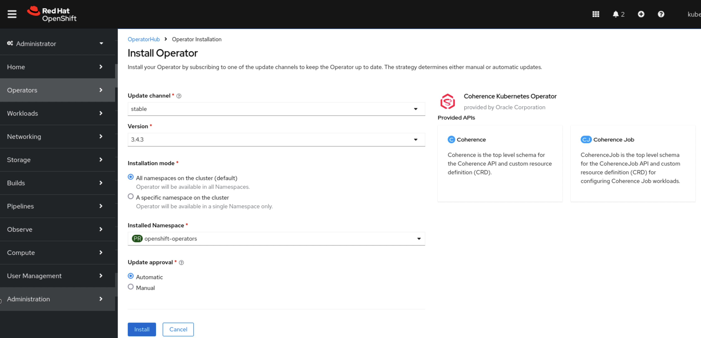
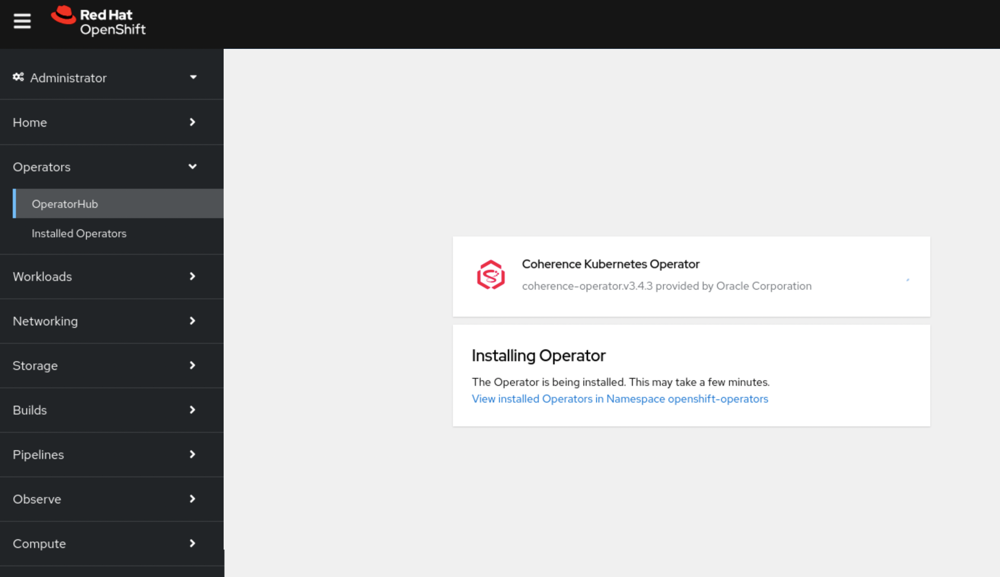
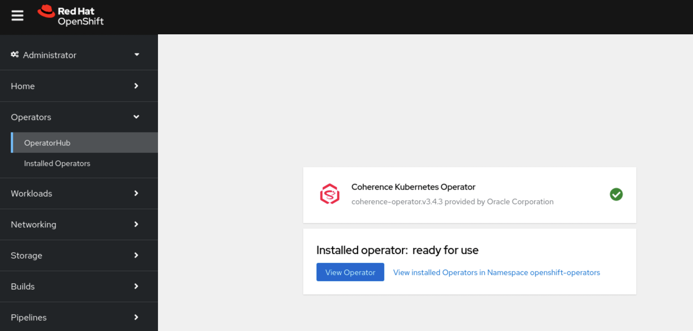
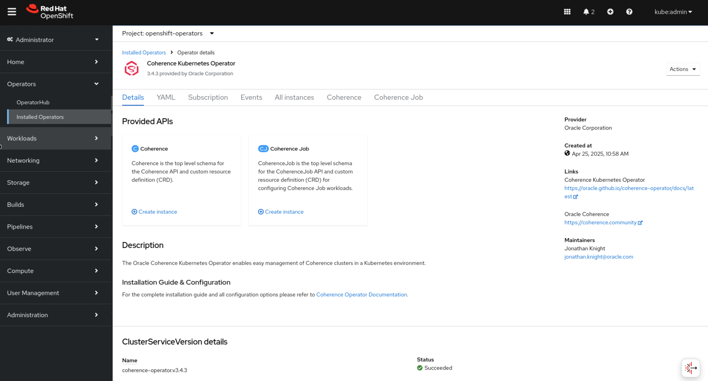

///////////////////////////////////////////////////////////////////////////////

    Copyright (c) 2020, 2025, Oracle and/or its affiliates.
    Licensed under the Universal Permissive License v 1.0 as shown at
    http://oss.oracle.com/licenses/upl.

///////////////////////////////////////////////////////////////////////////////

= Install on OpenShift

== Install on OpenShift

The Coherence Operator can be installed into OpenShift using either the web console or
manually using yaml manifests.

The https://docs.redhat.com/en/documentation/openshift_container_platform/4.18/html/operators/index[OpenShift documentation]
covers operators in great detail along with how to install them.
It is advisable to check this documentation for the version of OpenShift being used.

There are two methods to install an operator in OpenShift.

* <<manual,Manually>> using a subscription yaml
* <<console,Automatically>> from the OpenShift web console

[#manual]
=== Manual Installation

Create a subscription yaml

[source]
.coherence-operator-subscription.yaml
----
apiVersion: operators.coreos.com/v1alpha1
kind: Subscription
metadata:
  name: coherence-operator
  namespace: openshift-operators
spec:
  channel: stable
  installPlanApproval: Automatic
  name: coherence-operator
  source: coherence-operator-catalog
  sourceNamespace: openshift-marketplace
  startingCSV: coherence-operator.v3.5.4
----

Apply the subscription yaml:

[source,bash]
----
oc apply -f coherence-operator-subscription.yaml
----

The Coherence Operator will be installed into the `openshift-operators` namespace.

The Coherence operator pods have a label `app.kubernetes.io/name=coherence-operator` and can be listed
with the following command:

[source,bash]
----
oc -n openshift-operators get pod -l app.kubernetes.io/name=coherence-operator
----

[source]
----
NAME                                                     READY   STATUS    RESTARTS      AGE
coherence-operator-controller-manager-859675d947-llmvd   1/1     Running   1 (14h ago)   14h
coherence-operator-controller-manager-859675d947-mk765   1/1     Running   3 (14h ago)   14h
coherence-operator-controller-manager-859675d947-z5m2x   1/1     Running   2 (14h ago)   14h
----

[#console]
=== Install from the Web Console

Using the OpenShift console, the Coherence operator can be installed in a few clicks.

In the web-console, expand "Operators" on the left-hand menu, select "OperatorHub" and then type "coherence"
into the search box. The Coherence Operator panel should be displayed.

Click on the Coherence Operator panel, which will display the Coherence Operator install page.

Typically, the latest version will be installed so click on the "Install" button which will display the installation
options panel.

Click on the "Install" button to start the installation.
The installation progress will be displayed.

The display will change to show when installation is complete.

Click on the "View Operator" button to see the details page for the Coherence Operator installation

The Coherence Operator is now installed and ready to manage Coherence workloads.
