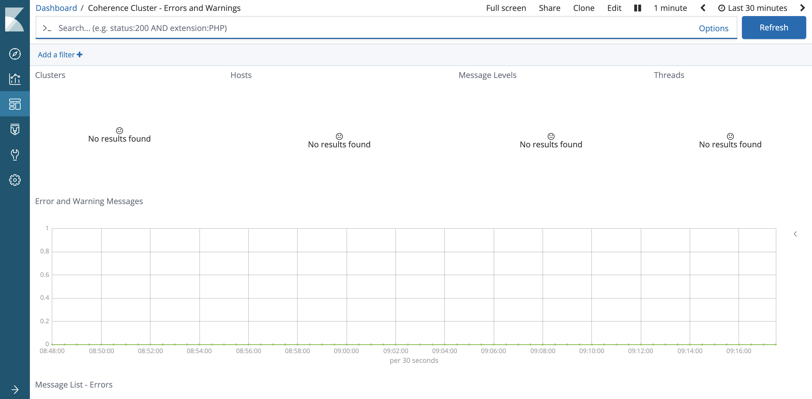

///////////////////////////////////////////////////////////////////////////////

    Copyright (c) 2019 Oracle and/or its affiliates. All rights reserved.

    Licensed under the Apache License, Version 2.0 (the "License");
    you may not use this file except in compliance with the License.
    You may obtain a copy of the License at

        http://www.apache.org/licenses/LICENSE-2.0

    Unless required by applicable law or agreed to in writing, software
    distributed under the License is distributed on an "AS IS" BASIS,
    WITHOUT WARRANTIES OR CONDITIONS OF ANY KIND, either express or implied.
    See the License for the specific language governing permissions and
    limitations under the License.

///////////////////////////////////////////////////////////////////////////////

= Kibana Dashboards

The Coherence Operator provides a number of Kibana dashboards and querires
to allow you to view and analyze logs from your Coherence clusters.

== Kibana Dashboards & Searches

== Table of Contents

. <<dashboards,Dashboards>>
.. <<all,Coherence Cluster - All Messages>>
.. <<errors,Coherence Cluster - Errors and Warnings>>
.. <<persistence,Coherence Cluster - Persistence>>
.. <<config,Coherence Cluster - Configuration Messages>>
.. <<network,Coherence Cluster - Network>>
.. <<partitions,Coherence Cluster - Partitions>>
.. <<sources,Coherence Cluster - Message Sources>>
. <<searches, Searches>>

[#dashboards]
== Dashboards

Information from all dashboards (and queries) can be filtered using the standard Kibana date/time
filtering in the top right of the UI, as well as the `Add a filter` button.

image::../images/kibana-filters.png[Filters,width="600",align="center"]

[#all]
=== 1. Coherence Cluster - All Messages

This dashboard shows all messages captured for the given time period for all clusters.

Users can drill-down by cluster, host, message level and thread.

image::../images/kibana-all-messages.png[All messages,width="900",align="center"]

[#errors]
=== 2. Coherence Cluster - Errors and Warnings

This dashboard shows errors and warning messages only.

Users can drill-down by cluster, host, message level and thread.

[#persistence]
=== 3. Coherence Cluster - Persistence

This dashboard shows Persistence related messages including failed and successful operations.

image::../images/kibana-persistence.png[Persistence,width="900",align="center"]

[#config]
=== 4. Coherence Cluster - Configuration Messages

This dashboard shows configuration related messages such as loading of operational, cache configuration
and POF configuration files.

image::../images/kibana-configuration.png[Configuration,900,align="center"]

[#network]
=== 5. Coherence Cluster - Network

This dashboard hows network related messages, such as communication delays and TCP ring disconnects.

image::../images/kibana-network.png[Network,width="900",align="center"]

[#partitions]
=== 6. Coherence Cluster - Partitions

Shows partition transfer and partition loss messages.

image::../images/kibana-partitions.png[Partitions,width="900",align="center"]

[#sources]
=== 7. Coherence Cluster - Message Sources

Shows the source (thread) for messages

Users can drill-down by cluster, host and message level.

image::../images/kibana-message-sources.png[Sources,900,447,align="center"]

[#searches]
== Searches

A number of searches are automatically includes which can help assist in
diagnosis and troubleshooting a Coherence cluster. They can be accessed via the `Discover` `side-bar
and selecting `Open`.

image::../images/kibana-search.png[Search,width="700",align="center"]

These are grouped into the following general categories:

* Cluster - Cluster join, discovery, heartbeat, member joining and stopping messages

* Cache - Cache restarting, exceptions and index exception messages

* Configuration - Configuration loading and not loading messages

* Persistence - Persistence success and failure messages

* Network - Network communications delays, disconnects, timeouts and terminations

* Partition - Partition loss, ownership and transfer related messages

* Member - Member thread dump, join and leave messages

* Errors - All Error messages only

* Federation - Federation participant, disconnection, connection, errors and other messages

