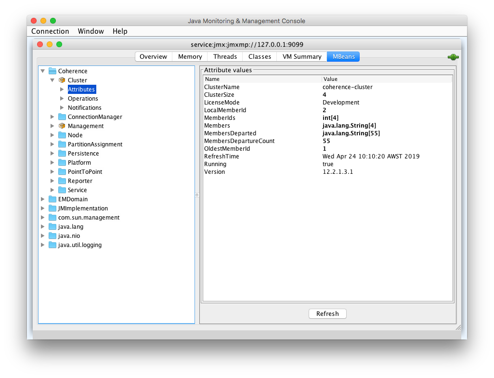

///////////////////////////////////////////////////////////////////////////////

    Copyright (c) 2020, 2023, Oracle and/or its affiliates.
    Licensed under the Universal Permissive License v 1.0 as shown at
    http://oss.oracle.com/licenses/upl.

///////////////////////////////////////////////////////////////////////////////

= Using VisualVM

https://visualvm.github.io/[VisualVM] is a visual tool integrating commandline JDK tools and lightweight profiling
capabilities, designed for both development and production time use.

== Access A Coherence Cluster via VisualVM

Coherence management is implemented using Java Management Extensions (JMX). JMX is a Java standard
for managing and monitoring Java applications and services. VisualVM and other JMX tools can be used to
manage and monitor Coherence Clusters via JMX.

The default transport used by JMX is RMI but RMI can be difficult to set-up reliably in containers and Kubernetes so
that it can be accessed externally due to its use of multiple TCP ports that are difficult to configure and it does
not work well with the NAT'ed type of networking typically found in these environments. JMXMP on the other hand is an
alternative to RMI that does work well in containers and only requires a single TCP port.

This example shows how to connect to a cluster via JMX over JMXMP.

As an alternative to JMX see <<docs/management/020_management_over_rest.adoc,Management over REST>>
for how to connect to a cluster via the VisualVM plugin using REST.

NOTE: See the https://docs.oracle.com/en/middleware/standalone/coherence/14.1.1.0/manage/introduction-oracle-coherence-management.html[Coherence Management Documentation]
for more information on JMX and Management.

[WARNING]
====
JMXMP does not support secure transports such as TLS so cannot be recommended for production use.
If used in production clusters, then the JMXMP ports should be secured behind TLS enabled ingress or
with suitable network policies.

Coherence has other mechanisms to access management APIs and metrics that do support TLS.
====

=== Prerequisites

. Install the Coherence Operator
+
Ensure you have installed the Coherence Operator using the <<docs/installation/01_installation.adoc,Install Guide>>.

. Download the JMXMP connector JAR
+
The JMX endpoint does not use RMI, instead it uses JMXMP. This requires an additional JAR on the classpath
of the Java JMX client (VisualVM and JConsole). You can use curl to download the required JAR.
+
[source,bash]
----
curl http://central.maven.org/maven2/org/glassfish/external/opendmk_jmxremote_optional_jar/1.0-b01-ea/opendmk_jmxremote_optional_jar-1.0-b01-ea.jar \
    -o opendmk_jmxremote_optional_jar-1.0-b01-ea.jar
----
+
This jar can also be downloaded as a Maven dependency if you are connecting through a Maven project.
+
[source,xml]
----
<dependency>
  <groupId>org.glassfish.external</groupId>
  <artifactId>opendmk_jmxremote_optional_jar</artifactId>
  <version>1.0-b01-ea</version>
</dependency>
----

=== Install a JMX Enabled Coherence Cluster

In this example a simple minimal cluster will be created running the MBean server.

[source,yaml]
.cluster-with-jmx.yaml
----
apiVersion: coherence.oracle.com/v1
kind: Coherence
metadata:
  name: test-cluster
spec:
  jvm:
    args:                                                  # <1>
      - -Dcoherence.management=all
      - -Dcoherence.management.remote=true
      - -Dcom.sun.management.jmxremote.ssl=false
      - -Dcom.sun.management.jmxremote.authenticate=false
    jmxmp:
      enabled: true                                        # <2>
      port: 9099
  ports:
    - name: jmx                                            # <3>
      port: 9099
----

<1> Additional system properties are added to enable Coherence management
See the https://docs.oracle.com/en/middleware/fusion-middleware/coherence/12.2.1.4/manage/introduction-oracle-coherence-management.html[Coherence Management Documentation]
<2> JMXMP is enabled on port `9099` so that a reliable JMX connection can be made to the MBean server from outside the `Pods`
<3> The JMXMP port is exposed as an additional port

The example `cluster-with-jmx.yaml` can be installed into Kubernetes with the following command:

[source,bash]
----
kubectl -n coherence-test apply -f cluster-with-jmx.yaml
----

This should install the cluster into the namespace `coherence-test` with a default replica count of three, resulting in
a `StatefulSet` with three `Pods`.

=== Port Forward the MBean Server Pod:

After installing the basic `cluster-with-jmx.yaml` from the example above there would be a three member
Coherence cluster installed into Kubernetes.

The `kubectl` CLI can be used to list `Pods` for the cluster:
[source,bash]
----
kubectl -n coherence-test get pod -l coherenceCluster=test-cluster

NAME             READY   STATUS    RESTARTS   AGE
test-cluster-0   1/1     Running   0          36s
test-cluster-1   1/1     Running   0          36s
test-cluster-2   1/1     Running   0          36s
----

In a test or development environment the simplest way to reach an exposed port is to use the `kubectl port-forward` command.
For example to connect to the first `Pod` in the deployment:
[source,bash]
----
kubectl -n coherence-test port-forward test-cluster-0 9099:9099

Forwarding from [::1]:9099 -> 9099
Forwarding from 127.0.0.1:9099 -> 9099
----

JMX can now be access using the URL `service:jmx:jmxmp://127.0.0.1:9099`

=== Access MBeans Through JConsole

. Run JConsole with the JMXMP connector on the classpath:
+
[source,bash]
----
jconsole -J-Djava.class.path="$JAVA_HOME/lib/jconsole.jar:$JAVA_HOME/lib/tools.jar:opendmk_jmxremote_optional_jar-1.0-b01-ea.jar" service:jmx:jmxmp://127.0.0.1:9099
----

. In the console UI, select the `MBeans` tab and then `Coherence Cluster` attributes.
You should see the Coherence MBeans as shown below:
+

=== Access MBeans Through VisualVM

. Ensure you run VisualVM with the JMXMP connector on the classpath:
+
[source,bash]
----
jvisualvm -cp "$JAVA_HOME/lib/tools.jar:opendmk_jmxremote_optional_jar-1.0-b01-ea.jar"
----
+
NOTE: If you have downloaded VisualVM separately (as VisualVM has not been part of the JDK from Java 9 onwards),
then the executable is `visualvm` (or on MacOS it is `/Applications/VisualVM.app/Contents/MacOS/visualvm`).

. From the VisualVM menu select `File` / `Add JMX Connection`

. Enter `service:jmx:jmxmp://127.0.0.1:9099` for the `Connection` value and click `OK`.
+
A JMX connection should be added under the `Local` section of the left hand panel.

. Double-click the new local connection to connect to the management `Pod`.
You can see the `Coherence` MBeans under the `MBeans` tab.
If you have installed the Coherence VisualVM plugin, you can also see a `Coherence` tab.
+
image:../images/jvisualvm.png[VisualVM,width="735"]

Refer to the https://docs.oracle.com/en/middleware/standalone/coherence/14.1.1.0/manage/oracle-coherence-mbeans-reference.html#GUID-5E57FA4D-9CF8-4069-A8FD-B50E4FAB2687[Coherence MBean Reference]
for detailed information about Coherence MBeans.
