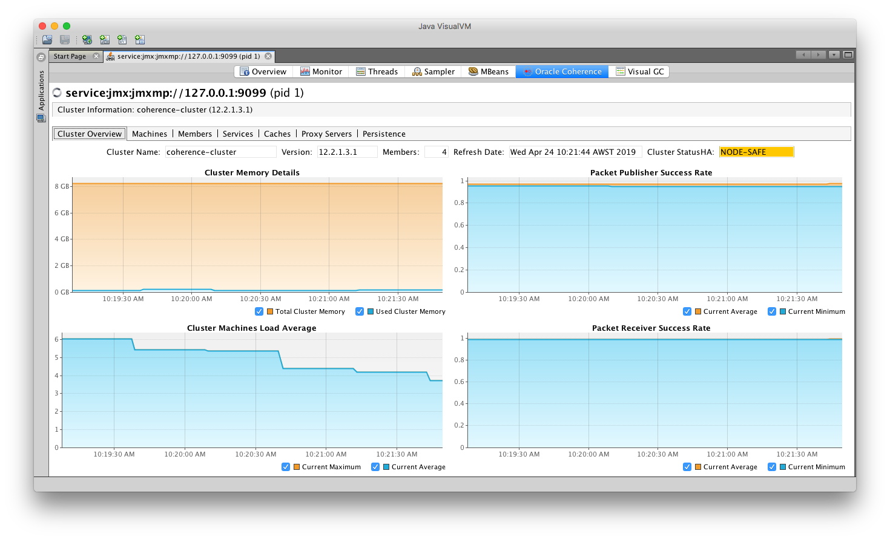

///////////////////////////////////////////////////////////////////////////////

    Copyright (c) 2019 Oracle and/or its affiliates. All rights reserved.

    Licensed under the Apache License, Version 2.0 (the "License");
    you may not use this file except in compliance with the License.
    You may obtain a copy of the License at

        http://www.apache.org/licenses/LICENSE-2.0

    Unless required by applicable law or agreed to in writing, software
    distributed under the License is distributed on an "AS IS" BASIS,
    WITHOUT WARRANTIES OR CONDITIONS OF ANY KIND, either express or implied.
    See the License for the specific language governing permissions and
    limitations under the License.

///////////////////////////////////////////////////////////////////////////////

= Using VisualVM

https://visualvm.github.io/[VisualVM] is a visual tool integrating commandline JDK tools and lightweight profiling
capabilities, designed for both development and production time use.

== Access A Coherence Cluster via VisualVM

Coherence management is implemented using Java Management Extensions (JMX). JMX is a Java standard
for managing and monitoring Java applications and services. VisualVM and other JMX tools can be used to
manage and monitor Coherence Clusters via JMX.

The default transport used by JMX is RMI but RMI can be difficult to set-up reliably in containers and Kubernetes so
that it can be accessed externally due to its use of multiple TCP ports that are difficult to configure and it does
not work well with the NAT'ed type of networking typically found in these environments. JMXMP on the other hand is an
alternative to RMI that does work well in containers and only requires a single TCP port.

This example shows how to connect to a cluster via JMX over JMXMP.

As an alternative to JMX see <<020_manegement_over_rest.adoc,Management over REST>> for how to connect to a cluster via
the VisualVM plugin using REST.

NOTE: See the https://docs.oracle.com/en/middleware/fusion-middleware/coherence/12.2.1.4/manage/introduction-oracle-coherence-management.html[Coherence Management Documentation]
for more information on JMX and Management.

=== Prerequisites

. Install the Coherence Operator
+
Ensure you have installed the Coherence Operator using the <<install/01_installation.adoc,Install Guide>>.

. Download the JMXMP connector JAR
+
The JMX endpoint does not use RMI, instead it uses JMXMP. This requires an additional JAR on the classpath
of the Java JMX client (VisualVM and JConsole). You can use curl to download the required JAR.
+
[source,bash]
----
curl http://central.maven.org/maven2/org/glassfish/external/opendmk_jmxremote_optional_jar/1.0-b01-ea/opendmk_jmxremote_optional_jar-1.0-b01-ea.jar \
    -o opendmk_jmxremote_optional_jar-1.0-b01-ea.jar
----
+
This jar can also be downloaded as a Maven dependency if you are connecting through a Maven project.
+
[source,xml]
----
<dependency>
  <groupId>org.glassfish.external</groupId>
  <artifactId>opendmk_jmxremote_optional_jar</artifactId>
  <version>1.0-b01-ea</version>
</dependency>
----

=== Install the `CoherenceCluster`

In this example a simple cluster with two roles will be created. The first role,
named `data` will be three storage enabled members. The second role named `management` will have a single replica
and will run the MBean server.

[source,yaml]
.cluster-with-jmx.yaml
----
apiVersion: coherence.oracle.com/v1
kind: CoherenceCluster
metadata:
  name: test-cluster
spec:
  roles:
    - role: data                                                  # <1>
      replicas: 3
    - role: management                                            # <2>
      replicas: 1                                                 # <3>
      coherence:
        storageEnabled: false                                     # <4>
      application:
        main: com.oracle.coherence.k8s.JmxmpServer                # <5>
      jvm:
        args:
          - -Dcoherence.management=all                            # <6>
          - -Dcoherence.management.remote=true
          - -Dcom.sun.management.jmxremote.ssl=false
          - -Dcom.sun.management.jmxremote.authenticate=false
        jmxmp:
          enabled: true                                           # <7>
      ports:
        - name: jmx                                               # <8>
          port: 9099
----

<1> This example uses a role named `data` as the storage enabled part of the cluster with three replicas
<2> The `management` role will be configured to run the MBean server
<3> Only one replica is typically required for the MBean server role
<4> The MBean server should be storage disabled
<5> The main class that the JVM should run should be the custom MBean server class `com.oracle.coherence.k8s.JmxmpServer`
<6> Additional system properties are added to enable Coherence management
See the https://docs.oracle.com/en/middleware/fusion-middleware/coherence/12.2.1.4/manage/introduction-oracle-coherence-management.html[Coherence Management Documentation]
<7> JMXMP is enabled so that a reliable JMX connection can be made to the MBean server from outside the `Pods`
<8> The default port that the JMXMP server binds to is `9099` so this port is exposed as an additional port for the
`management` role

NOTE: The default Coherence image used comes from https://container-registry.oracle.com[Oracle Container Registry]
so unless that image has already been pulled onto the Kubernetes nodes an `imagePullSecrets` field will be required
to pull the image.
See <<about/04_obtain_coherence_images.adoc,Obtain Coherence Images>>

The example `cluster-with-jmx.yaml` can be installed into Kubernetes with the following command:

[source,bash]
----
kubectl -n sample-coherence-ns apply -f cluster-with-jmx.yaml
----

This should install the cluster with two roles resulting in two `CoherenceRole` resources, two `StatefulSets` and four
`Pods` being created.

=== Check Whether the MBean server Pod is Running:

The following `kubectl` command can be used to check that the cluster is running:

[source,bash]
----
kubectl -n sample-coherence-ns get coherenceclusters
----

...which should display something like:
[source,bash]
----
NAME           ROLES
test-cluster   2             <1>
----

<1> The `test-cluster` was created and as expected has two roles.

The following `kubectl` command can be used to check that the roles is running:

[source,bash]
----
kubectl -n sample-coherence-ns get coherenceroles
----

...which should display something like:
[source,bash]
----
NAME                      ROLE         CLUSTER        REPLICAS   READY   STATUS
test-cluster-data         data         test-cluster   3          3       Ready    <1>
test-cluster-management   management   test-cluster   1          1       Ready    <2>
----

<1> The `data` role was created with three replicas and three `Pods` are ready
<2> The `management` role was created with one replica and one `Pod` is ready

NOTE: The output above may not all of the `Pods` are ready depending on how quickly the command is entered after
creating the `CoherenceCluster`, eventually all of the `Pods` should reach a ready state.

The following `kubectl` command can be used to list the `Pods`

[source,bash]
----
kubectl -n sample-coherence-ns get pods
----

...which should display something like:
[source,bash]
----
NAME                                          READY   STATUS    RESTARTS   AGE
operator-coherence-operator-5d779ffc7-6pnfk   1/1     Running   0          4m33s  <1>
test-cluster-data-0                           1/1     Running   0          2m39s  <2>
test-cluster-data-1                           1/1     Running   0          2m39s
test-cluster-data-2                           1/1     Running   0          2m39s
test-cluster-management-0                     1/1     Running   0          2m36s  <3>
----

<1> The Coherence Operator `Pod` is running in the namespace
<2> There are three pods prefixed `test-cluster-data-` that are the `Pods` for the `data` role
<3> There is one pod `test-cluster-management-0` that is the `Pod` for the `management` role

NOTE: The output above may not all of the `Pods` are ready depending on how quickly the command is entered after
creating the `CoherenceCluster`, eventually all of the `Pods` should reach a ready state.

=== (Optional) Add Data to a Cache

NOTE: If you do not carry out this step, then you will not see any `CacheMBeans`.

. The following command will run `kubectl` to exec into the first `data` role `Pod` and start an interactive
Coherence console session.
+
[source,bash]
----
kubectl exec -it --namespace sample-coherence-ns \
    test-cluster-data-0 bash /scripts/startCoherence.sh console
----

. At the `Map (?):` prompt, enter the command:
+
[source]
----
cache test
----
This will create a cache names `test` in the cache service `PartitionedCache`.

. Enter the following command to add 100,000 objects of size 1024 bytes, starting at index 0 and using batches of 100.
+
[source,bash]
----
bulkput 100000 1024 0 100
----

. When the `Map (?):` prompt returns, enter the `size` command and the console should display `100000`.

. Finally type the command `bye` and press `<enter>` to exit the `console`.

=== Port Forward the MBean Server Pod:

The simplest way to connect from a dev machine into the management node is to just use `kubectl` to forward a local
port to the management `Pod`, which is named `test-cluster-management-0`.

[source,bash]
----
kubectl --namespace sample-coherence-ns port-forward \
  test-cluster-management-0 9099:9099
----

JMX can now be access using the URL `service:jmx:jmxmp://127.0.0.1:9099`

=== Access MBeans Through JConsole

. Run JConsole with the JMXMP connector on the classpath:
+
[source,bash]
----
jconsole -J-Djava.class.path="$JAVA_HOME/lib/jconsole.jar:$JAVA_HOME/lib/tools.jar:opendmk_jmxremote_optional_jar-1.0-b01-ea.jar" service:jmx:jmxmp://127.0.0.1:9099
----

. In the console UI, select the `MBeans` tab and then `Coherence Cluster` attributes.
You should see the Coherence MBeans as shown below:
+
image:../images/jconsole.png[VisualVM,width="513"]

=== Access MBeans Through VisualVM

. Ensure you run VisualVM with the JMXMP connector on the classpath:
+
[source,bash]
----
jvisualvm -cp "$JAVA_HOME/lib/tools.jar:opendmk_jmxremote_optional_jar-1.0-b01-ea.jar"
----
+
NOTE: If you have downloaded VisualVM separately (as VisualVM has not been part of the JDK from Java 9 onwards),
then the executable is `visualvm` (or on MacOS it is `/Applications/VisualVM.app/Contents/MacOS/visualvm`).

. From the VisualVM menu select `File` / `Add JMX Connection`

. Enter `service:jmx:jmxmp://127.0.0.1:9099` for the `Connection` value and click `OK`.
+
A JMX connection should be added under the `Local` section of the left hand panel.

. Double-click the new local connection to connect to the management `Pod`.
You can see the `Coherence` MBeans under the `MBeans` tab.
If you have installed the Coherence VisualVM plugin, you can also see a `Coherence` tab.
+

Refer to the https://www.oracle.com/pls/topic/lookup?ctx=en/middleware/fusion-middleware/coherence/12.2.1.4&id=COHMG5442[Coherence MBean Reference]
for detailed information about Coherence MBeans.

=== Clean Up

Finally to clean up the cluster run the `kubectl` command:

[source,bash]
----
kubectl -n sample-coherence-ns delete -f cluster-with-jmx.yaml
----

And finally, if required, uninstall the Coherence Operator.

