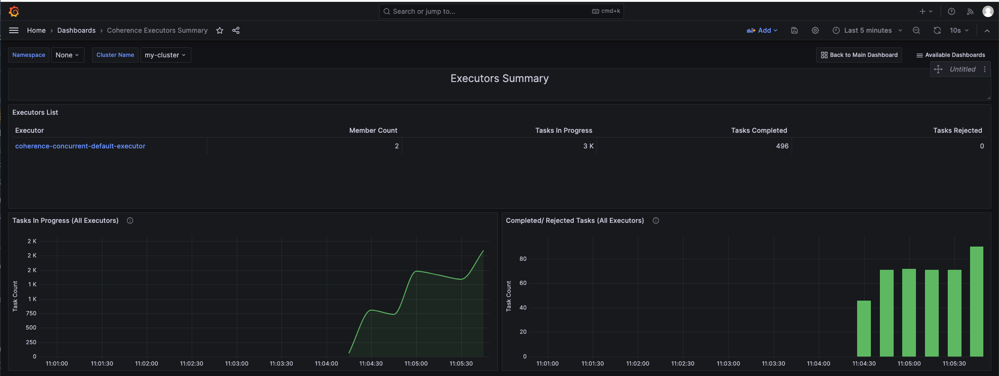
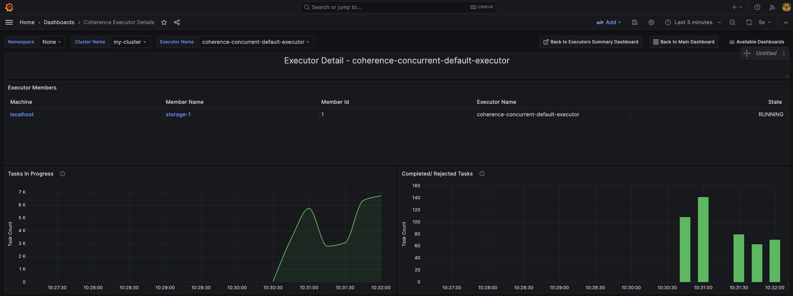

///////////////////////////////////////////////////////////////////////////////

    Copyright (c) 2020, 2024, Oracle and/or its affiliates.
    Licensed under the Universal Permissive License v 1.0 as shown at
    http://oss.oracle.com/licenses/upl.

///////////////////////////////////////////////////////////////////////////////

= Coherence Grafana Dashboards

The Coherence Operator provides detailed Grafana dashboards to provide insight into your running Coherence Clusters.

== Coherence Grafana Dashboards

NOTE: Note: The Grafana dashboards require Coherence metrics, which is available only when using Coherence version 12.2.1.4 or above.

== Table of Contents

. <<navigation, Navigation>>
. <<dashboards, Dashboards>>
.. <<main,Coherence Dashboard Main>>
.. <<members,Members Summary & Details Dashboards>>
.. <<services,Services Summary & Details Dashboards>>
.. <<caches,Caches Summary & Detail Dashboards>>
.. <<proxies,Proxy Servers Summary & Detail Dashboards>>
.. <<persistence,Persistence Summary Dashboard>>
.. <<federation,Federation Summary & Details Dashboards>>
.. <<machines,Machines Summary Dashboard>>
.. <<http,HTTP Servers Summary Dashboard>>
.. <<ed,Elastic Data Summary Dashboard>>
.. <<executors,Executors Summary & Details Dashboards>>
.. <<grpc,gRPC Proxy Summary & Details Dashboards>>
.. <<topics,Topics, Subscribers and Subscriber Groups Dashboards>>

[#navigation]
== Navigation

The pre-loaded Coherence Dashboards provide a number of common features and
navigation capabilities that appear at the top of most dashboards.

=== Variables

Allows for selection of information to be displayed where there is more than one item.

. Namespace - Allows selection of a namespace if you have multiple Coherence clusters  with the same name in multipled namespaces. Will default to `None` if you are not running in Kubernetes
. Cluster Name - Allows selection of the specific cluster to view metrics for
. Top N Limit - Limits the display of `Top` values for tables that support it
. Service Name, Member Name, Cache Name - These will appear on various dashboards

See the https://grafana.com/docs/reference/templating/[Grafana Documentation] for more information on Variables.

=== Annotations

Vertical red lines on a graph to indicate a change in a key markers such as:

. Show Cluster Size Changes - Displays when the cluster size has changed
. Show Partition Transfers - Displays when partition transfers have occurred

See the https://grafana.com/docs/reference/annotations/[Grafana Documentation] for more information on Annotations.

=== Navigation

. Select Dashboard - In the top right a drop-down list of dashboards is available selection
. Drill Through - Ability to drill through based upon service, member, node, etc on highlighted columns.

[#dashboards]
== Dashboards

[#main]
=== 1. Coherence Dashboard Main

Shows a high-level overview of the selected Coherence cluster including metrics such as:

* Cluster member count, services, memory and health

* Top N loaded members, Top N heap usage and GC activity

* Service backlogs and endangered or vulnerable services

* Top query times, non-optimized queries

* Guardian recoveries and terminations

image::../images/grafana-main.png[Dashboard Main,width="1024",align="center"]

[#members]
=== 2. Members Summary & Details Dashboards

Shows an overview of all cluster members that are enabled for metrics capture including metrics such as:

* Member list include heap usage

* Top N members for GC time and count

* Total GC collection count and time by Member

* Publisher and Receiver success rates

* Guardian recoveries and send queue size

==== Members Summary

image::../images/grafana-members.png[Members,width="1024",align="center"]

==== Member Details

[#services]
=== 3. Services Summary & Details Dashboards

Shows an overview of all cluster services including metrics such as:

* Service members for storage and non-storage services

* Service task count

* StatusHA values as well as endangered, vulnerable and unbalanced partitions

* Top N services by task count and backlog

* Task rates, request pending counts and task and request averages

==== Services Summary

==== Service Details

image::../images/grafana-service.png[Service Details,width="1024",align="center"]

[#caches]
=== 4. Caches Summary & Detail Dashboards

Shows an overview of all caches including metrics such as:

* Cache entries, memory and index usage

* Cache access counts including gets, puts and removed,  max query times

* Front cache hit and miss rates

==== Caches Summary

==== Cache Details

image::../images/grafana-cache.png[Cache Details,width="1024",align="center"]

[#proxies]
=== 5. Proxy Servers Summary & Detail Dashboards

Shows and overview of Proxy servers including metrics such as:

* Active connection count and service member count

* Total messages sent/ received

* Proxy server data rates

* Individual connection details abd byte backlogs

==== Proxy Servers Summary

image::../images/grafana-proxies.png[Proxy Servers,width="1024",align="center"]

==== Proxy Servers Detail

image::../images/grafana-proxy.png[Proxy Server Details,width="1024",align="center"]

[#persistence]
=== 6. Persistence Summary Dashboard

Shows and overview of Persistence including metrics such as:

* Persistence enabled services

* Maximum active persistence latency

* Active space total usage and by service

image::../images/grafana-persistence.png[Persistence,width="1024",align="center"]

[#federation]
=== 7. Federation Summary & Details Dashboards

Shows overview of Federation including metrics such as:

* Destination and Origins details

* Entries, records and bytes send and received

==== Federation Summary

==== Federation Details

[#machines]
=== 8. Machines Summary Dashboard

Shows an overview of all machines that make up the Kubernetes cluster underlying the Coherence cluster including metrics such as:

* Machine processors, free swap space and physical memory

* Load averages

image::../images/grafana-machines.png[Machines,width="1024",align="center"]

[#http]
=== 9. HTTP Servers Summary Dashboard

Shows an overview of all HTTP Servers running in the cluster including metrics such as:

* Service member count, requests, error count and average request time

* HTTP Request rates and response codes

[#ed]
=== 10. Elastic Data Summary Dashboard

Shows an overview of all HTTP Servers running in the cluster including metrics such as:

* RAM and Flash journal files in use

* RAM and Flash compactions

[#executors]
=== 11. Executors Summary & Details Dashboards

Shows an overview of all Executors running in the cluster including metrics such as:

* Tasks in Progress

* Completed and Rejected Tasks

* Individual Executor status

==== Executors Summary

==== Executor Details

[#grpc]
=== 12. gRPC Proxy Summary & Details Dashboards

Shows an overview of all gRPC Proxies running in the cluster including metrics such as:

* Connections

* Requests and responses

* Proxy list

==== gRPC Proxies Summary

==== gRPC Proxies Details

image::../images/grafana-proxy.png[gRPC Proxy Detail,width="1024",align="center"]

[#topics]
=== 13. Topics, Subscribers and Subscriber Groups Dashboards

Shows an overview of all Topics running in the cluster including metrics such as:

* Topics, Subscribers and Subscriber Groups

* Published and received messages counts

* Topic channel allocations

==== Topics Summary

==== Topic Details

==== Topic Subscriber Group

==== Topic Subscriber

