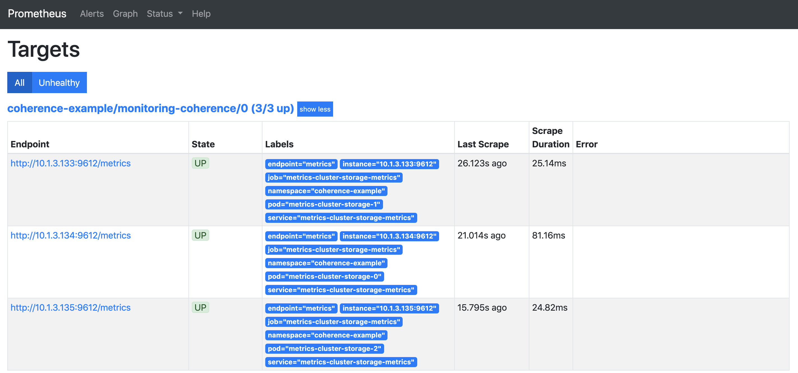

///////////////////////////////////////////////////////////////////////////////

    Copyright (c) 2019 Oracle and/or its affiliates. All rights reserved.

    Licensed under the Apache License, Version 2.0 (the "License");
    you may not use this file except in compliance with the License.
    You may obtain a copy of the License at

        http://www.apache.org/licenses/LICENSE-2.0

    Unless required by applicable law or agreed to in writing, software
    distributed under the License is distributed on an "AS IS" BASIS,
    WITHOUT WARRANTIES OR CONDITIONS OF ANY KIND, either express or implied.
    See the License for the specific language governing permissions and
    limitations under the License.

///////////////////////////////////////////////////////////////////////////////

= Using Your Own Prometheus

If required, you can scrape the metrics from your own Prometheus Operator instance rather
than using the `prometheusopeartor` subchart included with the Coherence Operator.

== Scraping metrics from your own Prometheus instance

NOTE: Note: Use of metrics is available only when using the operator with clusters running
Coherence 12.2.1.4 or later version.

This example shows you how to scrape metrics from your own Prometheus instance.

[#install]
=== 1. Install the Coherence Operator with Prometheus disabled

A more complete helm install command to enable Prometheus is as follows:

[source,bash]
----
helm install \
    --namespace <namespace> \  <1>
    --name coherence-operator \
    coherence/coherence-operator
----
<1> Set `<namespace>` to the Kubernetes namespace that the Coherence Operator should be installed into.

After the installation completes, list the pods in the namespace that the Operator was installed into:
[source,bash]
----
kubectl -n <namespace> get pods
----

The results returned should only show the Coherence Operator.

[source,bash]
----
NAME                                                   READY   STATUS    RESTARTS   AGE
operator-coherence-operator-5d779ffc7-7xz7j            1/1     Running   0          53s
----

=== 2. Install Prometheus Operator (Optional)

Id you do not already have a Prometheus environment installed, you can use the `Prometheus Operator`
chart from https://github.com/helm/charts/tree/master/stable/prometheus-operator using the following:

[source,bash]
----
helm install stable/prometheus-operator --namespace <namespace> --name prometheus \
      --set prometheusOperator.createCustomResource=false
----

=== 3. Create a ServiceMonitor

Create a ServiceMonitor with the following configuration to instruct Prometheus to scrape the Coherence Pods.

[source,yaml]
.service-monitor.yaml
----
apiVersion: monitoring.coreos.com/v1
kind: ServiceMonitor
metadata:
  name: monitoring-coherence
  namespace: coherence-example
  labels:
    release: prometheus         <1>
spec:
  selector:
    matchLabels:
      component: coherencePod   <2>
  endpoints:
  - port: metrics               <3>
    interval: 30s
  namespaceSelector:
    matchNames:
      - coherence-example
----

<1> Match the Prometheus Operator release name
<2> Scrape all Pods that match component=`coherencePod`
<3> The metrics Pod to Scrape

The yaml above can be installed into Kubernetes using `kubectl`:

[source,bash]
----
kubectl create -n <namespace>-f service-monitor.yaml
----

See the https://github.com/coreos/prometheus-operator[Prometheus Operator] documentation
for more information on ServiceMonitors usage.

[#install-coh]
=== 4. Install a Coherence Cluster with Metrics Enabled

Now that Prometheus is running Coherence clusters can be created that expose metrics on a port on each `Pod`.

Deploy a simple metrics enabled `CoherenceCluster` resource with a single role like this:
[source,yaml]
.metrics-cluster.yaml
----
apiVersion: coherence.oracle.com/v1
kind: CoherenceCluster
metadata:
  name: metrics-cluster
spec:
  role: storage
  replicas: 3
  coherence:
    metrics:
      enabled: true
      port: 9612
  ports:
    - name: metrics
      port: 9612
----

The yaml above can be installed into Kubernetes using `kubectl`:

[source,bash]
----
kubectl -n <namespace> create -f metrics-cluster.yaml
----

[source,bash]
----
kubectl -n <namespace> get pods

NAME                                                     READY   STATUS    RESTARTS   AGE
alertmanager-prometheus-prometheus-oper-alertmanager-0   2/2     Running   0          51m
coherence-operator-8465cf7d88-7hw4g                      1/1     Running   0          81m
metrics-cluster-storage-0                                1/1     Running   0          12m
metrics-cluster-storage-1                                1/1     Running   0          12m
metrics-cluster-storage-2                                1/1     Running   0          12m
prometheus-grafana-757f7c9f6d-brqvb                      2/2     Running   0          51m
prometheus-kube-state-metrics-5ffdf76ddd-86qg4           1/1     Running   0          51m
prometheus-prometheus-node-exporter-4d9qx                1/1     Running   0          51m
prometheus-prometheus-oper-operator-64cd6c6c45-5ql2k     2/2     Running   0          51m
prometheus-prometheus-prometheus-oper-prometheus-0       3/3     Running   1          51m
----

=== 5. Validate that Prometheus can see the Pods

Port-forward the Prometheus port using the following:

[source,bash]
----                                                                                                
kubectl -n <namespace> port-forward prometheus-prometheus-prometheus-oper-prometheus-0 9090:9090

Forwarding from 127.0.0.1:9090 -> 9090
Forwarding from [::1]:9090 -> 9090
----

Access the following endpoint to confirm that Prometheus is scraping the pods:

http://127.0.0.1:9090/targets

The following should be displayed indicating the Coherence Pods are being scraped.

=== 6. Access Grafana and Load the Dashboards

Port-forward the Grafana port using the following, replacing the grafana pod 

[source,bash]
----
kubectl port-forward $(kubectl get pod -n <namespace> -l app=grafana -o name) -n <namespace> 3000:3000

Forwarding from 127.0.0.1:9090 -> 9090
Forwarding from [::1]:9090 -> 9090
----

Access Grafana via the following URL: http://127.0.0.1:3000/

NOTE: The Grafana credentials are username `admin` password `prom-operator`

Once logged in, highlight the `+` icon and select `Import`.

Import all of the Grafana dashboards from the following location: https://github.com/oracle/coherence-operator/helm-charts/coherence-operator/dashboards

Once all the dashboards have been loaded, you can access the Main dasbohard via: http://127.0.0.1:3000/d/coh-main/coherence-dashboard-main

==== 7. Uninstall the Coherence Cluster & Prometheus

[source,bash]
----
kubectl delete -n <namespace> -f metrics-cluster.yaml

coherencecluster.coherence.oracle.com "metrics-cluster" deleted

helm delete prometheus --purge

release "prometheus" deleted
----