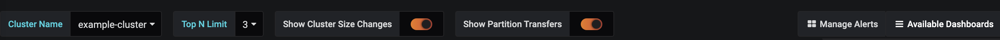
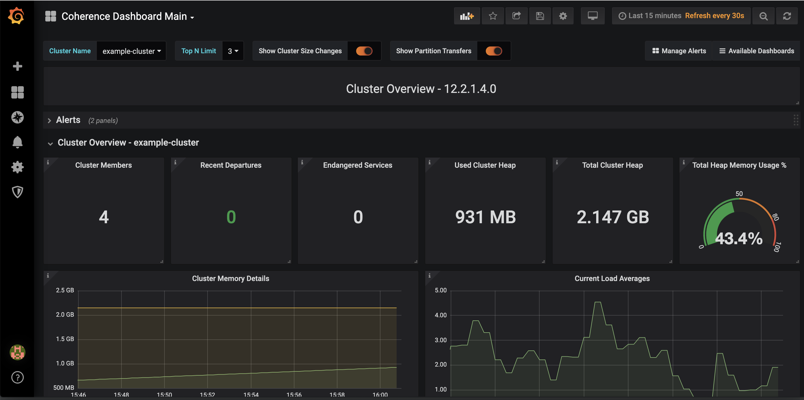

///////////////////////////////////////////////////////////////////////////////

    Copyright (c) 2019 Oracle and/or its affiliates. All rights reserved.

    Licensed under the Apache License, Version 2.0 (the "License");
    you may not use this file except in compliance with the License.
    You may obtain a copy of the License at

        http://www.apache.org/licenses/LICENSE-2.0

    Unless required by applicable law or agreed to in writing, software
    distributed under the License is distributed on an "AS IS" BASIS,
    WITHOUT WARRANTIES OR CONDITIONS OF ANY KIND, either express or implied.
    See the License for the specific language governing permissions and
    limitations under the License.

///////////////////////////////////////////////////////////////////////////////

= Grafana Dashboards

The Coherence Operator provides detailed Grafana dashboards to provide insight into your running Coherence Clusters.

== Grafana Dashboards

NOTE: Note: Use of metrics is available only when using the operator with clusters running
Coherence 12.2.1.4 or later version.

Please see <<clusters/060_coherence_metrics#ssl,Coherence Metrics Documentation>> for information on how to enable SSL.

== Table of Contents

. <<navigation, Navigation>>
. <<dashboards, Dashboards>>
.. <<main,Coherence Dashboard Main>>
.. <<members,Members Summary & Details Dashboards>>
.. <<services,Services Summary & Details Dashboards>>
.. <<caches,Caches Summary & Detail Dashboards>>
.. <<proxies,Proxy Servers Summary & Detail Dashboards>>
.. <<persistence,Persistence Summary Dashboard>>
.. <<federation,Federation Summary & Details Dashboards>>
.. <<machines,Machines Summary Dashboard>>
.. <<http,HTTP Servers Summary Dashboard>>
.. <<ed,Elastic Data Summary Dashboard>>

[#navigation]
== Navigation

The pre-loaded Coherence Dashboards provide a number of common features and
navigation capabilities.

. Variables
.. Cluster Name - Allows selection of the cluster to view metrics for
.. Top N Limit - Limits the display of `Top` values for tables that support it
. Annotations - Vertical red lines on a graph to indicate a change
.. Show Cluster Size Changes - Displays when the cluster size has changed
.. Show Partition Transfers - Displays when partition transfers have occurred
. Navigation
.. Select Dashboard - In the top right a drop down list of dashboards is available selection
.. Drill Through - Ability to drill through based upon service, member, node, etc.

[#dashboards]
== Dashboards

[#main]
=== 1. Coherence Dashboard Main

Provides a high-level overview of the selected Coherence cluster including:

* Cluster members, services, memory and health

* Top loaded members, Top heap usage and GC activity

* Service backlogs and endangered or vulnerable services

* Top query times, non-optimized queries

* Guardian recoveries and terminations

[#members]
=== 2. Members Summary & Details Dashboards

[#services]
=== 3. Services Summary & Details Dashboards

[#caches]
=== 4. Caches Summary & Detail Dashboards

[#proxies]
=== 5. Proxy Servers Summary & Detail Dashboards

[#persistence]
=== 6. Persistence Summary Dashboard

[#federation]
=== 7. Federation Summary & Details Dashboards

[#machines]
=== 8. Machines Summary Dashboard

[#http]
=== 9. HTTP Servers Summary Dashboard

[#ed]
=== 10. Elastic Data Summary Dashboard

