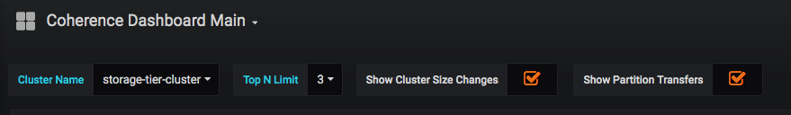
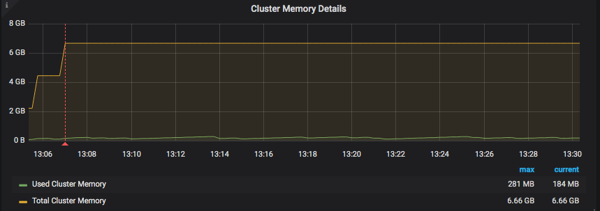
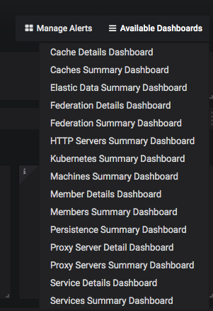

# Monitoring Coherence Services via Grafana Dashboards

The Coherence Operator (the "operator") includes the Prometheus Operator as an optional subchart named, `prometheusoperator`.
To configure the Prometheus Operator and monitor Coherence services via Grafana dashboards, follow the instructions:

> **Note:** Use of Prometheus and Grafana is available only when using the
> operator with Coherence 12.2.1.4.


This use-case is covered in the samples. Refer to the [samples documentation](docs/samples/operator/metrics/enable-metrics/).

## Install the Charts

When you install the `coherence-operator` chart, you must specify the following
additional set value for `helm` to install the subchart, `prometheusoperator`.

```bash
--set prometheusoperator.enabled=true
```

All `coherence` charts installed in `coherence-operator` `targetNamespaces` are monitored by
Prometheus. The servicemonitor, `<releasename>-coherence-service-monitor`
configures Prometheus to scrape all components of `coherence-service`.


## Port Forward Grafana

After you install the charts, use the following script to port forward the Grafana pod:

```bash
#!/bin/bash

trap "exit" INT

while :
do
  kubectl port-forward $(kubectl get pods --selector=app=grafana -n namespace --output=jsonpath="{.items..metadata.name}") -n namespace 3000:3000
done
```

> **Note:** Since port forwarding is sometimes unreliable, it should be used only as a development tool, and not in a production environment.

## Log in to Grafana

In a browser, go to the URL, `http://127.0.0.1:3000/d/coh-main/coherence-dashboard-main` to access the main Coherence dashboard.

On the Grafana login page, enter the login id, `admin` and the password, `prom-operator`.

Click `Home` on the upper left corner of the page to get a list of preconfigured dashboards.
Click ` Coherence Dashboard Main`.


### Default Dashboards

There are a number of dashboards created via the import process.

* Coherence Dashboard main for inspecting coherence cluster(s)

* Coherence Cluster Members Summary and Details

* Coherence Cluster Members Machines Summary

* Coherence Cache Summary and Details

* Coherence Services Summary and Details

* Coherence Proxy Servers Summary and Details

* Coherence Elastic Data Summary

* Coherence Cache Persistence Summary

* Coherence Http Servers Summary

## Navigate the Dashboards

The Grafana dashboards created to monitor Coherence Clusters have some common UI elements and navigation patterns:

* Variables and Annotations

   At the top left of the dashboard,  [variables](https://grafana.com/docs/reference/templating/) that are changeable and affect the
   queries in the dashboards are displayed. Similarly, [annotations](https://grafana.com/docs/reference/annotations/), that
   indicate events on the dashboard, can be enabled or disabled.

   

   `ClusterName` is a common variable that can be used to choose the cluster to display information for.

   `Show Cluster Size Changed` is an annotation that shows the time over which the cluster size has changed. All
   annotations appear as a red vertical line as shown below:

   

* Access other dashboards

   On the right of the page, you can click `Available Dashboards` to view all available dashboards.

   

## Configure your Prometheus Operator to Scrape Coherence pods

This section assumes that you do not want the coherence-operator's helm subchart,`prometheusoperator` installed.
It provides information on how to configure what is automated by using coherence-operator helm chart parameter
`prometheusoperator.enabled`=`true`.

Refer to the Prometheus Operator documentation to understand how to configure and deploy a service monitor for
your own Prometheus Operator installation. This section only describes the service monitor configuration as it
relates to the Coherence helm chart.

coherence-service-monitor.yaml fragment:
```
...
spec:
  selector:
    matchLabels:
      component: "coherence-service"
...      
endpoints:
  - port: 9612
```

If the Coherence helm chart parameter `service.metricsHttpPort` is set when installing the Coherence helm chart,
replace `9612` above with the new value.

If the Coherence helm chart parameter `store.metrics.ssl.enabled` is set to `true`, then add  `endpoints.scheme` with the value of `https`
to the `coherence-service-monitor.yaml` fragment.

## Troubleshoot

### Helm install of `coherence-operator` fails, creating a custom resource definition (CRD)

The helm installation for `coherence-operator` fails, creating a custom resource definition (CRD). When you see this error, follow the recommendation in [Prometheus Operator: helm fails to create CRDs](https://github.com/helm/charts/tree/master/stable/prometheus-operator#user-content-helm-fails-to-create-crds)
to manually install the Prometheus Operator CRDs, and then install the `coherence-operator` chart with these additional set values.

```bash
--set prometheusoperator.enabled=true --set prometheusoperator.prometheusOperator.createCustomResource=false
```

### No datasource found

When you see this error, manually create a datasource by clicking `Create your first data source` on the Grafana Home page, and fill in the following fields:

```bash
   Name:      Prometheus
   HTTP URL:  http://prometheus-operated.<namespace>.svc.cluster.local:9090
```
Ensure that this datasource is set as the default.
Click `Save & Test`.
