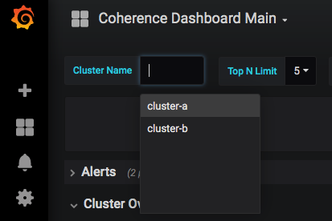

# Installing Multiple Coherence clusters with one Operator

The Coherence Operator can managed one or more Coherence clusters.

[Return to Coherence Deployments samples](../) / [Return to samples](../../README.md#list-of-samples)

* Prometheus: `--set prometheusoperator.enabled=true`

* Log capture: `--set logCaptureEnabled=true`

## Prerequisites

Ensure you have already installed the Coherence Operator by using the instructions [here](../../README.md#install-the-coherence-operator)
and make sure you set `--set prometheusoperator.enabled=true` so you will be able to view multiple clusters in Prometheus.

## Installation Steps

1. Install first Coherence cluster `cluster-a`

   for each of the clusters, we only create 2 pods to save on resources.

   ```bash
   $ helm install \
      --namespace sample-coherence-ns \
      --name cluster-a \
      --set clusterSize=2 \
      --set cluster=cluster-a \
      --set imagePullSecrets=sample-coherence-secret \
      --set prometheusoperator.enabled=true \
      --set logCaptureEnabled=false \
      --version 1.0.0-SNAPSHOT coherence-community/coherence
   ```
   
1. Install second Coherence cluster `cluster-b`

   for each of the clusters, we only create 2 pods to save on resources.

   ```bash
   $ helm install \
      --namespace sample-coherence-ns \
      --name cluster-b \
      --set clusterSize=2 \
      --set cluster=cluster-b \
      --set imagePullSecrets=sample-coherence-secret \
      --set prometheusoperator.enabled=true \
      --set logCaptureEnabled=false \
      --version 1.0.0-SNAPSHOT coherence-community/coherence
   ```

## Access Grafana

Use the `port-forward-grafana.sh` script in the [../../common](../../common) directory to view metrics.

1. Start the port-forward

   ```bash
   $ ./port-forward-grafana.sh sample-coherence-ns

   Forwarding from 127.0.0.1:3000 -> 3000
   Forwarding from [::1]:3000 -> 3000
   ```
   
1. Access Grafana using the following URL:

   [http://127.0.0.1:3000/d/coh-main/coherence-dashboard-main](http://127.0.0.1:3000/d/coh-main/coherence-dashboard-main)

   * Username: admin  

   * Password: prom-operator

1. Verify the two clusters appear

   Click on the drop-down next to the `Cluster Name` variable at the top.  You should see the two clusters
   listed as below.
   
   
   
## Uninstalling the Charts


Carry out the following commands to delete the charts installed in this sample.

```bash
$ helm delete cluster-a cluster-b --purge
```

Before starting another sample, ensure that all the pods are gone from previous sample.

If you wish to remove the `coherence-operator`, then include it in the `helm delete` command above.
