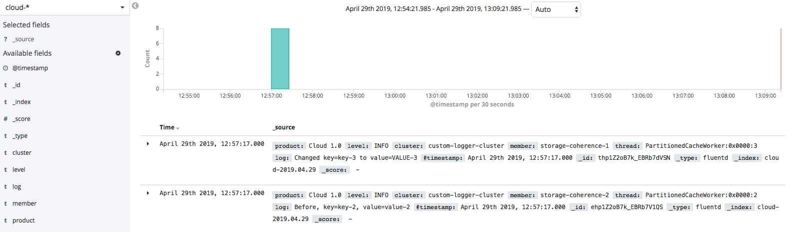

# Configure custom logger and view in Kibana 

The Oracle Coherence Operator manages logging data through the EFK
(ElasticSearch, Fluentd and Kibana) stack.

This sample shows how to configure your own application logger, called `cloud` and have the logs 
from this logger captured via Fluentd, passed into Elasticsearch and displayed in Kibana. 

A server-side Interceptor updates values to upper case and writes log messages to the `cloud` logger.

[Return to Logging samples](../) / [Return to Coherence Operator samples](../../) / [Return to samples](../../../README.md#list-of-samples)

## Sample files

* [src/main/docker/Dockerfile](src/main/docker/Dockerfile) - Dockerfile for creating side-car image from which configuration
  and server side jar will be read from at pod startup

* [src/main/resources/conf/custom-logging.properties](src/main/resources/conf/custom-logging.properties) - custom logging.properties file with `cloud` logger

* [src/main/resources/conf/fluentd-cloud.conf](src/main/resources/conf/fluentd-cloud.conf) - Fluentd configuration for `cloud` logger

* [src/main/java/com/oracle/coherence/examples/CustomFileHandler.java](src/main/java/com/oracle/coherence/examples/CustomFileHandler.java) - Logger for custom 'sample' logger

* [src/main/java/com/oracle/coherence/examples/UppercaseLoggingInterceptor.java](src/main/java/com/oracle/coherence/examples/UppercaseLoggingInterceptor.java) - interceptor to update values to upper case and use custom logger

## Prerequisites

Ensure you have already installed the Coherence Operator with `--set logCaptureEnabled=true` by using the instructions [here](../../../README.md#install-the-coherence-operator).

## Installation Steps

1. Change to the `samples/operator/logging/custom-logs` directory and ensure you have your maven build     
   environment set for JDK11 and build the project.

   ```bash
   mvn clean install -P docker
   ```

   The above will build the Docker image with the cache and login configuration as well as compiled Java classes
   
   > Note: If you are running against a remote Kubernetes cluster you will need to
   > push the above image to your repository accessible to that cluster. You will also need to 
   > prefix the image name in your `helm` command below.

1. The result of the above is the docker image will be built with the cache configuration files
   and compiled Java classes with the name in the format custom-logger-sample:{version}.

   For Example:

   ```bash
   custom-logger-sample:1.0.0-SNAPSHOT
   ```

   **Note:** If you are running against a remote Kubernetes cluster you will need to
   push the above image to your repository accessible to that cluster.

1. Install the Coherence cluster

   The following additional options are set:
   
   * `--set logCaptureEnabled=true` - enable log catpure
   
   * `--set userArtifacts.image=custom-logger-sample:1.0.0-SNAPSHOT` - custom image with config and classes
   
   * `--set store.logging.configFile=custom-logging.properties` - configure custom logger
   
   * `--set fluentd.application.configFile=/conf/fluentd-cloud.conf` - include custom fluentd.conf for `cloud` logger
   
   * `--set fluentd.application.tag=cloud` - set the fluentd application tag
   
   ```bash
   $ helm install \
      --namespace sample-coherence-ns \
      --name storage \
      --set clusterSize=3 \
      --set cluster=custom-logger-cluster \
      --set imagePullSecrets=sample-coherence-secret \
      --set store.cacheConfig=storage-cache-config.xml \
      --set prometheusoperator.enabled=false \
      --set logCaptureEnabled=true \
      --set userArtifacts.image=custom-logger-sample:1.0.0-SNAPSHOT \
      --set store.logging.configFile=custom-logging.properties \
      --set fluentd.application.configFile=/conf/fluentd-cloud.conf \
      --set fluentd.application.tag=cloud \
      --version 1.0.0-SNAPSHOT coherence-community/coherence
   ```

   Use `kubectl get pods -n sample-coherence-ns` to ensure that all pods are running.
   All 3 storage-coherence-0/1/2 pods should be running and ready, as below:

   ```bash
   NAME                                  READY   STATUS    RESTARTS   AGE
   coherence-operator-7f596c6796-9v5m4   2/2     Running   0          58m
   elasticsearch-5b5474865c-glrl8        1/1     Running   0          58m
   kibana-f6955c4b9-f959q                1/1     Running   0          58m
   storage-coherence-0                   2/2     Running   0          2m
   storage-coherence-1                   2/2     Running   0          1m
   storage-coherence-2                   2/2     Running   0          1m
   ```
          
1. Port forward the proxy port on the storage-coherence-0 pod.

   ```bash
   $ kubectl port-forward -n sample-coherence-ns storage-coherence-0 20000:20000
   ```

1. Connect via QueryPlus and issue CohQL commands

   Issue the following command to run QueryPlus:

   ```bash
   $ mvn exec:java
   ```

   Run the following CohQL commands to insert data into the cluster.

   ```sql
   insert into 'test' key('key-1') value('value-1');
   insert into 'test' key('key-2') value('value-2');
   insert into 'test' key('key-3') value('value-3');
   insert into 'test' key('key-4') value('value-4');
   ```
   
   Verify the data:
   
   ```sql
   select key(), value() from 'test';
   Results
   ["key-4", "VALUE-4"]
   ["key-2", "VALUE-2"]
   ["key-1", "VALUE-1"]
   ["key-3", "VALUE-3"]
   ```    
   
   From the above, you can see that the server side interceptor has changed the value
   to uppercase.
   
1. Confirm the log message can be seen 
   
   ```bash
   $ kubectl exec -it  storage-coherence-0  -n sample-coherence-ns -c coherence -- bash -c 'cat /logs/cloud*.log'
   
   2019-04-29 04:45:03 Cloud 1.0 <INFO> (cluster=custom-logger-cluster, member=storage-coherence-0, thread=PartitionedCacheWorker:0x0000:5): Before, key=key-4, value=value-4
   2019-04-29 04:45:03 Cloud 1.0 <INFO> (cluster=custom-logger-cluster, member=storage-coherence-0, thread=PartitionedCacheWorker:0x0000:5): Changed key=key-4 to value=VALUE-4
   ``` 
   
   *Note*: Depending upon the data distribution, not all members will show the messages.
   
## Verifying Kibana Logs

1. Access Kibana

   Access Kibana using the instructions [here](../../../README.md#access-kibana).
   
1. Create an Index Pattern

   * After logging in, click on `Management`, `Index Patterns` the `Create index pattern`.
   
   * Set the name to `cloud-*`. This show that this matches 1 index such as `cloud-2019.04.29`.
   
   * Click `Next Step` and select the `@timestamp` field and click on `Create index pattern`.
   
   >Note: It may take up to 5 minutes for the data to reach the elasticsearch instance.
   
1. View data from the `cloud-*` index pattern

   * Click on `Discover` and then the drop-down where it shows `coherence-cluster-*` and select `cloud-*`.
   
     
   
   * When you click `Refresh` you will now see the data from the custom logger:
   
      

## Uninstalling the Charts

Carry out the following commands to delete chart installed in this sample.

```bash
helm delete storage --purge
```

Before starting another sample, ensure that all the pods are gone from previous sample.

If you wish to remove the `coherence-operator`, then include it in the `helm delete` command above.
