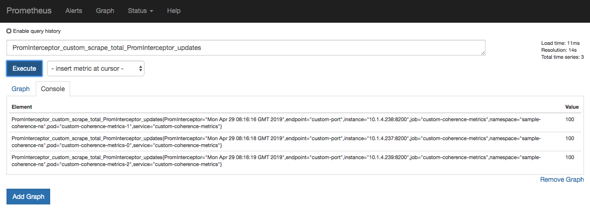

# Include custom user metrics for scraping by Prometheus

This sample shows how an end-user can include their own custom metrics 
for scraping by Prometheus.

> **Note:** use of Prometheus and Grafana is only available when using the
> operator with Coherence 12.2.1.4.

[Return to Metrics samples](../) / [Return to Coherence Operator samples](../../) / [Return to samples](../../../README.md#list-of-samples)

## Sample files

* [src/main/docker/Dockerfile](src/main/docker/Dockerfile) - Dockerfile for creating side-car image from which configuration
  and server side jar will be read from at pod startup

* [src/main/yaml/servicemonitoring.yaml](src/main/yaml/servicemonitoring.yaml) - servicemonitor to allow Prometheus to scrape custom endpoint

* [src/main/resources/conf/prometheus-server-cache-config.xml](src/main/resources/conf/prometheus-server-cache-config.xml) - server side cache config with interceptor

* [src/main/resources/conf/client-cache-config.xml](src/main/resources/client-cache-config.xml) - cache config for CohQL client

* [src/main/java/com/oracle/coherence/examples/PromInterceptor.java](src/main/java/com/oracle/coherence/examples/PromInterceptor.java) - Interceptor to create metrics

## Installation Steps

1. Install Coherence Operator

   When you install the `coherence-operator` chart, you must specify the following
   additional set value for `helm` to install subchart `prometheusoperator`.
  
   ```bash
   --set prometheusoperator.enabled=true
   ```
  
   All `coherence` charts installed in `coherence-operator` `targetNamespaces` are monitored by 
   Prometheus. The servicemonitor `<releasename>-coherence-service-monitor` 
   configures Prometheus to scrape all components of `coherence-service`.

   Issue the following command to install `coherence-operator` with `prometheusoperator` enabled:
   
   ```bash
   $ helm install \
      --namespace sample-coherence-ns \
      --set imagePullSecrets=sample-coherence-secret \
      --name coherence-operator \
      --set prometheusoperator.enabled=true \
      --set prometheusoperator.prometheusOperator.createCustomResource=false \
      --set "targetNamespaces={sample-coherence-ns}" \
      coherence/coherence-operator
   ```
   
   Once the install has completed, issue the following command to list the pods:
   
   ```bash
   $ kubectl get pods -n sample-coherence-ns
   NAME                                                     READY   STATUS    RESTARTS   AGE
   coherence-operator-66f9bb7b75-q2w8t                      1/1     Running   0          34s
   coherence-operator-grafana-769bb4d5cb-xwm9w              3/3     Running   0          35s
   coherence-operator-kube-state-metrics-5d5f6855bd-hh7cv   1/1     Running   0          35s
   coherence-operator-prometh-operator-58bd58ddfd-rldqk     1/1     Running   0          34s
   coherence-operator-prometheus-node-exporter-n9ls7        1/1     Running   0          35s
   prometheus-coherence-operator-prometh-prometheus-0       3/3     Running   1          21s
   ```
   
   Along with the `coherence-operator`, you should also see `grafana` and other `promethues` related pods.
   
1. Change to the `samples/operator/metrics/custom-metrics` directory and ensure you have your maven build environment set for JDK8 and build the project.

   ```bash
   $ mvn clean install -P docker,coherence12214 -P coherence.version=12.2.1-4-0 
   ```

   The above will build the Docker image called `custom-metrics-sample:1.0.0-SNAPSHOT`. 
   
   > **Note:** If you are running against a remote Kubernetes cluster you will need to
   > push the above image to your repository accessible to that cluster. You will also need to 
   > prefix the image name in your `helm` command below.
   
1. Install servicemonitor

   ```bash
   $ kubectl create -f src/main/yaml/servicemonitoring.yaml

   $ kubectl get servicemonitors -n sample-coherence-ns
   NAME                                                 CREATED AT
   coherence-operator-coherence-service-monitor         55m
   coherence-operator-prometh-apiserver                 55m
   coherence-operator-prometh-coredns                   55m
   coherence-operator-prometh-kube-controller-manager   55m
   coherence-operator-prometh-kube-etcd                 55m
   coherence-operator-prometh-kube-scheduler            55m
   coherence-operator-prometh-kube-state-metrics        55m
   coherence-operator-prometh-kubelet                   55m
   coherence-operator-prometh-node-exporter             55m
   coherence-operator-prometh-operator                  55m
   coherence-operator-prometh-prometheus                55m
   custom-coherence-monitor                             1m
   ```   
   
   This will allow Prometheus to discover the metrics endpoints.

1. Install the Coherence cluster with custom-metrics-sample:1.0.0-SNAPSHOT image as a sidecar.

   The following additional options are set:
   
   * `--set store.ports.custom-port=8200` - custom metrics port
   
   * `--name custom-coherence-metrics` 
   
   * `--set cluster=metrics-cluster` - matches spec.selector.matchLabels in [servicemonitoring.yaml](src/main/yaml/servicemonitoring.yaml)
   ```bash
   $ helm install \
      --namespace sample-coherence-ns \
      --name custom-coherence-metrics \
      --set clusterSize=3 \
      --set cluster=metrics-cluster \
      --set imagePullSecrets=sample-coherence-secret \
      --set store.cacheConfig=prometheus-server-cache-config.xml \
      --set prometheusoperator.enabled=true \
      --set userArtifacts.image=custom-metrics-sample:1.0.0-SNAPSHOT \
      --set store.ports.custom-port=8200 \
      coherence/coherence
   ```
    
   Once the install has completed, issue the following command to list the pods:

   ```bash
   $ kubectl get pods -n sample-coherence-ns
   NAME                         READY   STATUS    RESTARTS   AGE
   custom-coherence-metrics-0   1/1     Running   0          4m
   custom-coherence-metrics-1   1/1     Running   0          3m
   custom-coherence-metrics-2   1/1     Running   0          1m
   ```
   
1. Port forward the proxy port on the storage-coherence-0 pod.

   ```bash
   $ kubectl port-forward -n sample-coherence-ns custom-coherence-metrics-0 20000:20000
   ```
   
1. Port forward Prometheus

   Port-forward and access Prometheus using the instructions [here](../../../README.md#access-prometheus).
   
1. Check Prometheus targets

   Access the following URL to check that the new targets were discovered:
   
   ```bash
   http://127.0.0.1:9090/targets
   ```  
   
   Because we have not created any caches, the endpoints will be down.
   
   Tail the log of one of the Coherence pods:
   
   ```bash
   $ kubectl logs custom-coherence-metrics-0 -n sample-coherence-ns -f
   ```   
   
1. Connect via QueryPlus and issue CohQL commands

   Issue the following command to run QueryPlus:

   ```bash
   $ mvn exec:java
   ```

   Run the following CohQL commands to insert data into the cluster.

   ```sql
   insert into 'test' key('key-1') value('value-1');
   insert into 'test' key('key-2') value('value-2');
   insert into 'test' key('key-3') value('value-3');

   select key(), value() from 'test';
   Results
   ["key-1", "value-1"]   
   ["key-2", "value-2"]   
   ["key-3", "value-3"]
   ```
   
   In the `tail` of the Coherence pods started above, you should see some messages indicating that
   the cache has been created and the metrics are available.
   
   ```bash
   Creating a custom metrics endpoint for cache test...
   Custom metrics HTTP server started.
   PromInterceptor: http server handler handle request
   PromInterceptor: http server handler response: PromInterceptor_custom_scrape_total_PromInterceptor_updates{PromInterceptor="Mon Apr 29 08:10:48 GMT 2019"} 100
   ```
   
1. Confirm the the Prometheus endpoints are UP

   Access the following URL to check that the new targets are up:
   
   ```
   http://127.0.0.1:9090/targets
   ```  
   
   You should see that three endpoints on port 8200 are up:
   
   ```bash
   http://10.1.4.XXX:8200/metrics
   http://10.1.4.YYY:8200/metrics
   http://10.1.4.ZZZ:8200/metrics
   ```

1. Query data in Prometheus

   Access `http://localhost:9090/graph` and execute the query `PromInterceptor_custom_scrape_total_PromInterceptor_updates`.
   
   You should see a screen similar to the following indicating that the data is present.
   
    
   
   
## Uninstalling the Charts

Carry out the following commands to delete chart installed in this sample.

```bash
helm delete custom-coherence-metrics --purge
```

You must also delete the `servicemonitor` created.

```bash
$ kubectl delete servicemonitor custom-coherence-monitor  -n sample-coherence-ns
```

Before starting another sample, ensure that all the pods are gone from previous sample.

If you wish to remove the `coherence-operator`, then include it in the `helm delete` command above.
   
