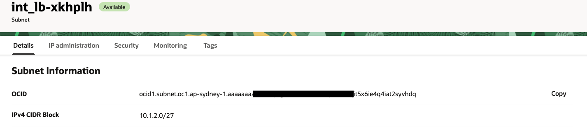
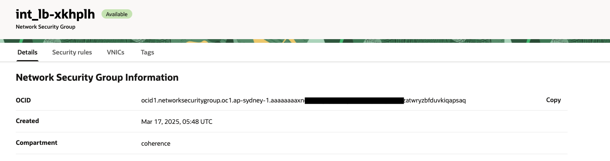

///////////////////////////////////////////////////////////////////////////////

    Copyright (c) 2021, 2025 Oracle and/or its affiliates.
    Licensed under the Universal Permissive License v 1.0 as shown at
    http://oss.oracle.com/licenses/upl.

///////////////////////////////////////////////////////////////////////////////
= Coherence Federation
:description: Coherence Operator Documentation - Coherence Federation Example
:keywords: oracle coherence, kubernetes, operator, federation, OCI, Oracle Cloud Infrastructure, example

== Coherence Federation

This example demonstrates the Coherence federation feature which allows you to federate cache data asynchronously across multiple geographically dispersed clusters.
Cached data is federated across clusters to provide redundancy, off-site backup, and multiple points of access for application users in different geographical locations.

NOTE: **Coherence federation feature requires Coherence Grid Edition.**

To demonstrate this feature, we will deploy two Coherence clusters, using the https://github.com/oracle/coherence-operator[Coherence Operator], located on separate OKE (Kubernetes Engine) clusters on Oracle Cloud (OCI).
It is assumed that you have two OCI regions, with these OKE clusters already configured, and have configured Dynamic Routing Gateways (DRGs)
to connect the two regions together.

TIP: Although this example uses OCI, the concepts can be applied to other cloud providers to achieve the same result.

They key (cloud platform-agnostic) aspects of the example are:

* The two Kubernetes clusters are located in separate cloud regions
* Each region must be able to be connected with or communicate with the other region
* Each region must have a network load balancer (LB), created either via deployment yaml or configured, that can forward traffic on port 40000, in our case, to the federation service in the OKE cluster
* Routing rules must be setup to allow LBs to send traffic over the specified ports between the regions

The diagram below outlines the setup for this example and uses the following OCI regions that have been configured with the relevant Kubernetes contexts.

* Melbourne region has a Kubernetes context of `c1`
* Sydney region has a Kubernetes context of `c3`

image::images/federated-coherence.png[Federated Setup,align="center",width="100%",height="auto"]

NOTE: **Although some network setup information is outlined below, it is assumed you have knowledge of, or access to
Oracle Cloud Infrastructure (OCI) administrators who can set up cross region networking using Dynamic Routing Gateways (DRG's) and
Remote Peering Connections. DRG Documentation below for more information.**

See the links below for more information on various topics described above:

* https://github.com/oracle/coherence-operator[Coherence Operator on GitHub]
* https://docs.oracle.com/en-us/iaas/Content/ContEng/Tasks/create-cluster.htm[Creating OKE Clusters]
* https://www.oracle.com/au/cloud/networking/dynamic-routing-gateway/[Dynamic Routing Gateway Documentation]
* https://{commercial-docs-base-url}/administer/federating-caches-clusters.html[Coherence Federation Documentation]
* <<docs/installation/04_obtain_coherence_images.adoc,Obtaining Commercial Coherence Images>>

[TIP]
====
The complete source code for this example is in the https://{examples-source}100_federation[Coherence Operator GitHub] repository.
====

=== What the Example will Cover

* <<prereqs,Prerequisites and Network Setup>>
** <<container-registry, Obtain your container registry Auth token>>
** <<create-oke, Create OKE clusters>>
** <<network-setup, Complete Network Setup>>
* <<prepare, Prepare the OKE clusters>>
** <<install-operator,Install the Coherence Operator>>
** <<create-the-example-namespace,Create the example namespace>>
** <<create-secret,Create image pull secrets and configmaps>>
* <<explore, Explore the Configuration>>
** <<explore-coherence, Coherence Configuration>>
** <<expore-yaml, Coherence Operator YAML>>
* <<deploy, Deploy the Example>>
** <<update-ocid,Update the OCID's for the federation service>>
** <<install-primary, Install the Primary Coherence cluster>>
** <<install-secondary, Install the Secondary Coherence cluster>>
** <<re-apply,Re-apply the yaml for both clusters>>
** <<check-federation,Check federation status>>
* <<run, Run the example>>
** <<add-data-p, Add Data in the primary cluster>>
** <<validate-data-p, Validate data in the secondary cluster>>
** <<add-data-s, Add Data in the secondary cluster>>
** <<validate-data-s, Validate data in the primary cluster>>
* <<cleanup, Cleaning Up>>

[#prereqs]
=== Prerequisites and Network Setup

[#container-registry]
==== Obtain your container registry Auth token

In this example we are using the Coherence Grid Edition container from Oracle's container registry.

* `container-registry.oracle.com/middleware/coherence:14.1.2.0.0`

To be able to pull the above image you need to do the following:

1. Sign in to the Container Registry at `https://container-registry.oracle.com/`. (If you don't have an account, with Oracle you will need to create one)
2. Once singed in, search for `coherence` and select the link for `Oracle Coherence`
3. If you have not already, you will need to accept the 'Oracle Standard Terms and Conditions' on the right before you are able to pull the image
4. Once you have accepted the terms and condition click on the drop-down next to your name on the top right and select `Auth Token`.
5. Click on `Generate Token` and save this in a secure place for use further down.

NOTE: See https://docs.oracle.com/en-us/iaas/Content/Registry/Tasks/registrygettingauthtoken.htm[the OCI documentation] for more information on creating your Auth token.

[#create-oke]
==== Create OKE clusters

This example assumes you have already created two OKE clusters in separate regions.

NOTE: For more information on creating OKE clusters, see https://docs.oracle.com/en-us/iaas/Content/devops/using/create_oke_environment.htm[the OCI documentation].

[#network-setup]
==== Complete Network Setup

You must ensure you have the following for each region:

1. A Dynamic Routing Gateway must be setup and must have a remote peering connection to the other region
2. The routing table associated with the worker nodes (OKE cluster) subnet for each region needs to have a rule to route traffic to the other region VCN via the Dynamic Routing Gateway
3. In this example, we are exposing coherence on port 40000 for federation, we require the following Security rules:
  a. Egress for worker nodes to get other cluster load balancer via the DRG on port 40000
  b. Ingress from worker to receive from their own load balancer on port 40000
  c. Ingress rule on own LBR to receive traffic from other region on port 40000
4. Each region has a dedicated private subnet for the network load balancer

Item 3 above is available via the OCI console via VCN->Security->Network Security Group Information->Worker Node Subnet->Security Rules.

NOTE: Refer to the https://www.oracle.com/au/cloud/networking/dynamic-routing-gateway/[DRG Documentation] for more information.

[#prepare]
=== Prepare the OKE clusters

For each of the OKE clusters, carry out the following

1. Install the Coherence Operator
2. Create the example namespace
3. Create image pull secrets and configmaps

[#install-operator]
==== 1. Install the Coherence Operator

To run the examples below, you will need to have installed the Coherence Operator,
do this using whatever method you prefer from the https://docs.coherence.community/coherence-operator/docs/latest/docs/installation/001_installation[Installation Guide].

[source,bash]
----
kubectl apply -f https://github.com/oracle/coherence-operator/releases/download/v3.4.3/coherence-operator.yaml
----

Once you complete, confirm the operator is running, for example:
[source,bash]
----
kubectl get pods -n coherence

NAME                                                    READY   STATUS    RESTARTS   AGE
coherence-operator-controller-manager-846887895-d7wzg   1/1     Running   0          40s
coherence-operator-controller-manager-846887895-l7dcl   1/1     Running   0          40s
coherence-operator-controller-manager-846887895-rtsjv   1/1     Running   0          40s
----

[#create-the-example-namespace]
==== 2. Create the example namespace

First, run the following command to create the namespace, coherence-example, for the example:

[source,bash]
----
kubectl create namespace coherence-example

namespace/coherence-example created
----

[#create-secret]
==== 3. Create image pull secrets and configmaps

This example requires a number of secrets:

* An image pull secret named `ocr-pull-secret` containing your OCR credentials to be used by the example.

Use a command similar to the following to create the image pull secret:

[source,bash]
----
kubectl create secret docker-registry ocr-pull-secret \
    --docker-server=container-registry.oracle.com \
    --docker-username="<username>" --docker-password="<password>" \
    --docker-email="<email>" -n coherence-example
----

* A store secret named `storage-config` to store the Coherence configuration files.

Run the following command to create the config secret:

[source,bash]
----
kubectl create secret generic storage-config -n coherence-example \
    --from-file=src/main/resources/tangosol-coherence-override.xml \
    --from-file=src/main/resources/storage-cache-config.xml
----

[#explore]
=== Explore the Configuration

[#explore-coherence]
==== Coherence Configuration

In this example there are two Coherence Configuration files.

**Coherence Operational Override**

The Coherence override file typically contains information regarding the cluster configuration. In this case we are specifying the edition
and the federation configuration.

[source,xml]
----
include::src/main/resources/tangosol-coherence-override.xml[]
----

<1> Defines the primary-cluster name, address and port. These are overridden by environment variables in the deployment yaml.
<2> Defines the secondary-cluster name, address and port.
<3> Sets the topology to be active-active

**Coherence Cache Configuration**

The Coherence cache configuration file contains the cache definitions. In this case we are specifying that all caches are federated.

[source,xml]
----
include::src/main/resources/storage-cache-config.xml[]
----

<1> Defines the cache mapping for all caches, '*', to map to the `server` scheme.
<2> The `server` scheme is a federated cache scheme
<3> Defines the local address and port on which to listen. Empty address will translate to `0.0.0.0`
<4> Specifies the topology, referenced above, to use.

[#expore-yaml]
==== Coherence Operator YAML

**Primary Cluster**

The following yaml file is used by the Coherence Operator to deploy the primary cluster.

[source,yaml]
----
include::src/main/yaml/primary-cluster.yaml[]
----

<1> The cluster name
<2> Environment variables to override the settings in the `tangosol-coherence-override.xml`.
<3> The `/config` path containing the xml files
<4> The federation port definitions
<5> The annotations to instruct OCI where to create the load balancer
<6> The cache config and override files
<7> The image and pull secrets

**Secondary Cluster**

The following yaml is for the secondary cluster.

[source,yaml]
----
include::src/main/yaml/primary-cluster.yaml[]
----

[#deploy]
=== Deploy the Example

[#update-ocid]
==== 1. Update the OCID's for the federation service

Before we apply the yaml for the primary **AND** secondary clusters, we must update the annotations in the
definition of the federation port to ensure we create the load balancer in the correct subnet.

The existing entry looks like the following:

[source,yaml]
----
  ports:
    - name: "federation"
      port: 40000
      protocol: TCP
      service:
        port: 40000
        type: LoadBalancer
        annotations:
          oci.oraclecloud.com/load-balancer-type: "nlb"
          oci-network-load-balancer.oraclecloud.com/internal: "true"
          oci-network-load-balancer.oraclecloud.com/subnet: "(Internal subnet OCID - REPLACE ME)"
          oci-network-load-balancer.oraclecloud.com/oci-network-security-groups: "(OCID of the NSG - REPLACE ME)"
----

The following values should be changed:

`oci-network-load-balancer.oraclecloud.com/subnet`

This value should be set to the OCID of the subnet created for the network load balancer.
In our case in Sydney region (c1) the subnet `int_lb-xkhplh` is used for the load balancer. (Virtual Cloud Networks-> Subnets)

`oci-network-load-balancer.oraclecloud.com/oci-network-security-groups`

This value should be set to the OCID of the network security group for the above subnet that has the security rules for ingress/egress defined previously.
In our case in Sydney region (c1) the network security group `int_lb-xkhplh` is used to apply the security rules we discussed previously. (Virtual Cloud Networks-> Security -> Network Security Groups)

NOTE: You should switch to the secondary region, Melbourne (c3), and change the values in `secondary-cluster.yaml` to reflect the OCID values in this region.

[#install-primary]
==== 2. Install the Primary Coherence cluster

Ensure you are in the `examples/federation` directory to run the example. This example uses the yaml files `src/main/yaml/primary-cluster.yaml` and `src/main/yaml/secondary-cluster.yaml`, which you modified in the previous step.

Ensure your Kubernetes context is set to the *primary* cluster, which is `c1` or Sydney in our case, and run the following
commands to create the primary cluster and load balancer for the federation port:

[source,bash]
----
kubectx c1
Switched to context "c1".
----

[source,bash]
----
kubectl -n coherence-example apply -f src/main/yaml/primary-cluster.yaml

coherence.coherence.oracle.com/primary-cluster created
----

Issue the following command to view the pods:
[source,bash]
----
 kubectl -n coherence-example get pods

NAME                READY   STATUS    RESTARTS   AGE
primary-cluster-0   1/1     Running   0          2m
primary-cluster-1   1/1     Running   0          2m
primary-cluster-2   1/1     Running   0          2m
----

Once all the pods are ready, view the services and wait for an external IP for the `primary-cluster-federation` service
as we have defined this as a load balancer.
Once this has been populated, update the `PRIMARY_CLUSTER_ADDRESS` in both `yaml` files to this value.
In our example this is `10.1.2.22`.

[source,bash]
----
kubectl get svc -n coherence-example

NAME                         TYPE           CLUSTER-IP      EXTERNAL-IP   PORT(S)                                                AGE
primary-cluster-federation   LoadBalancer   10.101.77.23    10.1.2.22     40000:30876/TCP                                        60s
primary-cluster-management   ClusterIP      10.101.202.62   <none>        30000/TCP                                              60s
primary-cluster-sts          ClusterIP      None            <none>        7/TCP,7575/TCP,7574/TCP,6676/TCP,40000/TCP,30000/TCP   60s
primary-cluster-wka          ClusterIP      None            <none>        7/TCP,7575/TCP,7574/TCP,6676/TCP                       60s
----

[source,bash]
----
  env:
    - name: "PRIMARY_CLUSTER"
      value: "primary-cluster"
    - name: "PRIMARY_CLUSTER_ADDRESS"
      value: "10.1.2.22"
----

[#install-secondary]
==== 3. Install the Secondary Coherence cluster

Ensure your Kubernetes context is set to the *secondary* cluster, which is `c3` or Melbourne in our case, and run the following
commands to create the secondary cluster and load balancer for federation port:

[source,bash]
----
kubectx c3
Switched to context "c3".
----

[source,bash]
----
kubectl -n coherence-example apply -f src/main/yaml/secondary-cluster.yaml

coherence.coherence.oracle.com/primary-cluster created
----

Issue the following command to view the pods:
[source,bash]
----
kubectl -n coherence-example get pods

NAME                  READY   STATUS    RESTARTS   AGE
secondary-cluster-0   1/1     Running   0          2m
secondary-cluster-1   1/1     Running   0          2m
secondary-cluster-2   1/1     Running   0          2m
----

Wait for an external-ip for the `secondary-cluster-federation` service.

[source,bash]
----
kubectl get svc -n coherence-example

NAME                           TYPE           CLUSTER-IP       EXTERNAL-IP   PORT(S)                                                AGE
secondary-cluster-federation   LoadBalancer   10.103.205.128   10.3.2.14     40000:30186/TCP                                        43s
secondary-cluster-management   ClusterIP      10.103.96.216    <none>        30000/TCP                                              43s
secondary-cluster-sts          ClusterIP      None             <none>        7/TCP,7575/TCP,7574/TCP,6676/TCP,40000/TCP,30000/TCP   43s
secondary-cluster-wka          ClusterIP      None             <none>        7/TCP,7575/TCP,7574/TCP,6676/TCP                       43s
----

Once this has been populated then update the `SECONDARY_CLUSTER_ADDRESS` in both `yaml` files to this value.
In our example this is `10.3.2.14`.

[source,bash]
----
    - name: "SECONDARY_CLUSTER"
      value: "secondary-cluster"
    - name: "SECONDARY_CLUSTER_ADDRESS"
      value: "10.3.2.14"
----

[#re-apply]
==== 4. Re-apply the yaml for both clusters

Run the following to re-apply the yaml in both regions to correctly set the load balancer addresses for each cluster.
Making a change to the yaml will be carried out in a safe manner via a rolling redeploy of the stateful set.

**Primary Cluster**

[source,bash]
----
kubectx c1
Switched to context "c1".

kubectl -n coherence-example apply -f src/main/yaml/primary-cluster.yaml
----

Issue the following command and wait until the `PHASE` is ready which indicates the rolling upgrade has been completed. Once it is ready, you
can use `CTRL-C` to exit the command.

[source,bash]
----
kubectl get coh -n coherence-example -w

NAME              CLUSTER           ROLE              REPLICAS   READY   PHASE
primary-cluster   primary-cluster   primary-cluster   3          2       RollingUpgrade
primary-cluster   primary-cluster   primary-cluster   3          3       RollingUpgrade
primary-cluster   primary-cluster   primary-cluster   3          2       RollingUpgrade
primary-cluster   primary-cluster   primary-cluster   3          3       RollingUpgrade
primary-cluster   primary-cluster   primary-cluster   3          2       RollingUpgrade
primary-cluster   primary-cluster   primary-cluster   3          3       Ready
----

**Secondary Cluster**

Change to the secondary cluster context and run the following to restart secondary cluster using a rolling restart.

[source,bash]
----
kubectx c3
Switched to context "c3".

kubectl -n coherence-example apply -f src/main/yaml/secondary-cluster.yaml
----

Wait for the cluster to be ready.

[source,bash]
----
kubectl get coh -n coherence-example -w

NAME                CLUSTER             ROLE                REPLICAS   READY   PHASE
secondary-cluster   secondary-cluster   secondary-cluster   3          2       RollingUpgrade
secondary-cluster   secondary-cluster   secondary-cluster   3          3       RollingUpgrade
secondary-cluster   secondary-cluster   secondary-cluster   3          2       RollingUpgrade
secondary-cluster   secondary-cluster   secondary-cluster   3          3       RollingUpgrade
secondary-cluster   secondary-cluster   secondary-cluster   3          2       RollingUpgrade
secondary-cluster   secondary-cluster   secondary-cluster   3          3       Ready
----

[#check-federation]
==== 5. Check federation status

When both clusters have completed the rolling upgrade, open two terminals, to view the federation status of the primary and secondary clusters.

This command uses the Coherence CLI, which is embedded in the operator. For more information on the CLI, see https://github.com/oracle/coherence-cli[here].

Run the following command using `--context c1` to view the Federation status. Because we have not yet added data, we should see
it showing the `STATES` as `[INITIAL]`.  The `-W` option will continuously display the federation output until you use `CTRL-C` to exit.

NOTE: From now on when we use `--context` parameter, you should replace this with the appropriate context for your environment.

[source,bash]
----
kubectl --context c1 exec -it -n coherence-example primary-cluster-0 -- /coherence-operator/utils/cohctl get federation all -o wide -W

2025-03-18 06:20:01.645984469 +0000 UTC m=+20.337976443
Using cluster connection 'default' from current context.

SERVICE         OUTGOING           MEMBERS  STATES     DATA SENT  MSG SENT  REC SENT  CURR AVG BWIDTH  AVG APPLY  AVG ROUND TRIP  AVG BACKLOG DELAY  REPLICATE  PARTITIONS  ERRORS  UNACKED
FederatedCache  secondary-cluster        3  [INITIAL]       0 MB         0         0          0.0Mbps        0ms             0ms                0ms      0.00%           0       0        0
----

In a second window, change the context and run the second command:

[source,bash]
----
kubectl --context c3 exec -it -n coherence-example secondary-cluster-0 -- /coherence-operator/utils/cohctl get federation all -o wide -W

2025-03-18 06:20:46.142911529 +0000 UTC m=+10.337433424
Using cluster connection 'default' from current context.

SERVICE         OUTGOING         MEMBERS  STATES     DATA SENT  MSG SENT  REC SENT  CURR AVG BWIDTH  AVG APPLY  AVG ROUND TRIP  AVG BACKLOG DELAY  REPLICATE  PARTITIONS  ERRORS  UNACKED
FederatedCache  primary-cluster        3  [INITIAL]       0 MB         0         0          0.0Mbps        0ms             0ms                0ms      0.00%           0       0        0
----

[#run]
=== Run the Example

[#add-data-p]
==== 1. Add Data in the primary cluster

In a separate terminal, on the primary-cluster, run the following command to run the console application to add data.

[source,bash]
----
kubectl exec --context c1 -it -n coherence-example primary-cluster-0 -- /coherence-operator/utils/runner console
----

At the `Map:` prompt, type the following to create a new cache called `test`.

[source,bash]
----
cache test
----

Then, issue the command `put key1 primary` to add an entry with key=key1, and value=primary

[source,bash]
.Output
----
Map (test): put key1 primary
null

Map (test): list
key1 = primary
----

TIP: Type `bye` to exit the console.

Once you run the command, switch back to the terminals with the `federation all` commands running for the primary cluster, and you
should see data has being sent from the primary to secondary cluster.

[source,bash]
.Primary Cluster
----
2025-03-18 06:25:22.649699832 +0000 UTC m=+341.341691816
Using cluster connection 'default' from current context.

SERVICE         OUTGOING           MEMBERS  STATES          DATA SENT  MSG SENT  REC SENT  CURR AVG BWIDTH  AVG APPLY  AVG ROUND TRIP  AVG BACKLOG DELAY  REPLICATE  PARTITIONS  ERRORS  UNACKED
FederatedCache  secondary-cluster        3  [INITIAL IDLE]       0 MB         1         1          0.0Mbps       20ms             7ms               88ms      0.00%           0       0        0
----

You should also see something similar on the secondary cluster, which shows data being received.

[source,bash]
.Secondary Cluster
----
2025-03-18 06:28:07.5999651 +0000 UTC m=+451.794486974
Using cluster connection 'default' from current context.

SERVICE         OUTGOING         MEMBERS  STATES     DATA SENT  MSG SENT  REC SENT  CURR AVG BWIDTH  AVG APPLY  AVG ROUND TRIP  AVG BACKLOG DELAY  REPLICATE  PARTITIONS  ERRORS  UNACKED
FederatedCache  primary-cluster        3  [INITIAL]       0 MB         0         0          0.0Mbps        0ms             0ms                0ms      0.00%           0       0        0

SERVICE         INCOMING         MEMBERS RECEIVING  DATA REC  MSG REC  REC REC  AVG APPLY  AVG BACKLOG DELAY
FederatedCache  primary-cluster                  1      0 MB        1        1       60ms              265ms
----

[#validate-data-s]
==== 2. Validate data in the secondary cluster

Run the following command against the secondary cluster to validate the data has been received:

[source,bash]
----
kubectl exec --context c3 -it -n coherence-example secondary-cluster-0 -- /coherence-operator/utils/runner console
----

At the `Map:` prompt, type `cache test` and then `list` to see the data that was transfered.

[source,bash]
----
Map (test): list
key1 = primary
----

NOTE: If you do not see any data, then you should check the pod logs to see if there are any errors.

[source,bash]
----
size
----

[#add-data-s]
==== 3. Add Data in the secondary cluster

TIP: Since we have configured federation to be active-active, any changes in either cluster will be replicated to the other.

Without leaving the console, run the command `put key2 secondary` and then `list`:

[source,bash]
----
Map (test): put key2 secondary
null

Map (test): list
key1 = primary
key2 = secondary
----

[#validate-data-p]
==== 4. Validate data in the primary cluster

Switch back to the primary cluster, and start the console to validate that the data has been receieved:

[source,bash]
----
kubectl exec --context c1 -it -n coherence-example primary-cluster-0 -- /coherence-operator/utils/runner console
----

At the `Map:` prompt, type `cache test` and the `list`

[source,bash]
----
Map (test): list
key2 = secondary
key1 = primary
----

Use the following command to add 100,000 entries to the cache with random data:

[source,bash]
----
bulkput 100000 100 0 100
----

If you view the `federation all` commands that are still running you should see the data being federated.

[source,bash]
.Primary Cluster
----
2025-03-18 06:34:04.272571513 +0000 UTC m=+862.964563476
Using cluster connection 'default' from current context.

SERVICE         OUTGOING           MEMBERS  STATES     DATA SENT  MSG SENT  REC SENT  CURR AVG BWIDTH  AVG APPLY  AVG ROUND TRIP  AVG BACKLOG DELAY  REPLICATE  PARTITIONS  ERRORS  UNACKED
FederatedCache  secondary-cluster        3  [SENDING]       3 MB    12,128    14,973          1.2Mbps      278ms            25ms              132ms      0.00%           0       0        0

SERVICE         INCOMING           MEMBERS RECEIVING  DATA REC  MSG REC  REC REC  AVG APPLY  AVG BACKLOG DELAY
FederatedCache  secondary-cluster                  1      0 MB        1        1       20ms              285ms
----

TIP: Run the console against the secondary cluster and validate that the cache size is 100,000.

[#cleanup]
=== Cleaning up

Use the following commands to delete the primary and secondary clusters: 

[source,bash]
----
kubectx c1
Switched to context "c1".

kubectl -n coherence-example delete -f src/main/yaml/primary-cluster.yaml

kubectx c3
Switched to context "c3".

kubectl -n coherence-example delete -f src/main/yaml/secondary-cluster.yaml
----

Uninstall the Coherence operator using the undeploy commands for whichever method you chose to install it.
