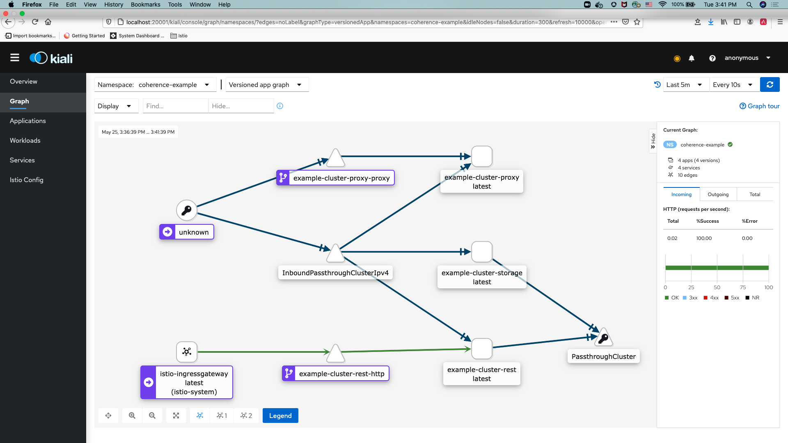

///////////////////////////////////////////////////////////////////////////////

    Copyright (c) 2021, Oracle and/or its affiliates.
    Licensed under the Universal Permissive License v 1.0 as shown at
    http://oss.oracle.com/licenses/upl.

///////////////////////////////////////////////////////////////////////////////
= Using Coherence with Istio

== Using Coherence with Istio

You can run the Coherence cluster and manage then using the Coherence Operator alongside https://istio.io[Istio].
Coherence clusters managed with the Coherence Operator 3.2.0 and later work with Istio 1.9.1 and later.
Coherence caches can be accessed from outside the Coherence cluster via Coherence*Extend, REST, and other supported Coherence clients.
Using Coherence clusters with Istio does not require the Coherence Operator to also be using Istio (and vice-versa) .
The Coherence Operator can manage Coherence clusters independent of whether those clusters are using Istio or not.

=== Why Doesn't Coherence Work with Istio?

Coherence uses a custom TCP message protocol for inter-cluster member communication.
When a cluster member sends a message to another member, the "reply to" address of the sending member is in the message. This address is the socket address the member is listening on (i.e. it is the IP address and port Coherence has bound to).
When Istio is intercepting traffic the message ends up being sent via the Envoy proxy and the actual port Coherence is listening on is blocked by Istio. When the member that receives the message tries to send a response to the reply to address, that port is not visible to it.

Coherence clients will work with Istio, so Extend, gRPC and http clients for things like REST, metrics and management will work when routed through the Envoy proxy.

=== Prerequisites

The instructions assume that you are using a Kubernetes cluster with Istio installed and configured already.

==== Enable Istio Strict Mode

For this example we make Istio run in "strict" mode so that it will not allow any traffic between Pods outside the Envoy proxy. If other modes are used, such as permissive, then Coherence will work as normal as its ports will not be blocked.

To set Istio to strict mode create the following yaml file.

[source,yaml]
.istio-strict.yaml
----
apiVersion: security.istio.io/v1beta1
kind: PeerAuthentication
metadata:
  name: "default"
spec:
  mtls:
    mode: STRICT
----

Install this yaml into the Istio system namespace with the following command:

[source,bash]
----
kubectl -n istio-system apply istio-strict.yaml
----

=== Using the Coherence operator with Istio

To use Coherence operator with Istio, you can deploy the operator into a namespace which has Istio automatic sidecar injection enabled.  Before installing the operator, create the namespace in which you want to run the Coherence operator and label it for automatic injection.

[source,bash]
----
kubectl create namespace coherence
kubectl label namespace coherence istio-injection=enabled
----

Istio Sidecar AutoInjection is done automatically when you label the coherence namespace with istio-injection.

==== Exclude the Operator Web-Hook from the Envoy Proxy

The Coherence Operator uses an admissions web-hook, which Kubernetes will call to validate Coherence resources.
This web-hook binds to port `9443` in the Operator Pods and is already configured to use TLS as is standard for
Kubernetes admissions web-hooks. If this port is routed through the Envoy proxy Kubernetes will be unable to
access the web-hook.

There are a number of ways to exclude the web-hook port, the simplest is to add a `PeerAuthentication` resource to the Operator namespace.

*Before installing the Operator*, create the following `PeerAuthentication` yaml.

[source,yaml]
.istio-operator.yaml
----
apiVersion: security.istio.io/v1beta1
kind: PeerAuthentication
metadata:
  name: "coherence-operator"
spec:
  selector:
    matchLabels:
      app.kubernetes.io/name: coherence-operator
      app.kubernetes.io/instance: coherence-operator-manager
      app.kubernetes.io/component: manager
  mtls:
    mode: STRICT
  portLevelMtls:
    9443:
      mode: PERMISSIVE
----

Then install this `PeerAuthentication` resource into the same namespace that the Operator will be installed into.
For example, if the Operator will be in the `coherence` namespace:

[source,bash]
----
kubectl -n coherence apply istio-operator.yaml
----

You can then install the operator using your preferred method in the Operator <<docs/installation/01_installation.adoc,Installation Guide>>.

After installed operator, use the following command to confirm the operator is running:

[source,bash]
----
kubectl get pods -n coherence

NAME                                                     READY   STATUS    RESTARTS   AGE
coherence-operator-controller-manager-7d76f9f475-q2vwv   2/2     Running   1          17h
----

The output should show 2/2 in READY column, meaning there are 2 containers running in the Operator pod. One is Coherence Operator and the other is Envoy Proxy.

=== Creating a Coherence cluster with Istio

You can configure your cluster to run with Istio automatic sidecar injection enabled. Before creating your cluster, create the namespace in which you want to run the cluster and label it for automatic injection.

[source,bash]
----
kubectl create namespace coherence-example
kubectl label namespace coherence-example istio-injection=enabled
----

==== Exclude the Coherence Cluster Ports

As explained above, Coherence cluster traffic must be excluded from the Envoy proxy, there are various ways to do this.

There are three ports that must be excluded:

* The cluster port - defaults to 7574, there is no need to set this to any other value.
* The TCP first local port - the Operator will default this to 7575 using its web-hook (if the web-hook is disabled this needs to be manually set).
* The TCP second local port - the Operator will default this to 7576 using its web-hook (if the web-hook is disabled this needs to be manually set).

*1 Use an Annotation in the Coherence Resource*

The Istio exclusion annotation `traffic.sidecar.istio.io/excludeInboundPorts` can be added to the Coherence yaml to list the ports to be excluded,

For example, using the default ports the following annotation will exclude those ports from Istio:

[source,yaml]
.coherence-storage.yaml
----
apiVersion: coherence.oracle.com/v1
kind: Coherence
metadata:
  name: storage
spec:
  annotations:
    traffic.sidecar.istio.io/excludeInboundPorts: "7574,7575,7576"
----

If the Coherence Operator's web-hook has been disabled, the local ports must be set in the yaml too:

[source,yaml]
.coherence-storage.yaml
----
apiVersion: coherence.oracle.com/v1
kind: Coherence
metadata:
  name: storage
spec:
  annotations:
    traffic.sidecar.istio.io/excludeInboundPorts: "7574,7575,7576"
  coherence:
    localPort: 7575
    localPortAdjust: 7576
----

*2 Use a PeerAuthentication resource*

A `PeerAuthentication` resource can be added to the Coherence cluster's namespace *before the cluster is deployed*.

[source,yaml]
.istio-coherence.yaml
----
apiVersion: security.istio.io/v1beta1
kind: PeerAuthentication
metadata:
  name: "coherence"
spec:
  selector:
    matchLabels:
      coherenceComponent: coherencePod
  mtls:
    mode: STRICT
  portLevelMtls:
    7574:
      mode: PERMISSIVE
    7575:
      mode: PERMISSIVE
    7576:
      mode: PERMISSIVE
----

The Coherence Operator labels Coherence Pods with the label `coherenceComponent: coherencePod` so this can be used in the `PeerAuthentication`. Then each port to be excluded is listed in the `portLevelMtls` and set to be `PERMISSIVE`.

This yaml can then be installed into the namespace that the Coherence cluster will be deployed into.

=== TLS

Coherence clusters work with mTLS and Coherence clients can also support TLS through the Istio Gateway with TLS termination to connect to Coherence cluster running inside kubernetes. For example, you can apply the following Istio Gateway and Virtual Service in the namespace of the Coherence cluster.  Before applying the gateway, create a secret for the credential from the certificate and key (e.g. server.crt and server.key) to be used by the Gateway:

[source,bash]
----
kubectl create -n istio-system secret tls extend-credential --key=server.key --cert=server.crt
----

Then, create a keystore (server.jks) to be used by the Coherence Extend client, e.g.:
[source,bash]
----
openssl pkcs12 -export -in server.crt -inkey server.key -chain -CAfile ca.crt -name "server" -out server.p12

keytool -importkeystore -deststorepass password -destkeystore server.jks -srckeystore server.p12 -srcstoretype PKCS12
----

tlsGateway.yaml
[source,bash]
----
apiVersion: networking.istio.io/v1alpha3
kind: Gateway
metadata:
  name: tlsgateway
spec:
  selector:
    istio: ingressgateway # use istio default ingress gateway
  servers:
  - port:
      number: 8043
      name: tls
      protocol: TLS
    tls:
      mode: SIMPLE
      credentialName: "extend-credential" # the secret created in the previous step
      maxProtocolVersion: TLSV1_3
    hosts:
    - "*"
----

tlsVS.yaml
[source,bash]
----
apiVersion: networking.istio.io/v1alpha3
kind: VirtualService
metadata:
  name: extend
spec:
  hosts:
  - "*"
  gateways:
  - tlsgateway
  tcp:
  - match:
    route:
    - destination:
        host: example-cluster-proxy-proxy  # the service name used to expose the Extend proxy port
----

Apply the Gateway and VirtualService:

[source,bash]
----
kubectl apply -f tlsGateway.yaml -n coherence-example
kubectl apply -f tlsVS.yaml -n coherence-example
----

Then configure a Coherence*Extend client to connect to the proxy server via TLS protocol.  Below is an example of a <remote-cache-scheme> configuration of an Extend client using TLS port 8043 configured in the Gateway and server.jks created earlier in the example.

client-cache-config.xml
----
...
    <remote-cache-scheme>
        <scheme-name>extend-direct</scheme-name>
        <service-name>ExtendTcpProxyService</service-name>
        <initiator-config>
            <tcp-initiator>
                <socket-provider>
                    <ssl>
                        <protocol>TLS</protocol>
                        <trust-manager>
                            <algorithm>PeerX509</algorithm>
                            <key-store>
                                <url>file:server.jks</url>
                                <password>password</password>
                            </key-store>
                        </trust-manager>
                    </ssl>
                </socket-provider>
                <remote-addresses>
                    <socket-address>
                        <address>$INGRESS_HOST</address>
                        <port>8043</port>
                    </socket-address>
                </remote-addresses>
            </tcp-initiator>
        </initiator-config>
    </remote-cache-scheme>
...
----

If you are using Docker for Desktop, `$INGRESS_HOST` is `127.0.0.1`, and you can use the Kubectl port-forward to allow the Extend client to access the Coherence cluster from your localhost:

[source,bash]
----
kubectl port-forward -n istio-system <istio-ingressgateway-pod> 8043:8043
----

=== Prometheus

The coherence metrics that record and track the health of Coherence cluster using Prometheus are also available in Istio environment and can be viewed through Grafana. However, Coherence cluster traffic is not visible by Istio.

=== Traffic Visualization

Istio provides traffic management capabilities, including the ability to visualize traffic in https://kiali.io[Kiali]. You do not need to change your applications to use this feature. The Istio proxy (envoy) sidecar that is injected into your pods provides it. The image below shows an example with traffic flow. In this example, you can see how the traffic flows in from the Istio gateway on the left, to the cluster services, and then to the individual cluster members.  This example has storage members (example-cluster-storage), a proxy member running proxy service (example-cluster-proxy), and a REST member running http server (example-cluster-rest).  However, Coherence cluster traffic between members is not visible.

To learn more, see https://istio.io/latest/docs/concepts/traffic-management/[Istio traffic management].
