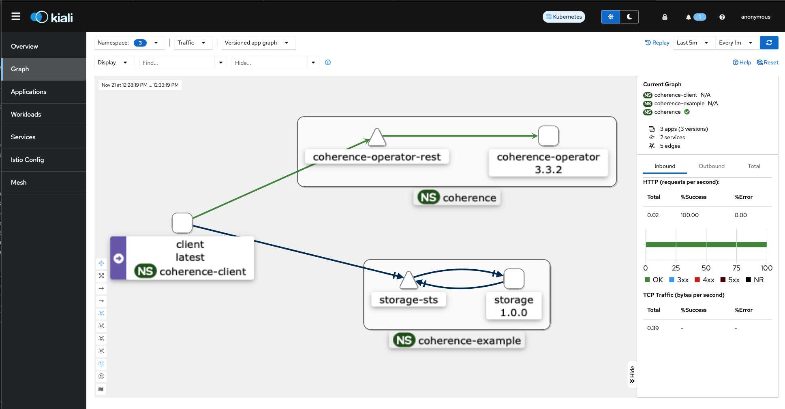

///////////////////////////////////////////////////////////////////////////////

    Copyright (c) 2021, 2025, Oracle and/or its affiliates.
    Licensed under the Universal Permissive License v 1.0 as shown at
    http://oss.oracle.com/licenses/upl.

///////////////////////////////////////////////////////////////////////////////
= Using Coherence with Istio
:description: Coherence Operator Documentation - Coherence with Istio Example
:keywords: oracle coherence, kubernetes, operator, istio, example

== Using Coherence with Istio

You can run the Coherence cluster and manage them using the Coherence Operator alongside https://istio.io[Istio].
Coherence clusters managed with the Coherence Operator 3.5.4 and later work with Istio 1.9.1 and later out of the box.
Coherence caches can be accessed from outside the Coherence cluster via Coherence*Extend, REST, and other supported
Coherence clients.
Using Coherence clusters with Istio does not require the Coherence Operator to also be using Istio (and vice-versa) .
The Coherence Operator can manage Coherence clusters independent of whether those clusters are using Istio or not.

Although Coherence itself can be configured to use TLS, when using Istio Coherence cluster members and clients can
just use the default socket configurations and Istio will control and route all the traffic over mTLS.

[TIP]
====
Coherence clusters can be manually configured to work with Istio, even if not using the Operator.
See the Istio example in the <<examples/no-operator/04_istio/README.adoc,No Operator Examples>>
====

[IMPORTANT]
====
*Upgrading Istio*

The Istio documentations states that the recommended way to upgrade Istio is to use
https://istio.io/latest/docs/setup/upgrade/canary/[Istio revisions and canary upgrades].
If Istio is upgraded using a simple in-place upgrade option this will cause Coherence Pods to have communication issues
and ultimately make the Coherence cluster unusable. This is because an in-place Istio upgrade will cause the Istio Proxy
in the side-car containers to receive config updates and then to drain all the TCP connections it is managing, hence
causing Coherence containers to disconnect from each other.

This issue is not just related to Coherence but can impact any long-lived TCP connections, for example connections to a database.

If you are using Istio in a managed environment where you do not control its life-cycle, you must ensure that the people
that are responsible for managing Istio use the recommended upgrade approach.
====

=== How Does Coherence Work with Istio?

Istio is a "Service Mesh" so the clue to how Istio works in Kubernetes is in the name, it relies on the configuration
of Kubernetes Services.
This means that any ports than need to be accessed in Pods, including those using in "Pod to Pod" communication
must be exposed via a Service. Usually a Pod can reach any port on another Pod even if it is not exposed in the
container spec, but this is not the case when using Istio as only ports exposed by the Envoy proxy are allowed.

For Coherence cluster membership, this means the cluster port and the local port must be exposed on a Service.
To do this the local port must be configured to be a fixed port instead of the default ephemeral port.
The Coherence Operator uses the default cluster port of `7574` and there is no reason to ever change this.
The Coherence Operator always configures a fixed port for the local port so this works with Istio out of the box.
In addition, the Operator uses the health check port to determine the status of a cluster, so this needs to be
exposed so that the Operator can reach Coherence Pods.

The Coherence localhost property can be set to the name of the Pod.
This is easily done using the container environment variables, which the Operator does automatically.

Coherence clusters are run as a StatefulSet in Kubernetes. This means that the Pods are configured with a host name
and a subdomain based on the name of the StatefulSet headless service name, and it is this name that should be used
to access Pods.
For example for a Coherence resource named `storage` the Operator will create a StatefulSet named `storgage` with a
headless service named `storage-sts`. Each Pod in a StatefulSet is numbered with a fixed identity, so the first Pod
in this cluster will be `storage-0`. The Pod has a number of DNS names that it is reachable with, but the fully
qualified name using the headless service will be `storage-0.storage-sts` or storage-0.storage-sts.<namespace>.svc`.

By default, the Operator will expose all the ports configured for the `Coherence` resource on the StatefulSet headless
service. This allows Coherence Extend and gRPC clients to use this service name as the WKA address when using the
Coherence NameService to lookup endpoints (see the client example below).

=== Prerequisites

The instructions assume that you are using a Kubernetes cluster with Istio installed and configured already.

==== Enable Istio Strict Mode

For this example we make Istio run in "strict" mode so that it will not allow any traffic between Pods outside the
Envoy proxy.
If other modes are used, such as permissive, then Istio allows Pod to Pod communication so a cluster may appear to work
in permissive mode, when it would not in strict mode.

To set Istio to strict mode create the following yaml file.

[source,yaml]
.istio-strict.yaml
----
apiVersion: security.istio.io/v1beta1
kind: PeerAuthentication
metadata:
  name: "default"
spec:
  mtls:
    mode: STRICT
----

Install this yaml into the Istio system namespace with the following command:

[source,bash]
----
kubectl -n istio-system apply istio-strict.yaml
----

=== Using the Coherence operator with Istio

To use Coherence operator with Istio, you can deploy the operator into a namespace which has Istio automatic sidecar
injection enabled.
Before installing the operator, create the namespace in which you want to run the Coherence operator and label it for
automatic injection.

[source,bash]
----
kubectl create namespace coherence
kubectl label namespace coherence istio-injection=enabled
----

Istio Sidecar AutoInjection is done automatically when you label the coherence namespace with istio-injection.

==== Exclude the Operator Web-Hook from the Envoy Proxy

The Coherence Operator uses an admissions web-hook, which Kubernetes will call to validate Coherence resources.
This web-hook binds to port `9443` in the Operator Pods and is already configured to use TLS as is standard for
Kubernetes admissions web-hooks. If this port is routed through the Envoy proxy Kubernetes will be unable to
access the web-hook.

The Operator yaml manifests and Helm chart already add the `traffic.sidecar.istio.io/excludeInboundPorts` annotation
to the Operator Pods. This should exclude the web-hook port from being Istio.

Another way to do this is to add a `PeerAuthentication` resource to the Operator namespace.

*Before installing the Operator*, create the following `PeerAuthentication` yaml.

[source,yaml]
.istio-operator.yaml
----
apiVersion: security.istio.io/v1beta1
kind: PeerAuthentication
metadata:
  name: "coherence-operator"
spec:
  selector:
    matchLabels:
      app.kubernetes.io/name: coherence-operator
      app.kubernetes.io/instance: coherence-operator-manager
      app.kubernetes.io/component: manager
  mtls:
    mode: STRICT
  portLevelMtls:
    9443:
      mode: PERMISSIVE
----

Then install this `PeerAuthentication` resource into the same namespace that the Operator will be installed into.
For example, if the Operator will be in the `coherence` namespace:

[source,bash]
----
kubectl -n coherence apply istio-operator.yaml
----

You can then install the operator using your preferred method in the
Operator <<docs/installation/001_installation.adoc,Installation Guide>>.

After installed operator, use the following command to confirm the operator is running:

[source,bash]
----
kubectl get pods -n coherence

NAME                                                     READY   STATUS    RESTARTS   AGE
coherence-operator-controller-manager-7d76f9f475-q2vwv   2/2     Running   1          17h
----

The output should show 2/2 in READY column, meaning there are 2 containers running in the Operator pod.
One is Coherence Operator and the other is Envoy Proxy.

If we use the Istio Kiali addon to visualize Istio we can see the Operator in the list of applications

image::images/kiali-operator-app.png[width=1024,height=512]

We can also see on the detailed view, that the Operator talks to the Kubernetes API server

image::images/kiali-operator-app-graph.png[width=1024,height=512]

=== Creating a Coherence cluster with Istio

You can configure a cluster to run with Istio automatic sidecar injection enabled. Before creating the cluster,
create the namespace in which the cluster will run and label it for automatic injection.

[source,bash]
----
kubectl create namespace coherence-example
kubectl label namespace coherence-example istio-injection=enabled
----

Now create a Coherence resource as normal, there is no additional configuration required to work in Istio.

For example using the yaml below to create a three member cluster with management and metrics enabled:

[source,yaml]
.storage.yaml
----
apiVersion: coherence.oracle.com/v1
kind: Coherence
metadata:
  name: storage
spec:
  replicas: 3
  image: container-registry.oracle.com/middleware/coherence-ce:14.1.2-0-1
  labels:
    app: storage      # <1>
    version: 1.0.0    # <2>
  coherence:
    management:
      enabled: true
    metrics:
      enabled: true
  ports:
    - name: management  # <3>
    - name: metrics
    - name: extend
      port: 20000
      appProtocol: tcp  # <4>
    - name: grpc-proxy
      port: 1408
      appProtocol: grpc # <5>
----

<1> Istio prefers applications to have an `app` label
<2> Istio prefers applications to have a `version` label
<3> The Coherence Pods will expose ports for Management over REST, metrics, a Coherence*Extend proxy and a gRPC proxy
<4> The Operator will set the `appProtocol` for the management and metrics ports to `http`, but the Extend port must be
set manually to `tcp` so that Istio knows what sort of traffic is being used by that port
<5> The gRPC port's `appProtocol` field is set to `grpc`

Using the Kiali console, we can now see two applications, the Coherence Operator in the "coherence" namespace
and the "storage" application in the "coherence-example" namespace.

If we look at the graph view we can see all the traffic between the different parts of the system

- We can see the Kubernetes API server accessing the Operator web-hook to validate the yaml
- We can see tge storage pods (the box marked "storage 1.0.0") communicate with each other via the storage-sts service to from a Coherence cluster
- We can see the storage pods communicate with the Operator REST service to request their Coherence site and rack labels
- We can see the Operator ping the storage pods health endpoints via the storage-sts service

All of this traffic is using mTLS controlled by Istio

=== Coherence Clients Running in Kubernetes

Coherence Extend clients and gRPC clients running inside the cluster will also work with Istio.

For this example the clients will be run in the `coherence-client` namespace, so it needs to be
created and labelled so that Istio injection works in that namespace.

[source,bash]
----
kubectl create namespace coherence-client
kubectl label namespace coherence-client istio-injection=enabled
----

To simulate a client application a `CoherenceJob` resource will be used with different configurations
for the different types of client.

The simplest way to configure a Coherence extend client in a cache configuration file is a default configuration
similar to that shown below. No ports or addresses need to be configured. Coherence will use the JVM's configured
cluster name and well know addresses to locate to look up the Extend endpoints using the Coherence NameService.

[source,xml]
----
<remote-cache-scheme>
  <scheme-name>thin-remote</scheme-name>
  <service-name>RemoteCache</service-name>
  <proxy-service-name>Proxy</proxy-service-name>
</remote-cache-scheme>
----

We can configure a `CoherenceJob` to run an Extend client with this configuration as shown below:

[source,yaml]
.extend-client.yaml
----
apiVersion: coherence.oracle.com/v1
kind: CoherenceJob
metadata:
  name: client
spec:
  image: container-registry.oracle.com/middleware/coherence-ce:14.1.2-0-1  # <1>
  restartPolicy: Never
  cluster: storage  # <2>
  coherence:
    wka:
      addresses:
        - "storage-sts.coherence-example.svc"  # <3>
  application:
    type: operator  # <4>
    args:
      - sleep
      - "300s"
  env:
    - name: COHERENCE_CLIENT    # <5>
      value: "remote"
    - name: COHERENCE_PROFILE   # <6>
      value: "thin"
----

<1> The client will use the CE image published on GitHub, which will use the default cache configuration file from Coherence jar.
<2> The cluster name must be set to the cluster name of the cluster started above, in this case `storage`
<3> The WKA address needs to be set to the DNS name of the headless service for the storage cluster created above. As this
Job is running in a different name space this is the fully qualified name `<service-name>.<namespace>.svc` which is `storage-sts.coherence-example.svc`
<4> Instead of running a normal command this Job will run the Operator's `sleep` command and sleep for `300s` (300 seconds).
<5> The `COHERENCE_CLIENT` environment variable value of `remote` sets the Coherence cache configuration to be an Extend client using the NameService
<6> The `COHERENCE_PROFILE` environment variable value of `thin` sets the Coherence cache configuration not to use a Near Cache.

The yaml above can be deployed into Kubernetes:

[source,bash]
----
kubectl -n coherence-client apply -f extend-client.yaml
----

[source,bash]
----
$ kubectl -n coherence-client get pod
NAME           READY   STATUS    RESTARTS   AGE
client-qgnw5   2/2     Running   0          80s
----

The Pod is now running but not doing anything, just sleeping.
If we look at the Kiali dashboard we can see the client application started and communicated wth the Operator.

image::images/kiali-client-started-graph.png[width=1024,height=512]

We can use this sleeping Pod to exec into and run commands. In this case we will create a Coherence QueryPlus
client and run some CohQL commands. The command below will exec into the sleeping Pod.

[source,bash]
----
kubectl -n coherence-client exec -it client-qgnw5 -- /coherence-operator/utils/runner queryplus
----

A QueryPlus client will be started and eventually display the `CohQL>` prompt.

[source,bash]
----
Coherence Command Line Tool

CohQL>
----

A simple command to try is just creating a cache, so at the prompt type the command `create cache test` which will
create a cache named `test`. If all is configured correctly this client will connect to the cluster over Extend
and create the cache called `test` and return to the `CohQL` prompt.

[source,bash]
----
Coherence Command Line Tool

CohQL> create cache test
----

We can also try selecting data from the cache using the CohQL query `select * from test`
(which will return nothing as the cache is empty).

[source,bash]
----
CohQL> select * from test
Results

CohQL>
----

If we now look at the Kiali dashboard we can see that the client has communicated with the storage cluster.
All of this communication was using mTLS but without configuring Coherence to use TLS.

To exit from the `CohQL>` prompt type the `bye` command.

Coherence Extend clients can connect to the cluster also using Istio to provide mTLS support.
Coherence clusters work with mTLS and Coherence clients can also support TLS through the Istio Gateway with TLS
termination to connect to Coherence cluster running inside kubernetes.
For example, you can apply the following Istio Gateway and Virtual Service in the namespace of the Coherence cluster.
Before applying the gateway, create a secret for the credential from the certificate and key
(e.g. server.crt and server.key) to be used by the Gateway:

=== Coherence Clients Running Outside Kubernetes

Coherence clients running outside the Kubernetes can be configured to connect to a Coherence cluster inside
Kubernetes using any of the ingress or gateway features of Istio and Kubernetes.
All the different ways to do this are beyond the scope of this simple example as there are many and they
depend on the versions of Istio and Kubernetes being used.

When connecting Coherence Extend or gRPC clients from outside Kubernetes, the Coherence NameService cannot be used
by clients to look up the endpoints. The clients must be configured with fixed endpoints using the hostnames and ports
of the configured ingress or gateway services.
