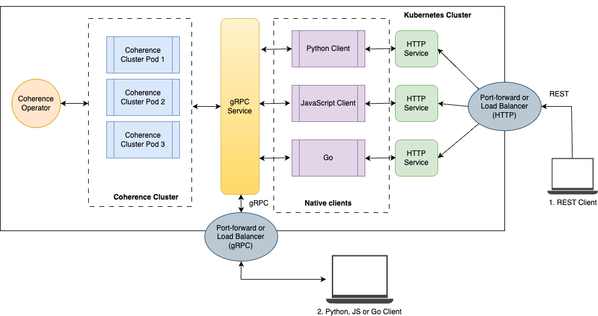

///////////////////////////////////////////////////////////////////////////////

    Copyright (c) 2025 Oracle and/or its affiliates.
    Licensed under the Universal Permissive License v 1.0 as shown at
    http://oss.oracle.com/licenses/upl.

///////////////////////////////////////////////////////////////////////////////
= Polyglot Client Demo
:description: Coherence Operator Documentation - Polyglot Client Demo Example
:keywords: oracle coherence, kubernetes, operator, polyglot, grpc, python, javascript, golang, go, example

== Polyglot Client Demo

This example shows how to deploy simple Python, JavaScript or Go applications that connect to Coherence running in Kubernetes.
The Coherence Operator is used to deploy a Coherence cluster and the applications connect via gRPC using the gRPC proxy.

A basic REST serve is written in each language which exposes the following endpoints to create, get, update or remove JSON people objects in the Coherence cluster.

* `POST /api/people` - create a person
* `GET /api/people` - return all people
* `GET /api/people/{id}` - return a single person
* `DELETE /api/people/{id}` - delete a person

The example shows how to connect to the Coherence cluster from any of the clients via two different methods:

1. From an application deployed with Kubernetes (purple processes shown below, accessed via `1. REST Client`)

2. From an application outside of Kubernetes using simple port-forward or LBR (yellow gRPC Service, accessed via `2. Python, JS or Go Client`)

**The diagram below outlines the example components.**

NOTE: We use `port-forward` for this example, but you would normally expose the services via load balancers.

See below for information on the Coherence langauge clients used:

* https://github.com/oracle/coherence-py-client[Coherence Python Client]
* https://github.com/oracle/coherence-js-client[Coherence JavaScript Client]
* https://github.com/oracle/coherence-go-client[Coherence Go Client]

== What the Example Will Cover

* <<pre,Prerequisites>>
** <<pre-1,Clone the GitHub repository>>
** <<pre-2,Create the coherence-demo namespace>>
** <<pre-3,Install the Coherence Operator>>
** <<pre-4,Download additional software (Optional)>>
* <<deploy, Deploy the example>>
** <<dep-1, Examine the Docker files>>
** <<dep-2, Build the example images>>
** <<dep-3, Push images>>
** <<dep-4, Deploy the Coherence Cluster>>
* <<run-example, Run the example>>
** <<run-1, Run from within Kubernetes>>
** <<run-2, View the cache information>>
** <<run-3, Run locally using native clients>>
* <<cleanup, Cleaning up>>

[#pre]
=== PreRequisites

You must have:

1. Docker running on your system. Either Docker Desktop or Rancher will work
2. Access to a Kubernetes cluster. You can use `kind` to create a local cluster on Mac. See https://kind.sigs.k8s.io/[Kind Documentation]
3. `kubectl` executable - See https://kubernetes.io/docs/tasks/tools/[Kubernetes Documentation]

NOTE: We have `Makefile` targets that will make the building and running of the example easier.

[#pre-1]
==== Clone the Coherence Operator Repository:

To build the examples, you first need to clone the Operator GitHub repository to your development machine.

[source,bash]
----
git clone https://github.com/oracle/coherence-operator

cd coherence-operator/examples/910_polyglot_demo
----

[#pre-2]
==== Create the coherence-demo Namespace

[source,bash]
----
make create-namespace
----

[source,bash]
.Output
----
kubectl create namespace coherence-demo || true
namespace/coherence-demo created
----

[#pre-3]
==== Install the Coherence Operator

TIP: The Coherence Operator is installed into a namespace called `coherence`. To change this see the documentation below.

[source,bash]
----
make deploy-operator
----

[source,bash]
.Output
----
kubectl apply -f https://github.com/oracle/coherence-operator/releases/download/v3.4.3/coherence-operator.yaml

namespace/coherence created
customresourcedefinition.apiextensions.k8s.io/coherence.coherence.oracle.com created
...
deployment.apps/coherence-operator-controller-manager created
----

You can check to see the Coherence Operator in running by issuing the following command, which will wait for it to be available.

[source,bash]
----
kubectl -n coherence wait --for=condition=available deployment/coherence-operator-controller-manager --timeout 120s
----

When you see the following message, you can continue.

[source,bash]
.Output
----
deployment.apps/coherence-operator-controller-manager condition met
----

See the <<docs/installation/001_installation.adoc,Installation Guide>> for more information about installing the Coherence Operator.

[#pre-4]
==== Download Additional Software (Optional)

If you are planning on running the clients locally, E.g. **not just from within the Kuberenetes cluster**, and connect to the cluster, you must install the following
software for your operating system.

Otherwise, you can continue to the next step.

1. Python 3.9 or Later - https://www.python.org/downloads/[https://www.python.org/downloads/]
2. Node 18.15.x or later and NPM 9.x or later - https://nodejs.org/en/download[https://nodejs.org/en/download]
3. Go 1.23 or later - https://go.dev/doc/install[https://go.dev/doc/install]

TIP: If you are just going to run the example within your Kubernetes cluster then you do not need the software.

[#deploy]
=== Deploy the Example

[#dep-1]
==== Examine the Docker Files

Each of the clients has a `Dockerfile` to build for the specific language client. You can inspect each of them below:

**Python Client**

[source,bash,indent=0]
----
include::py/Dockerfile[tag=dockerfile]
----

**JavScript Client**

[source,bash,indent=0]
----
include::js/Dockerfile[tag=dockerfile]
----

**Go Client**

[source,bash,indent=0]
----
include::go/Dockerfile[tag=dockerfile]
----

[#code]
==== Examine the Code

You can view the source of each of the language clients here:

* https://github.com/oracle/coherence-operator/blob/main/examples/910_polyglot_demo/py/main.py[py/main.py]
* https://github.com/oracle/coherence-operator/blob/main/examples/910_polyglot_demo/js/main.js[js/main.js]
* https://github.com/oracle/coherence-operator/blob/main/examples/910_polyglot_demo/go/main.go[go/main.go]

[#dep-2]
==== Build the Example images

TIP: If you are deploying to a remote cluster or deploying to a different architecture in Kubernetes, please read the *Important Notes* below before you build.

Build each of the images using make, or run `make create-all-images`, as shown below.

* `make create-py-image`
* `make create-js-image`
* `make create-go-image`

[source,bash,indent=0]
----
 make create-all-images
----

[source,bash,indent=0]
.Output
----
cd go && docker buildx build --platform linux/arm64 -t polyglot-client-go:1.0.0 .
[+] Building 27.8s (12/12) FINISHED
....
cd js && docker buildx build --platform linux/arm64 -t polyglot-client-js:1.0.0 .
[+] Building 4.2s (10/10) FINISHED
...
cd py && docker buildx build --platform linux/arm64 -t polyglot-client-py:1.0.0 .
[+] Building 3.0s (8/8) FINISHED
----

You will end up with the following images:

* `polyglot-client-py:1.0.0` - Python Client
* `polyglot-client-js:1.0.0` - JavaScript Client
* `polyglot-client-go:1.0.0` - Go Client

**Important Notes**

1. The images are built by default for arm64, you can specify `PLATFORM=linux/amd64` before your make commands to change the architecture.

2. If you need to push the images to a remote repository, you will need to specify the IMAGE_PREFIX=.. before the make commands, e.g.:
+
[source,bash,indent=0]
----
IMAGE_PREFIX=ghcr.io/username/repo/ make create-py-image
----
+
[source,bash,indent=0]
.Output
----
cd py && docker buildx build --platform linux/arm64 -t ghcr.io/username/repo/polyglot-client-py:1.0.0 .
...
----
+
NOTE: In this example the image will be `ghcr.io/username/repo/polyglot-client-py:1.0.0`. You will also need to update the deployment yaml files.

[#dep-3]
==== Push Images

Choose one of the following methods, depending upon if you are using a local *kind* cluster or not.

**You are running a local cluster using kind**

Run the following to load the images you just created to the cluster.

[source,bash]
----
make kind-load-images
----

**You need to push to a remote repository**

1. Push the images to your local container repository. E.g. for the example above:
+
[source,bash]
----
docker push ghcr.io/username/repo/polyglot-client-py:1.0.0
docker push ghcr.io/username/repo/polyglot-client-js:1.0.0
docker push ghcr.io/username/repo/polyglot-client-go:1.0.0
----

2. Modify the following files to change the image name accordingly in the following deployment yaml files:
+
* https://github.com/oracle/coherence-operator/blob/main/examples/910_polyglot_demo/yaml/py-client.yaml[py-client.yaml]
* https://github.com/oracle/coherence-operator/blob/main/examples/910_polyglot_demo/yaml/js-client.yaml[js-client.yaml]
* https://github.com/oracle/coherence-operator/blob/main/examples/910_polyglot_demo/yaml/go-client.yaml[go-client.yaml]

3. Create a secret if your repository is not public:
+
If the repository you are pushing to is not public, you will need to create a pull secret, and add this to the deployment yaml for each client.
+
[source,bash]
----
kubectl create secret docker-registry my-pull-secret \
    --docker-server=ghcr.io \
    --docker-username="<username>" --docker-password="<password>" \
    --docker-email="<email>" -n coherence-demo
----
+
In each of the client deployment files, above add `imagePullSecrets` after the image. For example in the go-client:
+
[source,yaml]
----
        - name: go-client
          image: ghcr.io/username/repo/polyglot-client-go:1.0.0
          imagePullPolicy: IfNotPresent
          imagePullSecrets:
            - name: my-pull-secret
----

[#dep-4]
==== 4. Deploy the Coherence Cluster

The following deployment file is used to deploy a 3 node Coherence cluster to your Kubernetes cluster.

[source,bash,indent=0]
----
include::yaml/coherence-cluster.yaml[]
----
<1> the cluster name
<2> the number of replicas to create
<3> Image to use to start Coherence
<4> Enable management
<5> Enable gRPC port

NOTE: When we deploy this yaml, each of the ports will become a service that we can use to connect to.

Deploy the Coherence Cluster using the following:

[source,bash,indent=0]
----
make deploy-coherence
----

[source,bash,indent=0]
.Output
----
kubectl -n coherence-demo apply -f yaml/coherence-cluster.yaml
coherence.coherence.oracle.com/demo-cluster created
sleep 5
kubectl -n coherence-demo get pods
NAME             READY   STATUS    RESTARTS   AGE
demo-cluster-0   0/1     Running   0          5s
demo-cluster-1   0/1     Running   0          5s
demo-cluster-2   0/1     Running   0          5s
----

Issue the following command to wait until the Coherence cluster is ready.

[source,bash,indent=0]
----
kubectl -n coherence-demo wait --for=condition=ready coherence/demo-cluster --timeout 120s
coherence.coherence.oracle.com/demo-cluster condition met
----

[#run-example]
=== Run the example

Choose one of the methods below to demo the application.

1. <<run-1, Run from within Kubernetes>>
2. <<run-3, Run locally using native clients>>

[#run-1]
==== Run from within Kubernetes

In this section, we will deploy all the client pods to Kubernetes, and access the REST endpoints via their services, using the `port-forward` command.

See **1. REST Client** on the right of the diagram below:

NOTE: We are accessing the application HTTP endpoint via port-forward, but the client pods within Kubernetes
are directly accessing cluster within Kubernetes.

When we deploy the clients, the yaml used is shown below:

* https://github.com/oracle/coherence-operator/blob/main/examples/910_polyglot_demo/yaml/py-client.yaml[Python Client]
* https://github.com/oracle/coherence-operator/blob/main/examples/910_polyglot_demo/yaml/js-client.yaml[JavaScript Client]
* https://github.com/oracle/coherence-operator/blob/main/examples/910_polyglot_demo/yaml/go-client.yaml[Go Client]

By default, the Python, JavaScript and Go clients connect to `localhost:1408` on startup, but you can specify the gRPC host and port to connect to in the
code or use the `COHERENCE_SERVER_ADDRESS` environment variable to specify this which is more flexible.

Each of the clients, (Python shown below for example), have this variable set to `demo-cluster-grpc:1408` where `demo-cluster-grpc`
is the service for the grpc port created when we deployed the Coherence cluster.

[source,yaml,indent=0]
----
include::yaml/py-client.yaml[tag=yaml]
----

**Deploy the clients**

Firstly, run the following to deploy all the clients. This yaml also deploys a service from which you can connect to the client.

[source,bash,indent=0]
----
make deploy-all-clients
----

[source,bash,indent=0]
.Output
----
kubectl -n coherence-demo apply -f yaml/go-client.yaml
service/go-client created
deployment.apps/go-client created
kubectl -n coherence-demo apply -f yaml/js-client.yaml
service/js-client created
deployment.apps/js-client created
kubectl -n coherence-demo apply -f yaml/py-client.yaml
service/py-client created
deployment.apps/py-client created
----

Issue the following to show the deployments and services.

[source,bash,indent=0]
----
kubectl get deployments -n coherence-demo
----

[source,bash,indent=0]
.Output
----
NAME        READY   UP-TO-DATE   AVAILABLE   AGE
go-client   1/1     1            1           3s
js-client   1/1     1            1           3s
py-client   1/1     1            1           3s
----

**Port forward to access the HTTP endpoint**

To port-forward the clients we will first need to view the services:

[source,bash,indent=0]
----
kubectl get services -n coherence-demo
----

[source,bash,indent=0]
.Output
----
NAME                      TYPE        CLUSTER-IP      EXTERNAL-IP   PORT(S)                                               AGE
demo-cluster-grpc         ClusterIP   10.96.200.57    <none>        1408/TCP                                              8m2s
demo-cluster-management   ClusterIP   10.96.46.69     <none>        30000/TCP                                             8m2s
demo-cluster-sts          ClusterIP   None            <none>        7/TCP,7575/TCP,7574/TCP,6676/TCP,1408/TCP,30000/TCP   8m2s
demo-cluster-wka          ClusterIP   None            <none>        7/TCP,7575/TCP,7574/TCP,6676/TCP                      8m2s
go-client-http            ClusterIP   10.96.249.42    <none>        8080/TCP                                              32s
js-client-http            ClusterIP   10.96.114.88    <none>        8080/TCP                                              31s
py-client-http            ClusterIP   10.96.196.163   <none>        8080/TCP                                              31s
----

The services we are interested in are the `go-client-http`, `js-client-http` or `py-client-http`.

As all the clients expose the same API, You can choose any of the clients to port-forward to. For this example will
choose the JavaScript client.

[source,bash,indent=0]
----
kubectl port-forward -n coherence-demo svc/js-client-http 8080:8080
----

[source,bash,indent=0]
.Output
----
Forwarding from 127.0.0.1:8080 -> 8080
Forwarding from [::1]:8080 -> 8080
----

[#rest-endpoints]
**Exercise the REST endpoints**

Use the following commands to work with the REST endpoints.

**Create two People**

[source,bash]
----
curl -X POST -H 'Content-Type: application/json' http://localhost:8080/api/people -d '{"id": 1,"name":"Tim", "age": 25}'
----

[source,bash]
----
curl -X POST -H 'Content-Type: application/json' http://localhost:8080/api/people -d '{"id": 2,"name":"John", "age": 35}'
----

*List the people in the cache*

[source,bash]
----
curl http://localhost:8080/api/people
----

[source,bash]
.Output
----
[{"id":1,"name":"Tim","age":25},{"id":2,"name":"John","age":35}]
----

*Get a single Person*

[source,bash]
----
curl http://localhost:8080/api/people/1
----

[source,bash]
.Output
----
{"id":1,"name":"Tim","age":25}
----

*Remove a Person*

[source,bash]
----
curl -X DELETE http://localhost:8080/api/people/1
----

[source,bash]
.Output
----
OK
----

*Try to retrieve the deleted person*

[source,bash]
----
curl http://localhost:8080/api/people/1
----

[source,bash]
.Output
----
Not Found
----

[#run-2]
==== View the cache information

You can use the https://github.com/oracle/coherence-cli[Coherence CLI] to view cluster and cache information.

NOTE: The Coherence CLI is automatically bundled with the Coherence Operator and can be accessed via `kuebctl exec`.

**Display the cluster members**

Use the following to show the cluster members:

[source,bash]
----
kubectl exec demo-cluster-0 -c coherence -n coherence-demo -- /coherence-operator/utils/cohctl get members
----

[source,bash]
.Output
----

Total cluster members: 3
Storage enabled count: 3
Departure count:       0

Cluster Heap - Total: 8,964 MB Used: 150 MB Available: 8,814 MB (98.3%)
Storage Heap - Total: 8,964 MB Used: 150 MB Available: 8,814 MB (98.3%)

NODE ID  ADDRESS                                          PORT  PROCESS  MEMBER          ROLE          STORAGE  MAX HEAP  USED HEAP  AVAIL HEAP
      1  demo-cluster-wka.coherence-demo.svc/10.244.0.31  7575       56  demo-cluster-0  demo-cluster  true     2,988 MB      45 MB    2,943 MB
      2  demo-cluster-wka.coherence-demo.svc/10.244.0.32  7575       57  demo-cluster-2  demo-cluster  true     2,988 MB      36 MB    2,952 MB
      3  demo-cluster-wka.coherence-demo.svc/10.244.0.33  7575       57  demo-cluster-1  demo-cluster  true     2,988 MB      69 MB    2,919 MB
----

**Display the cache information**

Use the following to show the cache information:

[source,bash]
----
kubectl exec demo-cluster-0 -c coherence -n coherence-demo -- /coherence-operator/utils/cohctl get caches -o wide
----

NOTE: You will see other system caches, but you should also see the `people` cache with one entry.

[source,bash]
.Output
----
Total Caches: 7, Total primary storage: 0 MB

SERVICE            CACHE                 COUNT  SIZE  AVG SIZE    PUTS    GETS  REMOVES  EVICTIONS    HITS   MISSES  HIT PROB
"$SYS:Concurrent"  executor-assignments      0  0 MB         0       0       0        0          0       0        0     0.00%
"$SYS:Concurrent"  executor-executors        2  0 MB     1,248  12,105  12,103        1          0  12,103        0   100.00%
"$SYS:Concurrent"  executor-tasks            0  0 MB         0       0       0        0          0       0        0     0.00%
"$SYS:Concurrent"  locks-exclusive           0  0 MB         0       0       0        0          0       0        0     0.00%
"$SYS:Concurrent"  locks-read-write          0  0 MB         0       0       0        0          0       0        0     0.00%
"$SYS:Concurrent"  semaphores                0  0 MB         0       0       0        0          0       0        0     0.00%
PartitionedCache   people                    1  0 MB       224       6      29        2          0      26        3    89.66%
----

[#run-3]
==== Run locally using native clients

Depending upon the client you are wanting to run you need to ensure you have installed the relevant
client software as shown in the <<pre-4,pre-requisites here>>.

TIP: Ensure you stopped the port-forward from the previous step if you ran this.

See **2. Python, JS or GO Client** on the bottom of the diagram below:

**Run Port forward**

Firstly we have to run a `port-forward` command to port-forward the gRPC 1408 locally to the `demo-cluster-grpc:1408` port on the Kubernetes cluster.

Typically, if you want to access a service from outside the Kubernetes cluster, you would have a load balancer configured to access this directly, but in example we will use `port-forward`.

Run the following:

[source,bash]
----
kubectl -n coherence-demo port-forward svc/demo-cluster-grpc 1408:1408
----

[source,bash]
.Output
----
Forwarding from 127.0.0.1:1408 -> 1408
Forwarding from [::1]:1408 -> 1408
----

the **DIAGARM**...

Then follow the instructions to start either of the clients below, which will list on port 8080 locally and connect to the Coherence cluster via gRPC on localhost:1408 which will be port-forwarded.

**Python Client**

NOTE: We are install a python virtual environment for this example.

1. Change to the `py` directory

2. Create a python virtual environment
+
[source,bash]
----
python3 -m venv ./venv
. venv/bin/activate
----

3. Install the requirements
+
[source,bash]
----
python3 -m pip install -r requirements.txt
----

4. Run the Python example
+
[source,bash]
----
python3 main.py
----
+
[source,bash]
.Output
----
2025-04-07 11:06:42,501 - coherence - INFO - Session [5d940a05-1cfc-4e6c-9ef8-52cc6e7705ba] connected to [localhost:1408].
2025-04-07 11:06:42,525 - coherence - INFO - Session(id=5d940a05-1cfc-4e6c-9ef8-52cc6e7705ba, connected to [localhost:1408] proxy-version=14.1.2.0.1, protocol-version=1 proxy-member-id=1)
[2025-04-07 11:06:42 +0800] [27645] [INFO] Running on http://0.0.0.0:8080 (CTRL + C to quit)
----
+
NOTE: This is now showing the HTTP server is running locally and connecting via port-forward to the Coherence Cluster.

5. Exercise the REST end-points as per the instructions <<rest-endpoints, here>>

**JavaScript Client**

1. Change to the `js` directory

2. Install the modules
+
[source,bash]
----
npm install
----

3. Run the JavaScript example
+
[source,bash]
----
node main.js
----

4. Exercise the REST end-points as per the instructions <<rest-endpoints, here>>

**Go Client**

1. Change to the `go` directory

2. Ensure you have the latest Coherence Go client
+
[source,bash]
----
npm install
----

3. Build the executable
+
[source,bash]
----
go get github.com/oracle/coherence-go-client/v2@latest
go mod tidy
----

4. Run the Go example
+
[source,bash]
----
/runner
----
+
[source,bash]
.Output
----
2025/04/07 11:19:21 INFO: Session [2073aa45-68aa-426d-a0b8-99405dcaa942] connected to [localhost:1408] Coherence version: 14.1.2.0.1, serverProtocolVersion: 1, proxyMemberId: 1
Server running on port 8080
----

5. Exercise the REST end-points as per the instructions <<rest-endpoints, here>>

[#cleanup]
=== Cleaning Up

1. Undeploy the clients using:
+
[source,bash]
----
make undeploy-all-clients
----

2. Undeploy the Coherence cluster
+
[source,bash]
----
make undeploy-coherence
----

3. Undeploy the Coherence Operator
+
[source,bash]
----
make undeploy-operator
----

4. Delete the namespace
+
[source,bash]
----
make delete-namespace
----

