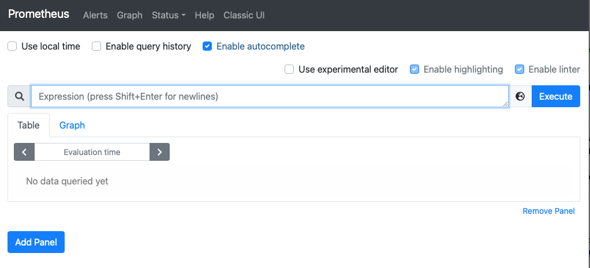
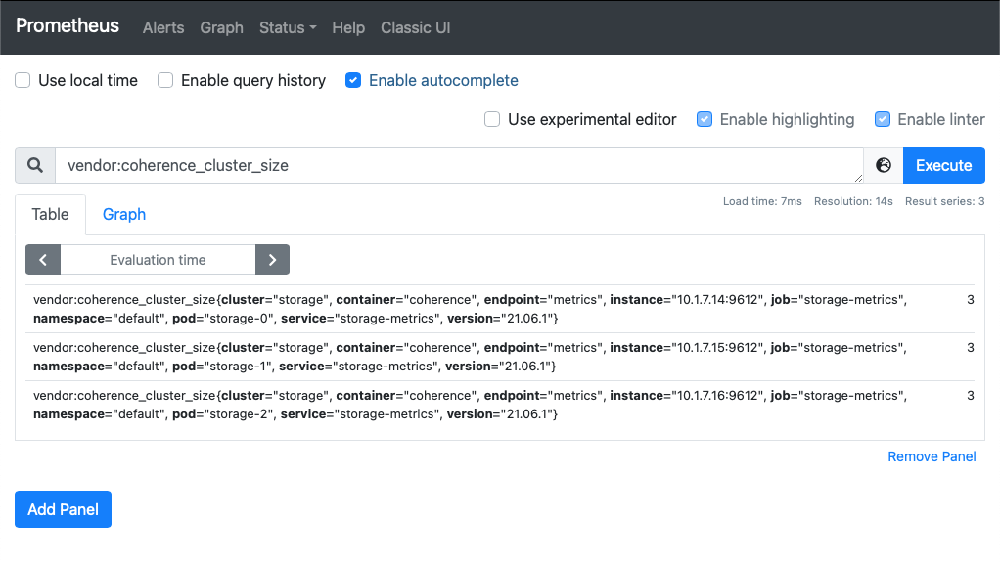
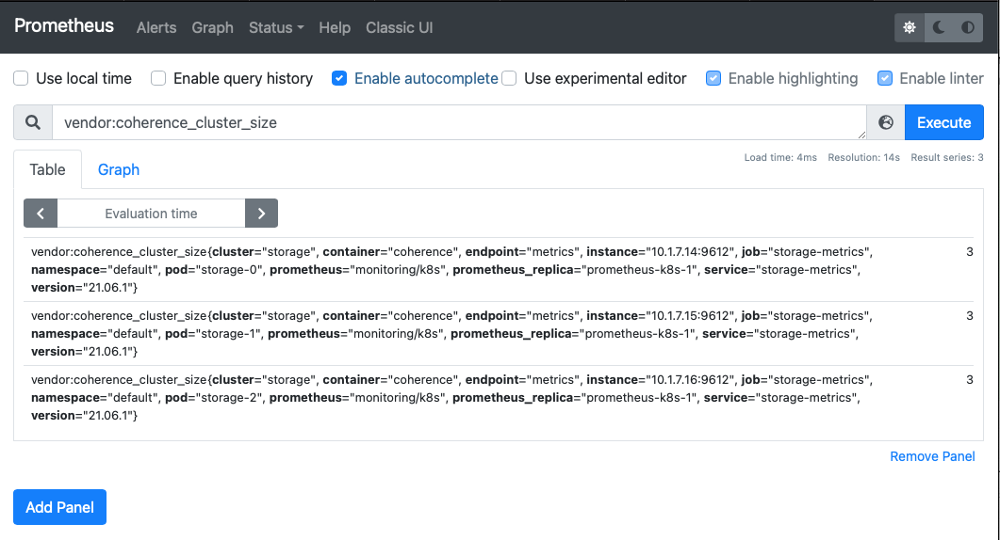

///////////////////////////////////////////////////////////////////////////////

    Copyright (c) 2021, 2022, Oracle and/or its affiliates.
    Licensed under the Universal Permissive License v 1.0 as shown at
    http://oss.oracle.com/licenses/upl.

///////////////////////////////////////////////////////////////////////////////
= Enabling Coherence Metrics

== Enabling Coherence Metrics

This example shows how to deploy a simple Coherence cluster in Kubernetes manually, and enabling the Pods in that cluster to expose a http endpoint to allow access to Coherence metrics.
This example expands on the `StatefulSet` used in the first simple deployment example.

[TIP]
====
image:GitHub-Mark-32px.png[] The complete source code for this example is in the https://{examples-source}no-operator/02_metrics[Coherence Operator GitHub] repository.
====

*Prerequisites*

This example assumes that you have already built the example server image.

== Create the Kubernetes Resources

In the simple server example we created some `Services` and a `StatefulSet` that ran a Coherence cluster in Kubernetes.
In this example we will just cover the additional configurations we need to make to expose Coherence metrics.
We will not bother repeating the configuration for the `Services` for the `StatefulSet` and well known addressing or the Service for exposing Extend. We will assume they are already part of our yaml file.

The `coherence-metrics.yaml` file that is part of the source for this example contains all those resources.

=== The StatefulSet

To expose Coherence metrics we just need to change the `StatefulSet` to set either the system properties or environment variables to enable metrics. We will also add a container port to the expose metrics endpoint.

[source,yaml]
.coherence.yaml
----
apiVersion: apps/v1
kind: StatefulSet
metadata:
  name: storage
spec:
  selector:
    matchLabels:
      coherence.oracle.com/cluster: test-cluster
      coherence.oracle.com/deployment: storage
  serviceName: storage-sts
  replicas: 3
  template:
    metadata:
      labels:
        coherence.oracle.com/cluster: test-cluster
        coherence.oracle.com/deployment: storage
    spec:
      containers:
        - name: coherence
          image: simple-coherence:1.0.0
          command:
            - java
          args:
            - -cp
            - "@/app/jib-classpath-file"
            - -Xms1800m
            - -Xmx1800m
            - "@/app/jib-main-class-file"
          env:
            - name: COHERENCE_CLUSTER
              value: storage
            - name: COHERENCE_WKA
              value: storage-wka
            - name: COHERENCE_CACHECONFIG
              value: "test-cache-config.xml"
            - name: COHERENCE_METRICS_HTTP_ENABLED
              value: "true"
          ports:
            - name: extend
              containerPort: 20000
            - name: metrics
              containerPort: 9612
----

The yaml above is identical to that used in the simple server example apart from:
* We added the `COHERENCE_METRICS_HTTP_ENABLED` environment variable with a value of `"true"`. Instead of this we could have added `-Dcoherence.metrics.http.enabled=true` to the `args:` list to set the `coherence.metrics.http.enabled` system property to true. Recent versions of Coherence work with both system properties or environment variables, and we just chose to use environment variables in this example.
* We added a port named `metrics` with a port value of `9612`, which is the default port that the Coherence metrics endpoint binds to.

== Deploy the Cluster

We can combine all the snippets of yaml above into a single file and deploy it to Kubernetes.
The source code for this example contains a file named `coherence-metrics.yaml` containing all the configuration above.
We can deploy it with the following command:
[source,bash]
----
kubectl apply -f coherence-metrics.yaml
----

We can see all the resources created in Kubernetes are the same as the simple server example:
[source,bash]
----
kubectl get all
----
Which will display something like the following:
[source]
----
pod/storage-0   1/1     Running   0          10s
pod/storage-1   1/1     Running   0          7s
pod/storage-2   1/1     Running   0          6s

NAME                     TYPE        CLUSTER-IP       EXTERNAL-IP   PORT(S)     AGE
service/kubernetes       ClusterIP   10.96.0.1        <none>        443/TCP     158d
service/storage-extend   ClusterIP   10.102.198.218   <none>        20000/TCP   10s
service/storage-sts      ClusterIP   None             <none>        7/TCP       10s
service/storage-wka      ClusterIP   None             <none>        7/TCP       10s

NAME                       READY   AGE
statefulset.apps/storage   3/3     10s
----

== Retrieve Metrics

To test that we can access metrics we will port-forward to one of the `Pods` and use `curl` to get the metrics.
We can choose any of the three `Pods` to test, or repeat the test for each `Pod`.
In this example, we'll just port-forward local port 9612 to port 9612 in `pod/storage-0`.

[source,bash]
----
kubectl port-forward pod/storage-0 9612:9612
----

Now in another terminal we can run the `curl` command to get metrics. As we are using port forwarding the host will be `127.0.0.1` and the port will be `9612`.
[source,bash]
----
curl -X GET http://127.0.0.1:9612/metrics
----

This should then bring back all the Coherence metrics for `pod/storage-0`. The default format of the response is Prometheus text format.

We can also retrieve individual metrics by name. For example, we can get the `Coherence.Cluster.Size` metric:
[source,bash]
----
curl -X GET http://127.0.0.1:9612/metrics/Coherence.Cluster.Size
----
which will display something like this:
[source,bash]
----
vendor:coherence_cluster_size{cluster="storage", version="21.12.1"} 3
----
This displays the metric name in Prometheus format `vendor:coherence_cluster_size`, the metric labels `cluster="storage", version="21.12.1"` and the metric value, in this case `3` as there are three cluster members because we specified a replicas value of 3 in the `StatefulSet`.

We can also receive the same response as `json` by using either the accepted media type header `"Accept: application/json"`:
[source,bash]
----
curl -X GET -H "Accept: application/json" http://127.0.0.1:9612/metrics/Coherence.Cluster.Size
----
Or by using the `.json` suffix on the URL
[source,bash]
----
curl -X GET http://127.0.0.1:9612/metrics/Coherence.Cluster.Size.json
----

Both requests will display something like this:
[source,bash]
----
[{"name":"Coherence.Cluster.Size","tags":{"cluster":"storage","version":"21.12.1"},"scope":"VENDOR","value":3}]
----

We have now verified that the `Pods` in the cluster are producing metrics.

== Using Prometheus

One of the most common ways to analyse metrics in Kubernetes is by using Prometheus.
The recommended way to do this is to deploy Prometheus inside your Kubernetes cluster so that it can scrape metrics directly from `Pods`. Whilst Prometheus can be installed outside the Kubernetes cluster, this introduces a much more complicated set-up.
If using Prometheus externally to the Kubernetes cluster, the approach recommended by Prometheus is to use federation, which we show in an example below.

=== Install Prometheus

The simplest way to install Prometheus is to follow the instructions in the Prometheus Operator
https://prometheus-operator.dev/docs/getting-started/quick-start/[Quick Start] page.
Prometheus can then be accessed as documented in the
https://prometheus-operator.dev/docs/getting-started/quick-start/#access-prometheus[Access Prometheus section of the Quick Start] page.

As described in the Prometheus docs we can create a port-forward process to the Prometheus `Service`.

[source,bash]
----
kubectl --namespace monitoring port-forward svc/prometheus-k8s 9090
----

Then point our browser to http://localhost:9090 to access the Prometheus UI.

At this stage there will be no Coherence metrics, but we'll change that in the next section.

=== Create a ServiceMonitor

The out of the box Prometheus install uses `ServiceMonitor` resources to determine which Pods to scrape metrics from.
We can therefore configure Prometheus to scrape our Coherence cluster metrics by adding a `Service` and `ServiceMonitor`.

A Prometheus `ServiceMonitor`, as the name suggests, monitors a `Service` so we need to create a `Service` to expose the metrics port.
We are not going to access this `Service` ourselves, so it does not need to be a load balancer, in fact it can just be a headless service.
Prometheus uses the `Service` to locate the Pods that it should scrape.

The yaml below is a simple headless service that has a selector that matches labels in our Coherence cluster `Pods`.
[source,yaml]
.prometheus-metrics.yaml
----
apiVersion: v1
kind: Service
metadata:
  name: storage-metrics
  labels:
    coherence.oracle.com/cluster: test-cluster
    coherence.oracle.com/deployment: storage
    coherence.oracle.com/component: metrics-service
spec:
  type: ClusterIP
  ports:
  - name: metrics
    port: 9612
    targetPort: metrics
  selector:
    coherence.oracle.com/cluster: test-cluster
    coherence.oracle.com/deployment: storage
----

We can now create a Prometheus `ServiceMonitor` that tells Prometheus about the `Service` to use.
[source,yaml]
.prometheus-metrics.yaml
----
apiVersion: monitoring.coreos.com/v1
kind: ServiceMonitor
metadata:
  name: storage-metrics
  labels:
    coherence.oracle.com/cluster: test-cluster
    coherence.oracle.com/deployment: storage
    coherence.oracle.com/component: service-monitor
spec:
  endpoints:
  - port: metrics
  selector:
    matchLabels:
        coherence.oracle.com/cluster: test-cluster
        coherence.oracle.com/deployment: storage
        coherence.oracle.com/component: metrics-service
----

The `ServiceMonitor` above contains a single endpoint that scrapes the port named `metrics` in any `Service` with labels matching those in the `matchLabels` array, which in this case are the labels we applied to the `storage-metrics` service above.

The full specification of what can be in a `ServiceMonitor` can be found in the Prometheus
https://github.com/prometheus-operator/prometheus-operator/blob/master/Documentation/api.md#servicemonitorspec[ServiceMonitorSpec]
documentation.

We can combine both of the above pieces of yaml into a single file and deploy them.
The example source code contains a file named `prometheus-metrics.yaml` that contains the yaml above.
Create the `Service` and `ServiceMonitor` in the same Kubernetes namespace as the Coherence cluster.

[source,bash]
----
kubectl apply -f prometheus-metrics.yaml
----

It can sometimes take a minute or two for Prometheus to discover the `ServiceMonitor` and start to scrape metrics from the Pods. Once this happens it should be possible to see Coherence metrics for the cluster in Prometheus.

As shown above, the `vendor:coherence_cluster_size` metric has been scraped from all three `Pods` and as expected all `Pods` have a cluster size value of `3`.

=== Federated Prometheus Metrics

Prometheus Federation is the recommended way to scale Prometheus and to make metrics from inside Kubernetes available in a Prometheus instance outside of Kubernetes. Instead of the external Prometheus instance needing to be configured to locate and connect to `Pods` inside Kubernetes, it only needs an ingress into Prometheus running inside Kubernetes and can scrape all the metrics from there.
More details can be found in the https://prometheus.io/docs/prometheus/latest/federation/[Prometheus Federation] documentation.

We can install a local Prometheus instance as described in the https://prometheus.io/docs/prometheus/latest/getting_started/[Prometheus Getting Started] guide.

In the Prometheus installation directory we can edit the `prometheus.yml` file to configure Prometheus to scrape the federation endpoint of Prometheus inside Kubernetes. We need to *add* the federation configuration to the `scrape_configs:` section as shown below:

[source,yaml]
.prometheus.yml
----
scrape_configs:
  - job_name: 'federate'
    scrape_interval: 15s
    honor_labels: true
    metrics_path: '/federate'
    params:
      'match[]':
        - '{__name__=~"vendor:coherence_.*"}'
    static_configs:
      - targets:
        - '127.0.0.1:9091'
----

You will notice that we have used `127.0.0.1:9091` as the target address. This is because when we run our local Prometheus instance it will bind to port 9090 so when we run the port-forward process to allow connections into Prometheus in the cluster we cannot use port `9090`, so we will forward local port `9091` to the Prometheus service port `9090` in Kubernetes.

In the `params:` section we have specified that the `'match[]':` field only federates metrics that have a name that starts with `vendor:coherence_` so in this example we only federate Coherence metrics.

Run the port-forward process so that when we start our local Prometheus instance it can connect to Prometheus in Kubernetes.

[source,bash]
----
kubectl --namespace monitoring port-forward svc/prometheus-k8s 9091:9090
----

We're now forwarding local port 9091 to Prometheus service port 9090 so we can run the local Prometheus instance.
As described in the Prometheus documentation, from the Prometheus installation directory run the command:

[source,bash]
----
./prometheus --config.file=prometheus.yml
----

Once Prometheus starts we can point our browser to http://localhost:9090 to access the prometheus UI.
After a short pause, Prometheus should start to scrap emetrics from inside Kubernetes and we should see them in the UI

== Grafana

We could now install Grafana and configure it to connect to Prometheus, either the local instance or the instance inside Kubernetes. The Coherence Operator provides a number of dashboards that can imported into Grafana. See the Operator
https://oracle.github.io/coherence-operator/docs/latest/#/docs/metrics/030_importing[Import Grafana Dashboards] documentation.

