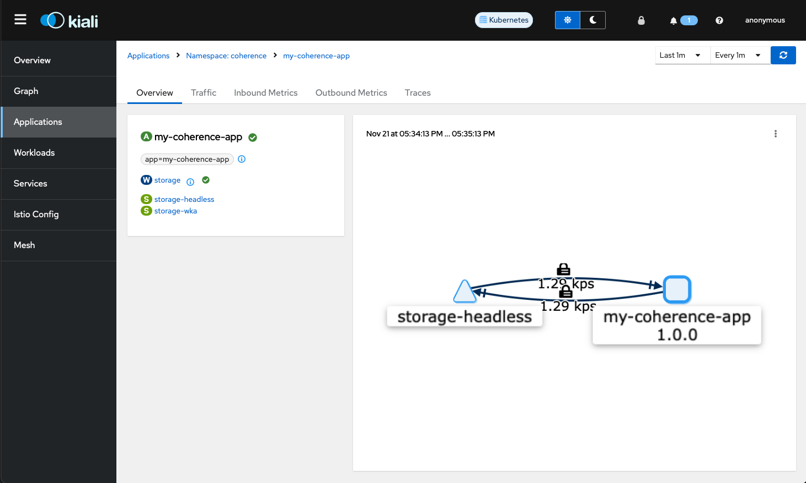

///////////////////////////////////////////////////////////////////////////////

    Copyright (c) 2023, Oracle and/or its affiliates.
    Licensed under the Universal Permissive License v 1.0 as shown at
    http://oss.oracle.com/licenses/upl.

///////////////////////////////////////////////////////////////////////////////
= Running Coherence with Istio

== Running Coherence with Istio

This example shows how to deploy a simple Coherence cluster in Kubernetes with Istio.

Coherence can be configured to work with https://istio.io[Istio], even if Istio is configured in Strict Mode.
Coherence caches can be accessed from inside or outside the Kubernetes cluster via Coherence*Extend, REST,
and other supported Coherence clients.
Although Coherence itself can be configured to use TLS, when using Istio Coherence cluster members and clients can
just use the default socket configurations and Istio will control and route all the traffic over mTLS.

== How Does Coherence Work with Istio?

Istio is a "Service Mesh" so the clue to how Istio works in Kubernetes is in the name, it relies on the configuration
of Kubernetes Services.
This means that any ports than need to be accessed in Pods, including those using in "Pod to Pod" communication
must be exposed via a Service. Usually a Pod can reach any port on another Pod even if it is not exposed in the
container spec, but this is not the case when using Istio as only ports exposed by the Envoy proxy are allowed.

For Coherence cluster membership, this means the cluster port and the local port must be exposed on a Service.
To do this the local port must be configured to be a fixed port instead of the default ephemeral port.
The default cluster port is `7574` and there is no reason to ever change this when running in containers.
A fixed local port has to be configured for Coherence to work with Istio out of the box.
Additional ports, management port, metrics port, etc. also need to be exposed if they are being used.

Ideally, Coherence clusters are run as a StatefulSet in Kubernetes.
This means that the Pods are configured with a host name and a subdomain based on the name of the StatefulSet
headless service name, and it is this name that should be used to access Pods.

=== Prerequisites

The instructions assume that you are using a Kubernetes cluster with Istio installed and configured already.

==== Enable Istio Strict Mode

For this example we make Istio run in "strict" mode so that it will not allow any traffic between Pods outside the
Envoy proxy.
If other modes are used, such as permissive, then Istio allows Pod to Pod communication so a cluster may appear to work
in permissive mode, when it would not in strict mode.

To set Istio to strict mode create the following yaml file.

[source,yaml]
.istio-strict.yaml
----
apiVersion: security.istio.io/v1beta1
kind: PeerAuthentication
metadata:
  name: "default"
spec:
  mtls:
    mode: STRICT
----

Install this yaml into the Istio system namespace with the following command:

[source,bash]
----
kubectl -n istio-system apply istio-strict.yaml
----

== Create a Coherence Cluster

The best way to run Coherence cluster members is to use a StatefulSet. Multiple StatefulSets can be created that
are all part of the same Coherence cluster.

In this example we will run a Coherence cluster using the CE image. This image starts Coherence with health
checks enabled on port 6676,
an Extend proxy listening on port 20000, a gRPC proxy on port 1408, the cluster port set to 7574.
We will also enable Coherence Management over REST on port 30000, and metrics on port 9612.
We will set the Coherence local port to a fixed value of 7575.

[NOTE]
====
Istio has a few requirements for how Kubernetes resources are configured.
One of those is labels, where an `app` and `version` label are required to specify the application name
that the resource is part of and the version of that application.
All the resources in this example contains those labels.
====

=== Cluster Discovery Service

For Coherence cluster discovery to work in Kubernetes we have to configure Coherence well-known-addresses which
requires a headless service. We cannot use the same headless service the we will create for the StatefulSet because
the WKA service must have the `publishNotReadyAddresses` field set to `true`, wheres the StatefulSet service does not.
We would not want the ports accessed via the StatefulSet service to route to unready Pods, but for cluster discovery
we must allow unready Pods to be part of the Service.

The discovery service can be created with yaml like that shown below.

[source,yaml]
.wka-service.yaml
----
apiVersion: v1
kind: Service
metadata:
  name: storage-wka    # <1>
spec:
  clusterIP: None
  publishNotReadyAddresses: true  # <2>
  selector:                       # <3>
    app: my-coherence-app
    version: 1.0.0
  ports:
    - name: coherence    # <4>
      port: 7574
      targetPort: coherence
      appProtocol: tcp
----

<1> The service name is `storeage-wka` and this will be used to configure the Coherence WKA address in the cluster.
<2> The `publishNotReadyAddresses` field must be set to `true`
<3> The `selector` is configured to match a sub-set of the Pod labels configured in the StatefulSet
<4> We do not really need or care about the port for the cluster discovery service, but all Kubernetes services must have
at least one port, so here we use the cluster port. We could use any random port, even one that nothing is listening on

=== StatefulSet Headless Service

All StatefulSets require a headless Service creating and the name of this Service is specified in the StatefulSet spec.
All the ports mentioned above will be exposed on this service.
The yaml for the service could look like this:

[source,yaml]
.storage-service.yaml
----
apiVersion: v1
kind: Service
metadata:
  name: storage-headless
spec:
  clusterIP: None
  selector:
    app: my-coherence-app  # <1>
    version: 1.0.0
  ports:
    - name: coherence              # <2>
      port: 7574
      targetPort: coherence
      appProtocol: tcp
    - name: coh-local              # <3>
      port: 7575
      targetPort: coh-local
      appProtocol: tcp
    - name: extend-proxy           # <4>
      port: 20000
      targetPort: extend-proxy
      appProtocol: tcp
    - name: grpc-proxy             # <5>
      port: 1408
      targetPort: grpc-proxy
      appProtocol: grpc
    - name: management             # <6>
      port: 30000
      targetPort: management
      appProtocol: http
    - name: metrics                # <7>
      port: 9612
      targetPort: metrics
      appProtocol: http
----

<1> The selector labels will match a sub-set of the labels specified for the Pods in the StatefulSet
<2> The Coherence cluster port 7574 is exposed with the name `coherence` mapping to the container port in the StatefulSet named `coherence`.
This port has an `appProtocol` of `tcp` to tell Istio that the port traffic is raw TCP traffic.
<3> The Coherence local port 7575 is exposed with the name `coh-local` mapping to the container port in the StatefulSet named `coh-local`
This port has an `appProtocol` of `tcp` to tell Istio that the port traffic is raw TCP traffic.
<4> The Coherence Extend proxy port 20000 is exposed with the name `extend-proxy` mapping to the container port in the StatefulSet named `extend-proxy`
This port has an `appProtocol` of `tcp` to tell Istio that the port traffic is raw TCP traffic.
<5> The Coherence gRPC proxy port 1408 is exposed with the name `grpc-proxy` mapping to the container port in the StatefulSet named `grpc-proxy`
This port has an `appProtocol` of `grpc` to tell Istio that the port traffic is gRPC traffic.
<6> The Coherence Management over REST port 30000 is exposed with the name `management` mapping to the container port in the StatefulSet named `management`
This port has an `appProtocol` of `http` to tell Istio that the port traffic is http traffic.
<7> The Coherence Metrics port 9612 is exposed with the name `metrics` mapping to the container port in the StatefulSet named `metrics`
This port has an `appProtocol` of `http` to tell Istio that the port traffic is http traffic.

[NOTE]
====
Istio requires ports to specify the protocol used for their traffic, and this can be done in two ways.
Either using the `appProtocol` field for the ports, as shown above.
Or, prefix the port name with the protocol, so instead of `management` the port name would be `http-management`
====

=== The StatefulSet

With the two Services defined, the StatefulSet can now be configured.
Istio

[source,yaml]
.storage.yaml
----
apiVersion: apps/v1
kind: StatefulSet
metadata:
  name: storage
  labels:
    app: my-coherence-app
    version: 1.0.0
spec:
  selector:
    matchLabels:
        app: my-coherence-app
        version: 1.0.0
  serviceName: storage-headless  # <1>
  replicas: 3
  podManagementPolicy: Parallel
  updateStrategy:
    type: RollingUpdate
    rollingUpdate:
      maxUnavailable: 1
  template:
    metadata:
      labels:
        app: my-coherence-app
        version: 1.0.0
    spec:
      containers:
        - name: coherence
          image: ghcr.io/oracle/coherence-ce:22.06.6   # <2>
          env:
            - name: COHERENCE_CLUSTER          # <3>
              value: "test-cluster"
            - name: NAMESPACE                  # <4>
              valueFrom:
                fieldRef:
                  fieldPath: "metadata.namespace"
            - name: COHERENCE_WKA                   # <5>
              value: "storage-wka.${NAMESPACE}.svc"
            - name: COHERENCE_LOCALPORT        # <6>
              value: "7575"
            - name: COHERENCE_LOCALHOST        # <7>
              valueFrom:
                fieldRef:
                  fieldPath: "metadata.name"
            - name: COHERENCE_MACHINE          # <8>
              valueFrom:
                fieldRef:
                  fieldPath: "spec.nodeName"
            - name: COHERENCE_MEMBER           # <9>
              valueFrom:
                fieldRef:
                  fieldPath: "metadata.name"
          ports:
           - name: coherence         # <10>
             containerPort: 7574
           - name: coh-local
             containerPort: 7575
           - name: extend-proxy
             containerPort: 20000
           - name: grpc-proxy
             containerPort: 1408
           - name: management
             containerPort: 30000
           - name: metrics
             containerPort: 9162
          readinessProbe:            # <11>
            httpGet:
              path: "/ready"
              port: 6676
              scheme: "HTTP"
          livenessProbe:
            httpGet:
              path: "/healthz"
              port: 6676
              scheme: "HTTP"
----

<1> All StatefulSets require a headless service, in this case the service will be named `storage-headless` to match the
service above
<2> This example is using the CE 22.06 image
<3> The `COHERENCE_CLUSTER` environment variable sets the Coherence cluster name to `test-cluster`
<4> The `NAMESPACE` environment variable contains the namespace the StatefulSet is deployed into.
The value is taken from the `matadata.namespace` field of the Pod. This is then used to create a fully qualified
well known address value
<5> The `COHERENCE_WKA` environment variable sets address Coherence uses to perform a DNS lookup for cluster member IP
addresses. In this case we use the name of the WKA service created above combined with the `NAMESPACE` environment
variable to give a fully qualified service name.
<6> The `COHERENCE_LOCALPORT` environment variable sets the Coherence localport to 7575, which matches what was exposed
in the Service ports and container ports
<7> The `COHERENCE_LOCAHOST` environment variable sets the hostname that Coherence binds to, in this case it will be
the same as the Pod name by using the "valueFrom" setting to get the value from the Pod's `metadata.name` field
<8> It is best practice to use the `COHERENCE_MACHINE` environment variable to set the Coherence machine label to the
Kubernetes Node name. The machine name is used by Coherence when assigning backup partitions, so a backup of a partition will
not be on the same Node as the primary owner of the partition.
the same as the Pod name by using the "valueFrom" setting to get the value from the Pod's `metadata.name` field
<9> It is best practice to use the `COHERENCE_MEMBER` environment variable to set the Coherence member name to the
Pod name.
<10> All the ports required are exposed as container ports. The names must correspond to the names used for the container ports in the Service spec.
<11> As we are using Coherence CE 22.06 we can use Coherence built in health check endpoints for the readiness and liveness probes.

=== Deploy the Cluster

We will deploy the cluster into a Kubernetes namespace names `coherence`.
Before deploying the cluster we need to ensure it has been labeled so that Istio will inject the
Envoy proxy sidecar into the Pods.

[source,bash]
----
kubectl create namespace coherence
kubectl label namespace coherence istio-injection=enabled
----

To deploy the cluster we just apply all three yaml files to Kubernetes.
We could combine them into  a single yaml file if we wanted to.

[source,bash]
----
kubectl apply -f wka-service.yaml
kubectl apply -f storage-service.yaml
kubectl apply -f storage.yaml
----

If we list the services, we see the two services we created

[source,bash]
----
$ kubectl get svc
NAME               TYPE        CLUSTER-IP   EXTERNAL-IP   PORT(S)                                                   AGE
storage-headless   ClusterIP   None         <none>        7574/TCP,7575/TCP,20000/TCP,1408/TCP,30000/TCP,9612/TCP   37m
storage-wka        ClusterIP   None         <none>        7574/TCP                                                  16m
----

If we list the Pods, we see three Pods, as the StatefulSet replicas field is set to three.

[source,bash]
----
$ kubectl get pod
NAME        READY   STATUS    RESTARTS   AGE
storage-0   2/2     Running   0          7m47s
storage-1   2/2     Running   0          7m47s
storage-2   2/2     Running   0          7m47s
----

We can use Istio's Kiali dashboard to visualize the cluster we created.

We labelled the resources with the `app` label with a value of `my-coherence-app` and we can see this application
in the Kiali dashboard. The graph shows the cluster member Pods communicating with each other via the `storage-headless`
service. The padlock icons show that this traffic is using mTLS even though Coherence has not been configured with TLS,
this is being provided by Istio.

== Coherence Clients

Coherence clients (Extend or gRPC) can be configured to connect to the Coherence cluster.

If the clients are also inside the cluster they can be configured to connect using the StatefulSet as the hostname
for the endpoints. Clients inside Kubernetes can also use the minimal Coherence NameService configuration where the
StatefulSet service name is used as the client's WKA address and the same cluster name is configured.

Clients external to the Kubernetes cluster can be configured using any of the ingress or gateway features of Istio and Kubernetes.
All the different ways to do this are beyond the scope of this simple example as there are many, and they
depend on the versions of Istio and Kubernetes being used.

When connecting Coherence Extend or gRPC clients from outside Kubernetes, the Coherence NameService cannot be used
by clients to look up the endpoints. The clients must be configured with fixed endpoints using the hostnames and ports
of the configured ingress or gateway services.

